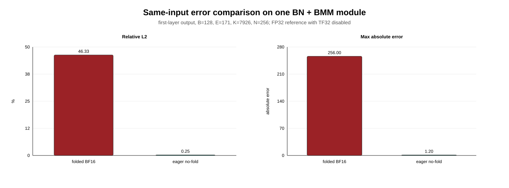
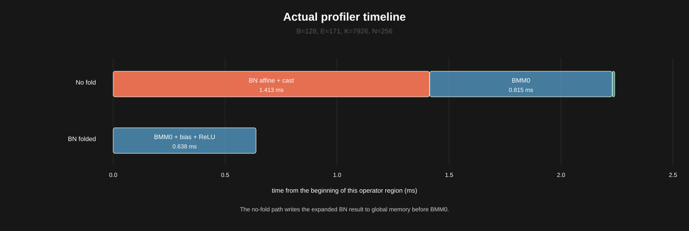
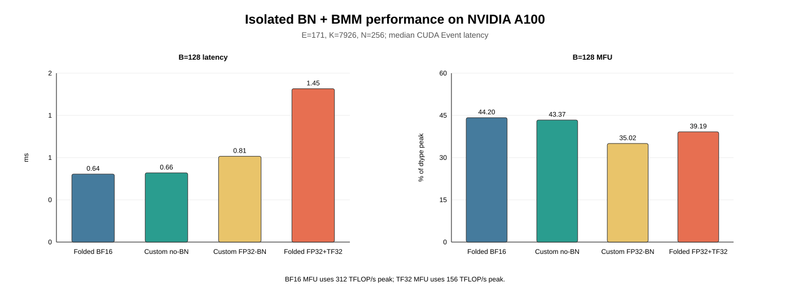

# BatchNorm Fold 在 BF16 下的精度问题与 Triton 融合实践

在屡次被BatchNorm坑到了之后, 最近再一次被BN坑了一把. 最近接手的一个已经初步被优化后的模块, 结构上是BatchNorm + BMM(Linear), 里面预先将BatchNorm fold进了BMM的weight和bias里面, 形式上相当于提前把bn做了, 仅留有一个BMM, 性能上肯定是最优的. 我遇到的问题是, FP32下端到端没有问题, 但是在BF16下出现严重的精度下降


我之前写过一篇[混合精度误差排查](https://zhuanlan.zhihu.com/p/2019473953937179645), 当时也在 BatchNorm 上踩过坑. 一遭被蛇咬, 十年怕井绳. 直接告诉我——又是你, BatchNorm！

先说一下结论 **BN的var里面存在极小值, BN fold 改变了参数分布, weight和bias里面出现了很大的离群值, 离群值 对 BF16 舍入非常敏感**. 不做 fold 可以解决精度问题, 但又触发了另一个性能坑：PyTorch Inductor 的 BMM template 支持把 bias、ReLU, 甚至一部分 BMM 后面的 BN 融合进 epilogue, 却没有提供 input prologue 去承接 BMM 前面的 BN（很好, 人家没想到, 我也没想到）. 于是 BN 广播后的 GiB 量级结果会被写回 global memory, 大幅提高 latency. 这个问题也好办, 直接使用一个手写的 kernel 来解决.


实验环境：

- GPU：NVIDIA A100 80GB PCIe, 108 个 SM
- 编译链路：PyTorch AOTInductor + Triton
- 矩阵计算精度：主要比较 BF16、FP32+TF32
- 典型形状：`E=171, K=7926, N=256`, `B` 为动态 batch

---

## 先看这个 BN + BMM 结构

原始输入 `x` 只有一份. 代码先增加 expert 维, 再通过 `expand` 把同一份输入广播给
171 组参数：

```text
x:                         [B, 7926]
x.unsqueeze(0):            [1, B, 7926]
x.expand(171, -1, -1):     [171, B, 7926]
```

这里最后一步只是 stride-0 view：expert 维的 stride 是 0, 171 个 expert 仍然读取
同一份 `x`, `expand` 本身既不分配 `[171,B,7926]`, 也不会写出 171 份数据.

但是, 每个 expert 都有独立的 BN 参数和 Linear 参数：

```text
running_mean/running_var:  [171, 7926]
gamma/beta:                 [171, 7926]
BN scale/shift:             [171, 7926]
BN broadcast operand:       [171, 1, 7926]
Linear0 weight:             [171, 7926, 256]
Linear0 bias:               [171, 256]
output:                     [171, B, 256]
```

整体的计算过程：

```python
x_expanded = x.unsqueeze(0).expand(171, -1, -1)
bn_out = x_expanded * scale[:, None, :] + shift[:, None, :]
bmm_input = bn_out.to(torch.bfloat16)
out = torch.bmm(bmm_input, weight) + bias[:, None, :]
```

虽然 `x_expanded` 仍是 view, 但 `bn_out` 对不同 expert 已经不同. 一旦 BN 不能融合进
BMM prologue, Inductor 就必须把广播后的逻辑结果物化成真正的 `[171,B,7926]`
连续 tensor. 后面看到的 GiB 级写入, 正是从这个 expert 广播维产生的；问题不是
`expand` 自己复制了数据, 而是广播后的 BN 结果被完整写回了 global memory.

这里的 `171` 就是 BMM 的 batch 维, 后面记作 `E`. BN 在 eval 模式下可以写成一个 affine：

$$
s = \frac{\gamma}{\sqrt{\mathrm{running\_var}+\epsilon}}
$$

$$
t = \beta-\mathrm{running\_mean}\cdot s
$$

$$
\mathrm{BN}(x)=x\cdot s+t
$$

接着做 BMM：

$$
y_{e,b,n}=\sum_k(x_{b,k}s_{e,k}+t_{e,k})W_{e,k,n}+b_{e,n}
$$

把式子展开, 就可以提前把 BN 吸收到 weight 和 bias 中：

$$
W^{fold}_{e,k,n}=s_{e,k}W_{e,k,n}
$$

$$
b^{fold}_{e,n}=b_{e,n}+\sum_k t_{e,k}W_{e,k,n}
$$

推理时只需要：

$$
y=\mathrm{BMM}(x,W^{fold})+b^{fold}
$$

这就是这个结构里的 BN fold. 它在实数域里完全等价, 在 FP32 下误差也很小, 同时还能省掉运行时的 BN, 所以通常是一个很自然的优化.

问题出在后面那句：**再把 fold 后的参数转成 BF16. **

---

## Fold 之后, 参数分布变得很不友好

我们把这个模块单独抽出来, 对 `[171,B,7926] @ [171,7926,256]` 的第一层做消融.

先看 fold 后的参数. 下面都是同一组 `weight0/bias0` 的统计：

| 参数 | max abs | mean abs | BF16 round-trip max error | BF16 round-trip relative L2 |
|---|---:|---:|---:|---:|
| weight `[171,7926,256]` | 273.69 | 0.922 | 0.512 | 0.165% |
| bias `[171,256]` | 67,779.72 | 5,669.61 | 195.72 | 0.164% |

单看参数 relative L2, `0.165%` 好像并不夸张. 但 fold 后的分布已经很不均匀：很多局部 group 近乎由一个离群值主导, bias 里还出现了几万量级的值.

这时 BMM 的结果依赖大 weight 项和大 bias 项之间的抵消. 它们分别做 BF16 舍入以后, 原本在 FP32 中能抵消掉的低位信息就回不来了.

为了避免把不同输入和不同执行路径的误差混在一起, 我们又固定了同一批 `B=128` 的输入、同一套原始参数, 只比较这一层的输出. reference 统一为：

```text
FP32 BN affine -> FP32 BMM + bias -> ReLU（TF32 关闭）
```

结果如下：

| 路径 | 输出 relative L2 | mean absolute error | max absolute error | ReLU 零值翻转率 |
|---|---:|---:|---:|---:|
| folded weight/bias BF16, 输入 BF16 | 46.327% | 1.9228 | 256.0000 | 5.4153% |
| no-fold eager, BN 结果转 BF16 后做 BMM | 0.2459% | 0.01219 | 1.20096 | 0.01344% |



这两条路径都从同一份模块输入和同一套原始参数出发, 而且都使用 PyTorch BMM. 区别是前者先把 BN fold 进 weight/bias 再舍入, 后者在运行时做 FP32 BN, 再把 BN 结果转成 BF16. folded 路径的 relative L2 是 no-fold 的约 188 倍, ReLU 零值翻转率也从 `0.01344%` 升到了 `5.4153%`.

这说明问题不在 BF16 BMM 本身. 真正破坏精度的, 是 fold 后的 weight 和 bias 分别做 BF16 舍入, 把原本依赖大数抵消的低位信息丢掉了.

更准确的描述是：**BN folding-induced outlier amplification and dynamic-range inflation**, 也就是 BN fold 引起的离群值放大和动态范围膨胀. 它进一步形成了一个依赖大数抵消、对 BF16 舍入敏感的参数化.

既然问题来自 fold, 一个直接的想法就是：不 fold.

---

## 不做 BN fold, Inductor 应该能自动融合吧？

不做 fold 后, 运行时计算变成：

```text
x FP32
  -> FP32 BN affine
  -> cast BF16
  -> BMM with BF16 weight
```

BN 在推理时只是 `mul + add`, 是最普通的 element-wise 操作. 我们一开始认为 Inductor 很容易把它融合到 BMM 的 prologue 中, 性能应该不会有明显回退.

实际 timeline 完全不是这样.



在这个 B128 case 里, no-fold 路径里 BN 和 BMM 是两个独立的主 kernel：

| 路径 | kernel | 时间 |
|---|---|---:|
| no-fold | BN affine + BF16 cast + 写中间结果 | 1.413 ms |
| no-fold | BMM0 | 0.815 ms |
| no-fold | bias + ReLU | 0.010 ms |
| BN folded | BMM0 + bias + ReLU | 0.638 ms |

问题不只是多了一次 kernel launch. BN kernel 真的把结果写成了一个新的连续 tensor：

```text
[171, B, 7926] BF16
```

当 `B=1024` 时, 这个中间 tensor 单独就有约 `2.585 GiB`. 也就是说, 在进入 BMM 前, GPU 先把两三 GiB 的数据写到 global memory, BMM 再把它读回来.

这已经不是“多做了一个 element-wise”这么简单, 而是多了一次超大规模的显存读写.

---

## 为什么没有融合？

到 Inductor 这一层时, BN 已经不再是一个 `aten.batch_norm`, 而是：

```text
FP32 mul + add -> BF16 cast -> aten.bmm
```

普通 pointwise 之间的融合比较成熟, pointwise 融合到普通 2D MM 的 prologue 也有相应支持. 但当前版本的 BMM template 没有声明可做 prologue fusion 的输入, scheduler 在看到 BN producer 时就会直接拒绝融合. 这才是原图没有融合的核心原因.

PyTorch 2.12.1 源码里删掉无关参数后, `TritonTemplate` 里这个选项默认是关闭的：

```python
# torch/_inductor/select_algorithm.py
def __init__(
    ...,
    prologue_loads_all_inputs=False,
    ...,
):
```

普通 MM 显式打开了它, BMM 却没有：

```python
# torch/_inductor/kernel/mm.py
mm_template = TritonTemplate(
    name="mm",
    ...,
    prologue_loads_all_inputs=True,
)

# torch/_inductor/kernel/bmm.py
bmm_template = TritonTemplate(
    name="bmm",
    grid=bmm_grid,
    source=load_kernel_template("triton_bmm"),
    cache_codegen_enabled_for_template=True,
)
```

到 scheduler 里, 模板没有登记任何允许做 prologue fusion 的输入, 就会直接返回：

```python
# torch/_inductor/scheduler.py
allowed_prologue_inps = template.get_allowed_prologue_inps()
if not allowed_prologue_inps:
    why("template has no allowed prologue inputs")
    return False
```

所以这里不是 scheduler 算了一遍收益后认为融合不划算, 而是 BMM template 根本没有提供这个入口.

严格来说, 只给 BMM 补上这个入口也不等于 FP32 BN 就能直接融合：scheduler 后面还有一层针对低精度 template 的 FP32 upcast 收益检查. 但那是补上 input hook 之后才会遇到的下一层限制, 不改变这里的第一个问题：当前 BMM template 没有 prologue-fusable input.

如果 BMM 最后选择 external ATen、cuBLAS 或 CUTLASS kernel, 情况更直接：它们是一个不透明 kernel, 同样没有接口让 Inductor 塞入 `scale*x+shift` 这样的 input prologue.

所以这里真正的限制是：

1. Triton BMM template 没有声明 prologue-fusable input, 无法吸收 BN producer.
2. external BMM 是 opaque kernel, 也不能吸收任意 input prologue.
3. PyTorch 里也没有现成的 `BN/input-affine -> BMM` 图重写来绕开这条路径.

最终, Inductor 只能先运行 BN pointwise kernel, 把 `[E,B,K]` 落盘, 再启动 BMM.

找到这里以后, 优化方向就很明确了：自己写一个 fused kernel, 让 BN affine 只存在于寄存器和 shared memory 中, 一把梭哈不落盘就完事了

---

## 手写一个 BN + BMM Triton kernel

kernel 内部的核心逻辑并不复杂：

```python
x = tl.load(x_ptr).to(tl.float32)
scale = tl.load(scale_ptr).to(tl.float32)
shift = tl.load(shift_ptr).to(tl.float32)

a = (x * scale + shift).to(tl.bfloat16)
w = tl.load(weight_ptr)
acc = tl.dot(a, w, acc=fp32_accumulator)
```

这个新算子也用前面固定的同一批输入做了第一层精度回归. reference 仍然是关闭 TF32 的 FP32 BN + FP32 BMM：

| 路径 | 输出 relative L2 | mean absolute error | max absolute error | ReLU 零值翻转率 |
|---|---:|---:|---:|---:|
| no-fold eager, BN 结果转 BF16 后做 BMM | 0.2459% | 0.01219 | 1.20096 | 0.01344% |
| Triton kernel, 输入 FP32、BN FP32、weight BF16 | 0.0917% | 0.00518 | 0.45246 | 0.01351% |
| Triton kernel, 输入 BF16、BN FP32、weight BF16 | 0.2019% | 0.01082 | 1.16498 | 0.01952% |

两种输入 dtype 下, 新算子的 relative L2 都在 `0.21%` 以内, 和 no-fold eager 处于同一量级. 输入即使转成 BF16, 精度也没有崩掉；这说明保留 FP32 输入不是恢复精度的必要条件, 融合也没有把前面的问题带回来.

关键还是 tiling.

我们的 grid 是：

```python
grid = (
    E,
    triton.cdiv(B, BLOCK_B),
    triton.cdiv(N, BLOCK_OUT),
)
```

每个 Triton program 负责：

```text
一个 expert e
一个 [BLOCK_B, K] 的 batch tile
一个 [K, BLOCK_OUT] 的 weight tile
输出 [BLOCK_B, BLOCK_OUT]
```

这里主要有三个取舍.

第一, `E` 单独作为 grid 的一维. 不同 E 使用不同的 BN 参数和 weight, 不适合塞进同一个 block. 原始输入 `x[B,K]` 却是跨 E 共享的, 它远小于全部 weight, 在 A100 的 L2 中有很好的复用机会.

第二, `B` 维不能切得太碎. 不同 batch tile 会重复读取同一个 `[K,BLOCK_OUT]` weight tile, `BLOCK_B` 越小, weight 重读次数越多. 所以大 E、大 K 的 case 下, `BLOCK_B=128` 通常比 32 或 64 更合适.

第三, 输出维切 `BLOCK_OUT`. 这个 case 的 `N=256`, 取 `BLOCK_OUT=128` 时每个 expert 有两个 output tile.

在 `E=171, B=128, N=256` 下, 一共会启动：

```text
171 * 1 * 2 = 342 CTAs
```

A100 有 108 个 SM, 342 个 CTA 约等于 SM 数量的 3.2 倍. 这个并发规模比较合适, 所以这里面就没有再考虑splik-k之类的写法了, 同时 `BLOCK_B=128` 又能尽量减少 weight 的重复读取.

---

## 性能还是不如原始的bn fold: 原因恰恰是因为kernel里面做了BN

先看 B128 的 isolated kernel 数据：



再列一下 B128 和 B512 的完整数字：

| 路径 | B128 latency | B128 MFU | B512 latency | B512 MFU |
|---|---:|---:|---:|---:|
| BN-folded BF16 | 0.644 ms | 44.20% | 2.113 ms | 53.91% |
| custom, 移除 BN 的同构消融 | 0.656 ms | 43.37% | 2.136 ms | 53.31% |
| custom, FP32 BN + BF16 BMM | 0.813 ms | 35.02% | 2.720 ms | 41.87% |
| BN-folded FP32 + TF32 | 1.453 ms | 39.19% | 4.728 ms | 48.17% |

计时使用 CUDA Event, 表里是 warmup 后的 median. MFU 分母按各自 dtype 的 A100 dense peak 计算：BF16 使用 312 TFLOP/s, TF32 使用 156 TFLOP/s；分子只计算 BMM FLOPs, 没有把 BN、bias 和 ReLU 算进去.

几个结论比较清楚.

首先, custom BN+BMM 相比 BF16 folded 路径大约是 `1.26x-1.29x`. 这个差距存在, 但比显式物化 `[E,B,K]` 好很多.

第二, 把 custom kernel 里的 BN 去掉以后, B128/B512 都和 folded kernel 基本对齐. 也就是说, grid、BMM 主体和 epilogue 不是主要问题, 主要额外开销确实来自 K-loop 里的：

```text
load FP32 scale/shift
-> FP32 scale*x+shift
-> FP32 to BF16
-> Tensor Core MMA
```

这条依赖链直接位于 MMA 输入的关键路径上. BN 本身的 FLOPs 很少, 但它不是一个可以完全藏起来的“免费 element-wise”.

第三, 虽然 custom 比 BF16 folded 慢, 但 BF16 folded 在这里精度不可接受, 不能作为实际方案. 和原来的 FP32+TF32 路径相比, custom 在 B128/B512 分别快约 44% 和 42%.

纯 FP32、关闭 TF32 的路径没有做同一套 isolated 测量, 所以这里不根据理论峰值反推一个数字. 已有数据已经能说明问题：在 BN affine 保持 FP32 计算的前提下, BF16 BMM 仍然比原来的 FP32+TF32 路径快不少, 也就是说比起现在因为精度问题, 导致不能使用bf16的结局, 起码是大赢特赢的.

这个形状不是一个特别容易跑出极高 MFU 的标准 GEMM. 它有独立的 E 维、固定 `N=256`, 还要在每个 K tile 前做 FP32 BN affine. 能在 B512 达到约 42% 的 BF16 峰值, 我认为是一个可以接受的结果.

---

## 一套 tile 不能覆盖所有 E/K

最后还有一个比较实际的问题：`E/K` 变化以后, 最优参数会明显变化.

大 `E`、大 `K` 时, grid 本身已经有足够多 CTA, 应该优先增大 `BLOCK_B`, 减少 weight 重读. 本文的 `E=171,K=7926,N=256` 就属于这种情况, `B128/O128/K32` 比较合适.

当 `E` 变小时, CTA 数量会跟着下降. 这时可以降低 `BLOCK_B`, 用更多 batch tile 补并发；较小的输出维还可以降低 `BLOCK_OUT`. 部分 K 较小或较特殊的 shape, 也可能更适合 `TILE_K=64/128` 或更多 warps.

因此这些超参数最好根据静态的 `E/K/N` 做路由, 而不是让一套 config 吃掉所有 shape：

```text
大 E、大 K：优先 BLOCK_B=128, 减少 weight traffic
小 E：降低 BLOCK_B, 增加 CTA 数
小 N：降低 BLOCK_OUT, 避免 tile 浪费
不同 K：在 TILE_K=32/64/128 之间选择
```

`B` 是动态 batch, 不适合做成大量 constexpr specialization. 让它作为 runtime 参数并用 mask 处理尾块, 可以避免线上遇到新 batch 时产生一堆新的编译变体.

---

## 总结

这次排查主要踩了两个坑.

第一个是数值问题. BN fold 在 FP32 下虽然等价, 但它可能放大 weight/bias 的离群值和动态范围. 参数再转成 BF16 后, 独立舍入会破坏大数之间的抵消, 最终让一个本来普通的 BMM 出现很大的输出误差.

第二个是编译问题. 不做 fold 后, 不能因为 BN 是 element-wise 就默认它一定会被融合. 至少在当前 PyTorch Inductor 的 BMM 路径里, BN affine 没有进入 BMM prologue, 而是物化成了巨大的 `[E,B,K]` 中间 tensor.

最后的处理方式比较直接：保留 FP32 BN, 在 Triton BMM prologue 里现算, 转成 BF16 后立刻进入 Tensor Core, 不让 expand 结果落盘. 对于本文的典型 shape, custom kernel 比最快的 BF16 folded 路径慢约 30%, 但明显快于原来的 FP32+TF32 路径, 同时避开了 BN fold 带来的 BF16 精度问题.
