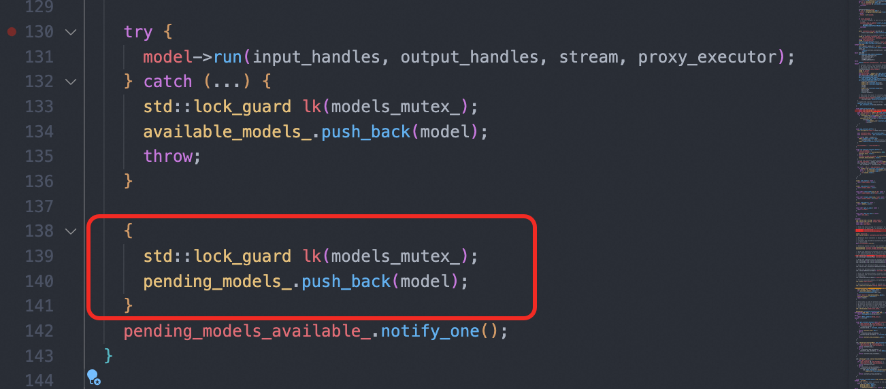
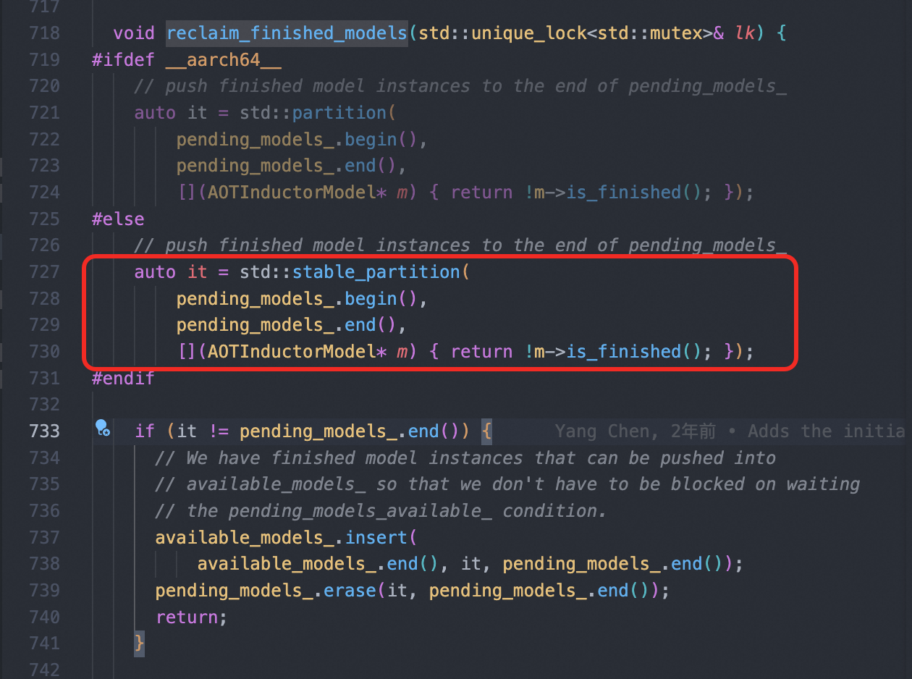
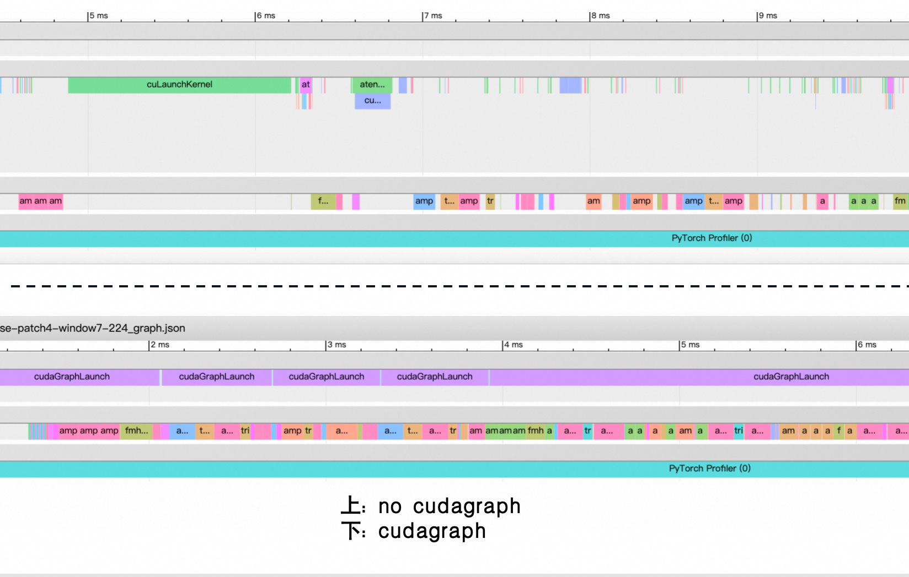
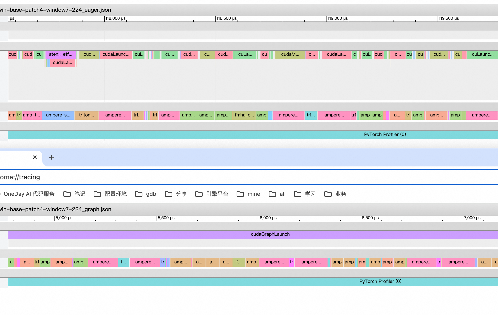

## 讨论一下AOTInductor在C++和Python下的并发设计

AOTInductor简单来说是inductor提供的一种将pytorch nn.Module编译成C++动态库, 从而在推理过程中完全摆脱python runtime的能力. 

可以参考PyTorch的官方教程文档: [AOTInductor: Ahead-Of-Time Compilation for Torch.Export-ed Models](https://docs.pytorch.org/docs/stable/torch.compiler_aot_inductor.html)

也可以参考我在github上写的一个文档: [基于图追踪和AOT(ahead of time)技术的Pytorch 2+模型部署链路初探](https://github.com/sujuyu/ZhangYu-s-Blog/tree/main/torch_fx_aot_chapter)

这边贴上PyTorch教程里的示例, 在Python里面可以将一个nn.Module编译成model.pt2文件, 本质这是一个zip压缩包, 里面是表示运算逻辑的动态库和可执行的二进制核函数文件
```Python
with torch.no_grad():
    exported = torch.export.export(model, example_input)
    output_path = torch._inductor.aoti_compile_and_package(
        exported,
        package_path=os.path.join(os.getcwd(), "model.pt2"),
    )

# python里面也可以直接载入这个model.pt2进行推理
aoti_model = torch._inductor.aoti_load_package("model.pt2")
print(aoti_model(example_input))
```

获取model.pt2文件之后, 也可以在C++中进行载入和推理, 完全完全摆脱Python
```C++
torch::inductor::AOTIModelPackageLoader loader("model.pt2");
// Assume running on CUDA
std::vector<torch::Tensor> inputs = {torch::randn({8, 10}, at::kCUDA)};
std::vector<torch::Tensor> outputs = loader.run(inputs);
std::cout << "Result from the first inference:"<< std::endl;
std::cout << outputs[0] << std::endl;
```

本质上, Dynamo --> inductor --> AOTInductor 是一个递进的关系, 从调度策略的角度来看: 
1. dynamo捕获的计算图摆脱了PyTorch的各种class的类型和shape检查
2. inductor的pattern优化和fuse策略, 降低了launch kernel和数据读写的开销
3. AOTInductor摆脱了Python Runtime的限制, 不再需要重复在 C++和python 两种runtime中反复切换

### 并发策略
我们先来看AOTIModelPackageLoader这个类的构造函数: 
```C++
  AOTIModelPackageLoader(
      const std::string& model_package_path,
      const std::string& model_name = "model",
      const bool run_single_threaded = false,
      const size_t num_runners = 1,
      const c10::DeviceIndex device_index = -1);
```
这边有一个num_runners和run_single_threaded参数, num_runner一看就是控制并发数量用的. 

我们跟着这个变量走下去, AOTIModelPackageLoader会将这个参数传递给AOTIModelContainerRunner的num_models参数, AOTIModelContainerRunner其实也是一层皮, 内部使用AOTInductorModelContainer来实现推理和对资源的抽象
<!-- ```C++
AOTIModelContainerRunner(
      const std::string& model_so_path,
      size_t num_models,
      const std::string& device_str,
      const std::string& cubin_dir,
      const bool run_single_threaded)
```
AOTIModelContainerRunner是对推理过程的抽象, runner对外提供run方法用于推理, 里面对资源的抽象叫做container, runner将num_models参数传递给container的构造函数: 
```C++
LOAD_SYMBOL(create_func_, "AOTInductorModelContainerCreateWithDevice")
AOTI_RUNTIME_ERROR_CODE_CHECK(create_func_(
      &container_handle_,
      num_models,
      device_str.c_str(),
      cubin_dir.empty() ? nullptr : cubin_dir.c_str()));
```
这个AOTInductorModelContainerCreateWithDevice函数并非在PyTorch的代码库中提供, 前面讲到AOTInductor会产出一个.pt2文件, 解压之后里面是一个动态库, 这个动态库其实是由codegen生成的C++代码编译而来, 解压这个pt2文件里面也会有一个.cpp后缀文件, 就是这个动态库本身的逻辑, 在里面我们能找到这个函数的具体实现, 其中又调用了AOTInductorModelContainer的构造函数
```C++
auto* container = new torch::aot_inductor::AOTInductorModelContainer(
        num_models, std::string(device_str), cubin_dir_opt);
``` -->
于是一路向下就会来到AOTInductorModelContainer的构造函数: 
```C++
  AOTInductorModelContainer(
      size_t num_models,
      const std::string& device_str,
      const std::optional<std::string>& cubin_dir = std::nullopt) {
    /*balabala*/
    models_.reserve(num_models);
    available_models_.reserve(num_models);
    for (size_t i = 0; i < num_models; ++i) {
      models_.push_back(AOTInductorModel::Create(
          constants_map_, constants_array_, device_str, cubin_dir));
      available_models_.push_back(models_.back().get());
    }
```
原来传进去的num_models是多少个, 这边就初始化几个model, 然后塞进models_和available_models_这两个vector里面. 

然后外部每次调用run函数的时候, 都需要通过get_available_model去独占一个有效的model, 如果当前available_models_里面已经空了, 则线程会卡在reclaim_finished_models这一步, 等待被唤醒
```C++
  AOTInductorModel* get_available_model() {
    std::unique_lock lk(models_mutex_);
    if (available_models_.empty()) {
      reclaim_finished_models(lk);
    }
    auto* result = available_models_.back();
    available_models_.pop_back();
    return result;
  }
```

在推理结束之后, 除非计算抛出了异常, 否则并不主动将model返回给available_models_, 而是将model塞到一个pedding列表, 并通知其他等待的线程


看样子run函数 问题来了, 我们怎么知道一次推理任务是否已经完成了呢？这里面的model是一个AOTInductorModel类型, 而AOTInductorModel由继承自AOTInductorModelBase, 后者的run逻辑长下面这样, 其中run_finished_是一个CUDA事件
```C++
std::optional<CUDAEvent_t> run_finished_;

  void run(
      AtenTensorHandle*
          input_handles,
      AtenTensorHandle*
          output_handles, 
      DeviceStreamType stream,
      AOTIProxyExecutorHandle proxy_executor) {

    if (!run_finished_) {
      CUDAEvent_t run_finished = nullptr;
      AOTI_RUNTIME_CUDA_CHECK(CUDAEventCreate(&run_finished));
      run_finished_.emplace(run_finished);
    }
    auto* model = static_cast<Model*>(this);
    model->run_impl(input_handles, output_handles, stream, proxy_executor);
    AOTI_RUNTIME_CUDA_CHECK(CUDAEventRecord(*run_finished_, stream));
  }
```
所以这下清楚了, 每次推理结束之后, 都会记录一个run_finished_事件, 然后我们回到reclaim_finished_models函数, 已知所有获取不到有效model的线程都会等在这里: 

被唤醒之后, 线程会去遍历pending_models_列表, 并对其进行排序, 将已经完成推理任务的model一次性全部insert到available_models_列表中. 

这下清楚了, 原来AOTInductor在C++下是通过"哪个线程遇上了资源枯竭, 就由这个线程负责回收"的方式, 来实现资源管理的. 

那在Python中, AOTI又是怎么样管理并发的呢？

```Python
def aoti_load_package(
    path: FileLike, run_single_threaded: bool = False, device_index: int = -1
) -> Any:  # type: ignore[type-arg]
    from torch._inductor.package import load_package
    return load_package(
        path, run_single_threaded=run_single_threaded, device_index=device_index
    )

def load_package(
    path: FileLike,
    model_name: str = "model",
    run_single_threaded: bool = False,
    num_runners: int = 1, # !!!!!!!
    device_index: int = -1,
) -> AOTICompiledModel: 
```

Python里面num_runners是写死1的, 也就是在Python里面根本没有用到AOTInductor的并发特性. 不过这也很合理, 在Python里面真要并发就开多进程了. 


### 为什么要做并发策略的控制
模型的前向过程可以理解为是读取权重, 和当前输入的tensor之间进行计算的过程, 计算的中间结果放在每个线程自己的栈上, 从这个角度来说, 似乎并没有资源的竞争, 完全可以做到来几个线程, 就有几个并发, 大家自己算自己的, 个不相干. 

为什么AOTInductor要大费周折, 抽象出这样一个控制并发上限的编程模型呢？

这里面的主要原因是GPU上的上下文并不是可以在多个线程之间共享的. 

```C++
static inline CUfunction loadKernel(
        std::string filePath,
        const std::string &funcName,
        uint32_t sharedMemBytes,
        const std::optional<std::string> &cubinDir = std::nullopt);

if (kernels_.triton_poi_fused_addmm_0 == nullptr) {
        kernels_.triton_poi_fused_addmm_0 = loadKernel("/tmp/torchinductor_zy429782/civjicgzh4nhfq7hrye6rt7ug7chob5uuwsaocvacvix2mkkrdul/cjn6jdovehlrybjtcbodprwenhl4cdyvwxfq7slb6mgysfltfg4g.cubin", "triton_poi_fused_addmm_0", 0, cubin_dir_); 
    }
```

前面说到, AOTIndcutor会把nn.Module编译成一个动态库和一堆的cubin文件, cubin文件即是triton融合算子的二进制可执行文件. 运行时, 这些cubin文件被载入成为一个可执行的CUfunction. 

在CUDA的编程模型里面CUfunction与一个特定的CUDA上下文绑定, CUDA上下文又与特定的主机线程绑定, 因此由线程A实例化的CUfunction无法在线程B中进行共享. 

### 副作用?

看样子一切都非常的美好, 直到我尝试在我的C++推理代码里面引入CUDAGraph, 一定会报错, 当然不局限于C++, 在python中同样会抛出这个异常: 
```bash
$./build/aoti_example 
Error: The model did not finish successfully. Error: operation not permitted when stream is capturing
terminate called after throwing an instance of 'std::runtime_error'
  what():  run_func_( container_handle_, input_handles.data(), input_handles.size(), output_handles.data(), output_handles.size(), reinterpret_cast<AOTInductorStreamHandle>(stream_handle), proxy_executor_handle_) API call failed at /pytorch/torch/csrc/inductor/aoti_runner/model_container_runner.cpp, line 107
Aborted
```
原因在于aoti使用CUDA事件来标记一次推理是否完成, 然而CUDAEventRecord无法被CUDAGraph支持

非常难受的一点是, 尝试对aoti推理过程进行capture, 如果失败了的话, 报错信息非常模糊, 从中完全不知道是其中哪个操作不能被CUDAGraph支持

我本来想提一个issue来者, 结果看到大概3个月前, 有个哥们遇上了跟我几乎一样的问题, 唯一的区别是, 他是在python里面遇到这个错误, 我是在C++里, [Fix for AOTI + CUDAGraphs when calling from Python](https://hud.pytorch.org/pytorch/pytorch/commit/85467ed063d284fa21a2f1d2adfec8fda544923d)

于是他往AOTIModelPackageLoader的构造函数里面添加了一个run_single_threaded形参, 如果是True的话, 就默认是在单线程环境中, 直接调用AOTInductorModelBase中的run_single_threaded实现（而非run）, 不再使用CUDAEvent来标识一次推理是否结束. 算是另辟蹊径支持了CUDAGraph. 

但是别开心的太早, 我测试了5个典型的模型, 重复100次计算耗时, 我的设备是NVIDIA A10, CUDA版本是12.4, CUDAGraph前后速度并没有明显的差别. 

| Model                                   | Eager Latency (ms) | CUDA Graph Latency (ms) | Speedup Factor |
|-----------------------------------------|--------------------|-------------------------|---------------|
| vit-base-patch16-224             | 17.5125            | 17.5381                 | 1.00x         |
| deit-base-distilled-patch16-224| 17.5869            | 17.6226                 | 1.00x         |
| swin-base-patch4-window7-224  | 18.4500            | 18.3340                 | 1.01x         |
| bert-base-uncased                       | 10.3262            | 10.3360                 | 1.00x         |
| roberta-base                            | 10.2852            | 10.3204                 | 1.00x         |


从profile来看, CUDAGraph后的第一次推理, 算子之间的密度明显要更密得多, 这也符合预期, AOTInductor内部需要进行CUDA上下文初始化, 内存分配, 载入kernel等操作. 


但是在后面的99次推理中, 两者几乎没有什么差别: 


某种程度上可以理解为, AOTInductor通过将nn.Module进行fuse, 转换为C++代码然后编译成动态库的方式, 本身的kernel launch的开销已经做到非常低了, 对于优化良好的模型, CUDAGraph在其上很可能并不会有太多增益. 