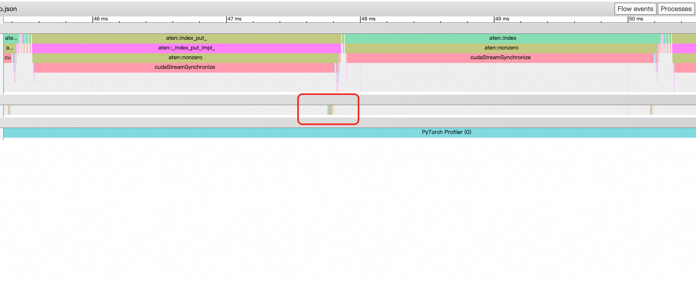

## PyTorch坑点随记：慎用数据依赖的索引操作

最近在做模型加速的时候, 发现了一个潜藏的坑点, 概括起来就是, 在batch比较小的推理场景下, 慎重使用依赖实际数据分布的索引操作. 

这里的“数据依赖索引”特指输出tensor的维度与输入index相关的索引操作. 例如

```Python
arr = torch.rand(3,4)
index = torch.randn(3) > 1
arr[index]
```
索引结果arr[index]的维度与index里面有几个元素>0相关, 在获得index时, 无法预先确定维度

### 场景示例
在写模型的时候, 我们可能会遇到存在数据依赖的场景, 例如我现在有一个任务建模如下：

首先有4种用户行为, 分别是

0. 打开淘宝
1. 打开拼多多
2. 打开抖音商城
3. 打开小红书商店

然后对于每一种行为都有一组embedding, 简单起见就认为每种行为都有1024个embedding, 表示用户会点击哪一个商品. 

模型会预测用户的行为类型, 和一条向量, 用这条向量跟这个行为类型下的1024条embedding计算距离, 距离最近的embedding表示用户要点击的商品. 

翻译成更晦涩间接的表述是：

输入:
1. predicted_class_indices ([B]): 模型预测出的每个样本的类别索引 (0, 1, 2, 3) . 

2. predicted_embeddings ([B, D]): 模型为每个样本生成的查询嵌入. 

候选池:

1. all_candidate_embeddings ([C, N, D]): 一个全局的、固定的候选池. C是类别数 (4) , N是每个类别下的候选数量 (1024) , D是嵌入维度. 

目标:

1. 对于批次中的每个样本, 根据其predicted_class_indices, 从all_candidate_embeddings中选出对应的候选集, 然后找到与predicted_embeddings最相似 (点积最大) 的那个候选者的索引. 

### 怎么写代码

#### 数据依赖写法

作为一个算法小白, 我会写一个for循环, 遍历这4种行为类别, 先把predicted_embeddings中属于这种类别的部分拿出来, 然后跟all_candidate_embeddings候选池计算距离, 然后写回去. 

这种方式在计算量上是最小的, 把属于这种类别的predicted_embeddings拎出来就是一种**数据依赖的索引操作**, 因为我需要知道当前预测的类别, 才能拿到索引结果. 
比如一个batch里面有4个类别是0 (打开了淘宝) , 我需要把这4条embedding单独拎出来. 一个batch里面有几条是"打开淘宝", 我事先是无法知晓的. 

代码如下：
```Python
class DataDependentIndexingModule(nn.Module):
    def __init__(self):
        super().__init__()

    def forward(self, 
                predicted_class_indices,    # [B]
                predicted_embeddings,       # [B, D]
                all_candidate_embeddings):  # [C, N, D]
        
        B, D = predicted_embeddings.shape
        C, N, _ = all_candidate_embeddings.shape
        # 预先分配一个输出张量来存储结果
        top_candidate_indices = torch.zeros(B, dtype=torch.long, device=predicted_embeddings.device)
        for i in range(C):
            # 创建布尔掩码, 找出哪些样本属于当前类别 i
            mask = (predicted_class_indices == i) # [B]
            # 使用数据依赖索引
            query_embs = predicted_embeddings[mask]      # [num_matches, D]
            # 获取该类别的候选池
            candidate_embs = all_candidate_embeddings[i] # [N, D]
            # 计算相似度得分
            # score shape: [num_matches, N]
            score = (query_embs.unsqueeze(1) * candidate_embs.unsqueeze(0)).sum(-1)
            # 找到每个查询的最佳候选索引
            best_indices_in_class = score.argmax(dim=-1) # [num_matches]
            # 将结果写回对应的位置 这在底层是一个 scatter / index_put_ 操作
            top_candidate_indices[mask] = best_indices_in_class
                
        return top_candidate_indices
```

#### 暴力向量化写法

另一种代码的写法会更加简单粗暴, 我不管一个batch里面有几个是“点击淘宝”, 有几个是“打开小红书”, 我把predicted_embeddings跟all_candidate_embeddings做一次大的矩阵乘

换句话说就是一条predicted_embedding, 会跟4种类别下的全部all_candidate_embeddings计算一次距离

然后遍历4种行为类目, 拿到对应泪目的距离, 找到最近的索引, 通过torch.where把一个batch里面真正属于这种行为的索引写入结果. 

代码如下：
```Python
class VectorizedModule(nn.Module):
    def __init__(self):
        super().__init__()

    def forward(self, 
                predicted_class_indices,    # [B]
                predicted_embeddings,       # [B, D]
                all_candidate_embeddings):  # [C, N, D]
        
        B, D = predicted_embeddings.shape
        C, N, _ = all_candidate_embeddings.shape
        
        # 预先分配最终结果张量
        final_best_indices = torch.zeros(B, dtype=torch.long, device=predicted_embeddings.device)
        # 不管predicted_embeddings属于什么类别, 跟全部的all_candidate_embeddings做一次大乘法
        scores = (predicted_embeddings.unsqueeze(1).unsqueeze(0) * all_candidate_embeddings.unsqueeze(1)).sum(-1) # [C, B, N]

        # 遍历每个类别
        for i in range(C):
            # 1. 直接拿到整个批次的查询与当前类别候选池的得分
            # 这不是"依赖数据索引" 因为输入输出的维度是完全确定的
            score_for_class_i = scores[i] # [B, N]
            
            # 2. 找到当前类别中的最佳索引
            best_indices_in_class_i = score_for_class_i.argmax(dim=-1) # [B]
            
            # 3. 创建掩码, 找出哪些样本真正属于当前类别 i
            mask = (predicted_class_indices == i) # [B]
            
            # 4. 使用 torch.where 将当前类别的结果合并到最终结果中
            final_best_indices = torch.where(mask, best_indices_in_class_i, final_best_indices)   
        return final_best_indices
```

### 性能对比
因为我主要是优化推理场景, 推理场景下batch size一般比较小, 搜推里面用户侧的batch甚至是1. 所以我设置batch size为16进行测试, benchmark函数如下
```Python
def benchmark(model, args, num_warmup=10, num_runs=100):
    model.eval()
    with torch.no_grad():
        for _ in range(num_warmup):
            _ = model(*args)
        torch.cuda.synchronize()

        start_time = time.time()
        for _ in range(num_runs):
            _ = model(*args)
        torch.cuda.synchronize()
        end_time = time.time()

    avg_time_ms = (end_time - start_time) / num_runs * 1000
    return avg_time_ms
```

直觉上来说, 前一种模型的写法省掉了冗余计算, 性能应该会更好才对, 但是实际上：
```bash
Benchmarking on NVIDIA A10
Params: BatchSize=16, NumClasses=4, NumCandsPerClass=1024, Dim=128
------------------------------------------------------------
Data-dependent Indexing (Bad):    0.5261 ms
Vectorized Gather (Good):         0.1983 ms
------------------------------------------------------------
The vectorized version is 165.32% faster.
```

居然有2.5倍的性能差距, 并且这还是包括形状检查等overhead开销下达成的, 如果使用torch.compile进行加速, 这种差距会更加明显：

```bash
Benchmarking on NVIDIA A10
Params: BatchSize=16, NumClasses=4, NumCandsPerClass=1024, Dim=128
------------------------------------------------------------
Data-dependent Indexing (Bad):    0.5508 ms
Vectorized Gather (Good):         0.0690 ms
------------------------------------------------------------
The vectorized version is 698.72% faster.
```

!!!足足有9倍多性能差距, 并且torch.compile对这种写法几乎没有性能上的增益. 

### 这是为何？
<!--  -->
<div align="center">
  
</div>


直接看第一种写法下的timeline


好家伙, aten层面满满当当, 又是aten::index_put_又是aten::non_zero的, 结果在GPU stream上就只有红框一小撮🤏. 真相水落石出了, 原来我的GPU 95%的时间都在摸鱼啊, 怪不得慢的令人发指. 

<!--  -->
<div align="center">
  
</div>


不过且先别急, 我们继续往下看, aten::non_zero是对下标索引的实现, 因为需要统计当前类目里面究竟有几个是"打开淘宝", 统计个数 ==> non_zero

在更底层的gpu stream上, non_zero会调用4个kernel

1. void at_cuda_detail::cub::DeviceReduceSingleTileKernel<...NonZeroOp...>
2. Memcpy DtoH (Device -> Pinned)
3. void at_cuda_detail::cub::DeviceCompactInitKernel<...>
4. void at_cuda_detail::cub::DeviceSelectSweepKernel<...>

其中1是reduce统计非零个数, 2是将结果传回CPU, 3 4是初始化存放结果的tensor, 并执行select操作. 

为什么把统计个数传回给CPU呢？这是因为初始化一个tensor的shape参数, 是一个CPU上的int类型. 

这也部分解释了为什么torch.compile对这种写法几乎没有加速效果, 因为TorchInductor进行node融合的时候, 遇到deviceToHost操作, 几乎毫无办法. 当然select这种数据依赖的操作, 对于TorchInductor这种静态的编译器也是相当的不友好, 所以在timeline上几乎看不到triton算子. 

本来推理场景下, batch size比较小, 整个模型是memory bound的, 现在整出了3个算子, 而且还没办法被Inductor做fuse, 这可不就慢下来了嘛. 

### 训练场景？
等等, 前面说到现在是memory bound的原因之一是因为推理场景下batch size一般都比较小, 那在训练的时候, batch size开大一点是不是这种索引方式占优了？

答案是肯定的, 比如现在batch size设置为256, 在compute bound的情况下, 显然通过索引降低计算量就非常有优势了

```bash
Benchmarking on NVIDIA A10
Params: BatchSize=256, NumClasses=4, NumCandsPerClass=1024, Dim=128
------------------------------------------------------------
Data-dependent Indexing (Bad):    1.0696 ms
Vectorized Gather (Good):         2.2534 ms
------------------------------------------------------------
The vectorized version is -52.53% faster.
```

### MoE?
我们思考一个问题, 现在预测4个类别 (淘宝、抖音、拼多多和小红书) , 然后根据不同的类别进行gemm计算,这不就是一个标准的moe算子吗？如果使用一个自定义的MoE算子来进行计算, 是不是能得到一个双全法？

我的答案是一般情况可以, 但在本例中, 专家只有4个并且只取1个的情况下, 计算很难成为瓶颈, 即便上MoE也很难取得性能提升. 

如果是128个专家取4个, batchsize也比较大的情况, 那会带来性能收益. 

参考github上的一段triton moe实现 [Link to ScatterMoe](https://github.com/shawntan/scattermoe/),
我简单做了一下性能对比. 

| BatchSize | Data-dependent Indexing (Bad) | Vectorized Gather (Good) | MoE Gemm (Good) |
|-----------|------------------------------|-------------------------|-----------------|
| 8         | 0.5679 ms                   | 0.1651 ms               | 0.7162 ms       |
| 16        | 0.5302 ms                   | 0.1985 ms               | 0.7063 ms       |
| 64        | 0.5920 ms                   | 0.5976 ms               | 0.6956 ms       |
| 256       | 1.0151 ms                   | 2.2560 ms               | 0.7009 ms       |
| 512       | 1.5475 ms                   | 4.4363 ms               | 0.6971 ms       |

基本上MoE需要batchsize > 64的情况下才会有一个比较好的效果. 