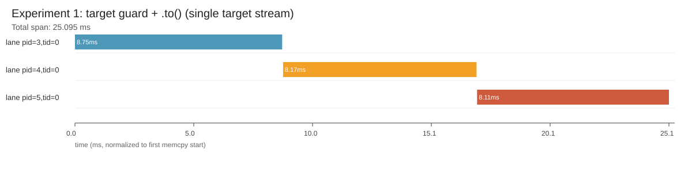
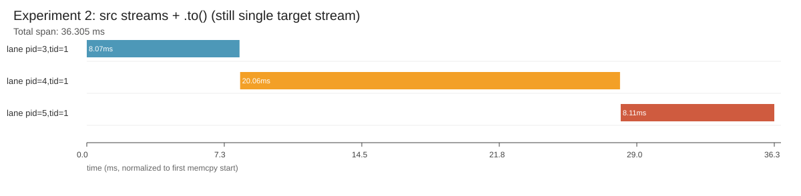
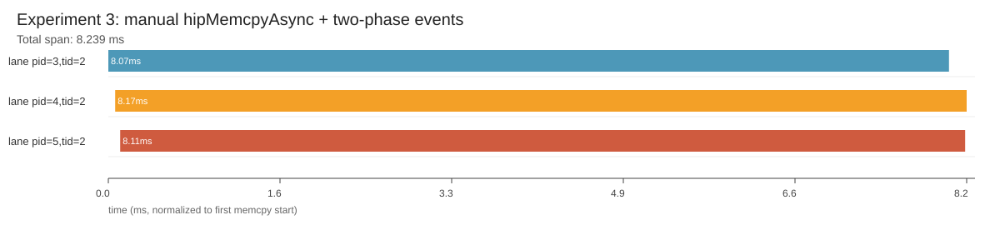

## PyTorch 多卡 D2D 踩坑实战：为什么 `.to(non_blocking=True)` 看起来异步，Timeline 却串行？

稀疏的搜推场景一般会有巨量的embedding，例如每个user，每个item都会有有embedding，用户的收入、国籍也会有embedding, 这些embeddingg加起来可能会达到数百GB量级。

既往这些embedding一般放在DDR内存里面，lookup之后通过RDMA或者PICe传输到GPU memory。当前由于GPU的显存越来越大，稀疏搜推网络的激活值往往用不完那么大的显存，因此我们正在尝试使用单机多卡的形式，把embedding切分之后放在多卡上，我们称之为GPU embedding.

GPU Embedding 场景里，典型链路是：
1. 多卡并行 lookup。
2. 非 target 卡结果 D2D 回 target 卡。
3. target 卡做聚合（reduce）并继续 forward。

线上现象是：我们使用 PyTorch提供的`.to(target, non_blocking=True)` 做跨卡 D2D，但 timeline 上三路 copy 明显串行，导致耗时接近三段相加。

1. 为什么 `在target dev上发起d2d` 和 `在source dev上发起d2d` 都串行？
2. 为什么手写 `hipMemcpyAsync + event` 能并行？

---

### 实验环境

1. 8 卡 ROCm 机器。
2. PyTorch: `2.9.0a0+git715dca6`。
3. 测试负载：3 路 D2D（`cuda:1/2/3 -> cuda:0`），每路 `384MB`。

---

### 先看源码：`.to()` 跨设备 copy 到底干了什么

核心逻辑在：
`pytorch/aten/src/ATen/native/cuda/Copy.cu:281-345`

关键点（`copy_device_to_device`）：

```cpp
// 1) copy 在 src 的 current stream 上发起
CUDAStream copy_stream = getCurrentCUDAStream(src_device.index());

if (src_device != dst_device) {
  // 2) copy 前：src 等 dst（dst_ready）
  dst_ready->record(getCurrentCUDAStream(dst_device.index()));
  dst_ready->block(copy_stream);
}

// 3) 真正执行 memcpy
CUDACachingAllocator::memcpyAsync(..., copy_stream, ...);

if (src_device != dst_device) {
  // 4) copy 后：dst 等 src（src_ready）
  src_ready->record(copy_stream);
  src_ready->block(getCurrentCUDAStream(dst_device.index()));
}
```

每次 .to() 跨卡拷贝，PyTorch 都会强制两次“先等再干”：

1. 拷贝开始前，先等目标流上之前的操作做完。
2. 拷贝结束后，再让目标流等这次拷贝做完。

这两个事实叠加后，就能解释我们的串行现象。

---

### 实验 1：target guard + `.to()`（同一 target stream）

关键代码：

```python
with torch.cuda.device(target), torch.cuda.stream(target_stream):
    for dev in srcs:
        out = src[dev].to(target, non_blocking=True)
```

timeline：



结果：3 段 memcpy 几乎首尾相接，基本无重叠。

解释：
1. 每次 `.to()` 都会使用同一条 `target_stream` 作为 dst current stream。
2. `Copy.cu` 每次都会做 `dst waits src`，这些 wait 都排在同一条 dst stream 上。
3. 因为 dst stream 内部天然 FIFO，表现为链式串行。

---

### 实验 2：source 多 stream + `.to()`（target 仍同一条）

这次我们直接在src dev上发起d2d，也就是每次d2d发起方的stream是不一样的，这样能充分并行吗？关键代码：

```python
with torch.cuda.device(target):
    torch.cuda.set_stream(target_stream)
for dev in srcs:
    with torch.cuda.device(dev), torch.cuda.stream(src_streams[dev]):
        out = src[dev].to(target, non_blocking=True)
```

timeline：



结果：仍然串行。

为什么“source 多 stream”也救不了：
1. 这段代码确实让每次 copy 的 `src current stream` 不同。
2. 但 dst 侧仍是同一条 `target_stream`。
3. 根据 `Copy.cu` 的双向 barrier，每次 copy 都要在 dst current stream 建依赖。
4. 所以最终瓶颈仍然落在同一条 dst stream 上，整体还是串行。

`src dev` 成功实现了并发提交, 然而`dst dev` 并未实现并发消费。

---

### 实验 3：手动 `hipMemcpyAsync` + 两段 event 同步
通过 `ctypes` 直接加载 HIP runtime 动态库，调用 C 接口：

```python
import ctypes

hip = ctypes.CDLL("libamdhip64.so.6")  # HIP runtime 动态库
hipMemcpyAsync = hip.hipMemcpyAsync    # 取到 C 函数符号
hipMemcpyAsync.restype = ctypes.c_int
hipMemcpyAsync.argtypes = [
    ctypes.c_void_p,  # dst ptr
    ctypes.c_void_p,  # src ptr
    ctypes.c_size_t,  # bytes
    ctypes.c_int,     # hipMemcpyKind
    ctypes.c_void_p,  # hipStream_t
]
```

```python
# phase A: target 声明 dst 可写
with torch.cuda.device(target), torch.cuda.stream(dst_stream[dev]):
    dst_ready[dev].record(dst_stream[dev])

# phase B: src 等待 dst_ready 后发起 D2D
with torch.cuda.device(dev), torch.cuda.stream(src_stream[dev]):
    src_stream[dev].wait_event(dst_ready[dev])
    hipMemcpyAsync(dst_ptr, src_ptr, bytes, hipMemcpyDeviceToDevice, src_stream_ptr)
    copy_done[dev].record(src_stream[dev])

# phase C: target consume stream 等待所有 copy_done
with torch.cuda.device(target), torch.cuda.stream(consume_stream):
    consume_stream.wait_event(copy_done[dev])
```

timeline：



结果：3 路 copy 基本同时起跑，重叠明显。

1. 每路 copy 的执行流是各自 src stream，不再共享单一 dst 执行流。
2. dst 只在最终 consume 阶段做一次汇合等待。
3. 因此可以得到并行 copy + 正确依赖。

---

### 数据对比

时延（`latency_stats.json`）：
1. `exp1_shared_target_to`: mean `24.90ms`。
2. `exp2_src_stream_to_shared_target`: mean `24.84ms`。
3. `exp3_manual_memcpy_events`: mean `8.32ms`。

trace 重叠（`experiment_summary.json`）：
1. exp1: `sum_dur=25.034ms`, `span=25.095ms`, `overlap≈0`。
2. exp2: `sum_dur=36.238ms`, `span=36.305ms`, `overlap≈0`。
3. exp3: `sum_dur=24.353ms`, `span=8.239ms`, `overlap≈0.662`。

---

### 这套方案在工程上要注意生命周期

手写 `hipMemcpyAsync` 的代价是需要承担依赖与生命周期管理。

必须满足：
1. `dst/src tensor` 在对应 `wait_event` 完成前不能释放。
2. `event` 在被所有消费者 stream 消费前不能销毁。
3. `stream` 不能提前复用到不兼容阶段（否则容易引入隐式竞争）。

否则会出现“功能偶发正确，但高并发下 NaN/脏读”的典型问题。

---

### 最终结论

1. `.to(non_blocking=True)` 只保证“异步提交”，不保证“多路并行完成”。
2. 在跨设备 copy 上，只要多路共享同一条 target current stream，通常会串行。
3. 多卡 fan-in D2D 想稳定并行，建议用“`dst_ready -> src copy -> copy_done -> target consume`”两段同步模型。

补充一点：PyTorch 这里的实现本身是合理的。框架无法静态判断多次 D2D 之间是否存在数据依赖或别名关系，所以默认采用“安全优先”的保守同步语义；当实际场景里面明确知道可并行时，我们可以通过手动 `event` 编排把并行度释放出来。
