# RTP-Torch 2025 更快、更易用、更搜推
2024年，RTP团队提出了一个在PyTorch上训练的搜推模型从离线到在线的完整流程方案，感兴趣的同学可以回顾这篇ATA [RTP支持PyTorch模型预测打分启航](https://ata.atatech.org/articles/11020343605?spm=ata.25287382.0.0.2b847536Ysaic3)

借助于PyTorch自身优秀的基建，尤其是Inductor后端强大的算子融合和codegen能力，以及PyTorch自身高效鲁棒的scaled_dot_product_attention(SDPA)实现，RTP-Torch在诞生之初，就有一个较高的性能基准。

以Inductor编译器为例，假设网络中存在如下的连续的4个element-wise操作
```Python
z = torch.add(x, y)
m = torch.div(z, 2)
n = torch.sqrt(m)
out = torch.sub(m, n)
```
在Python中，GPU环境下执行时，会相继launch 4个kernel，并且有4次运算结果的写入和写回，计算访存比相对低下。而Inductor会将这4个连续的操作融合成一个triton核函数，只需要一次写入和写回。并且这不需要我们进行任何操作，只需要打开max_autotune的编译选项。

在TF中会是一个什么样的情况呢？如果不适用XLA之类的融合手段，那么除非自己写一个pattern进行算子融合，在图上就会原封不动出现4个节点。

又以SDPA为例，PyTorch对于Attention计算专门有一个SDPA算子，内部根据输入的维度和数值类型差异，自动dispatch到包含Flash-Attention在内的多种后端算子上，比起最原始的math方法，计算效率上一般有着成倍的提升。

| 注意力类型            | Batch 维约束                               | head_dim 要求                                  | 数据类型               | 支持 attn-mask | 架构要求                         | 备注                                                       |
|-----------------------|--------------------------------------------|------------------------------------------------|-----------------------|----------------|----------------------------------|------------------------------------------------------------|
| Flash Attention       | qkv batch_size 一致<br>q 的 num_head 可以是 kv 的整数倍 | <= 256<br>sm86-90 且 under_train <192          | float16<br>bfloat16   | no             | >sm80                            |                                                            |
| Efficient Attention   | qkv batch_size 一致<br>qkv num_head 一致  | 4 的倍数<br>半精度下使用 tensorcore 需要是 8 的倍数 | float16<br>bfloat16<br>float32 | yes            | >sm50                            |                                                            |
| cuDNN Attention       | qkv batch_size 一致<br>q 的 num_head 可以是 kv 的整数倍 | <= 128                                         | float16<br>bfloat16   | yes            | >sm80<br>cuDNN >9.0               | 设置环境变量 TORCH_CUDNN_SDPA_PREFERRED<br>sm90 以上优先级高于 Flash Attention |

而在TF这边，由于没有类似的融合算子，只能以模板匹配的形式，匹配图中Attention的子图，并替换为RTP自己的Attention融合实现。一方面这种融合发生在训练结束之后，训练过程无法从中受益; 另一方面模板匹配子图是一种具有不确定性的操作，需要约束用户的写法; 最后也无法做到PyTorch一样，具备动态dispatch到多种后端实现的鲁棒性。

可以说，RTP-Torch是含着金汤匙出生的，是充分享受了近十年深度学习框架发展红利的。同时，由于这样一个高基线的存在，也对我们RTP团队在其之上做进一步建设，提出了更高的能力要求。

好消息是PyTorch本身是面向整个深度学习领域的框架工具，而RTP提供的是一套搜推领域的推理方案。
就像大家熟知的领域特定语言(DSL, Domain-Specific Language)与通用编程语言之间的讨论一样，立足于特定的领域，诸如CUDA, Verilog之类的DSL往往能提供比Python, C++之类通用语言更强的性能。
同样的，站在搜推的视角，RTP-Torch在性能和易用性上大幅超越原生的PyTorch也并非遥不可及的目标。

2025年，RTP团队立足于搜推领域场景，朝着"更快更易用"的建设方向一路前行，推动着RTP-Torch在功能和实用性上的进一步完善，并支持了多个业务的在线接流。

## 追求更快
性能是RTP的生命，榨干硬件的利用率是我们坚持不懈的追求。

在底层算子上，我们针对搜推领域的维度特点，对性能瓶颈的kernel进行领域特化，持续提高热点kernel的并行度和计算访存比。
在上层框架上，我们追求更低的传输延迟，CPU和GPU配比解耦，同时降低kernel launch的开销。

### 提升kernel执行效率
#### scaled_dot_product_attention算子进一步领域特化
当前搜推网络最重要的结构毫无疑问是attention计算，对应于PyTorch的Aten层面算子即scaled_dot_product_attention，而SDPA在更底层会根据输入Tensor的shape和dtype，以及当前的硬件平台，dispatch到最合适的kernel上，例如PyTorch在2023年就引入了Flash-Attention2实现。

一般而言，SDPA非常具有很高的性能，同时也兼具很高的鲁棒性，即在一个相对广谱的输入范围内，都有着良好的性能表现。

但是立足于搜推场景，一个面向通用的SDPA真的能做到面面具到吗？显而易见答案是否定的。

##### Target Attention && Short-Query Attention

TA是在搜推广里面常见但是特有的一种特征交互方法。简而言之，搜推场景下，用户是一个人，而候选商品是几百上千个。

用户的行为存在"序列"的概念，例如点击序列，浏览序列，其维度往往是[1, sequence_length, dim]，1表示只有一个用户，sequence_length是时序上的行为，比如连续1000次的浏览行为。

商品的特征则更加"二维"，维度上可能体现为[batch, 1, dim]，batch就是待打分的文档数量，1是指商品自身是没有序列长度的概念的。

为了能让用户特征与商品特征之间进行交互，往往会使用这种batch size不等的特殊的cross-attention，即以[1, sequence_length, dim]维度的用户特征作为KV，商品特征作为Q，我们常常称之为"Target Attention"

如下图，一般的Flash-Attention算法会在Q的Batch维度上进行完整的切分，每个block需要在KV的序列维度上进行完整遍历，即进行Online-Softmax的规约操作，KV代表的用户行为序列往往上千，block的宽度受到shared_memory的限制，因此不得不在这个维度上循环数十次

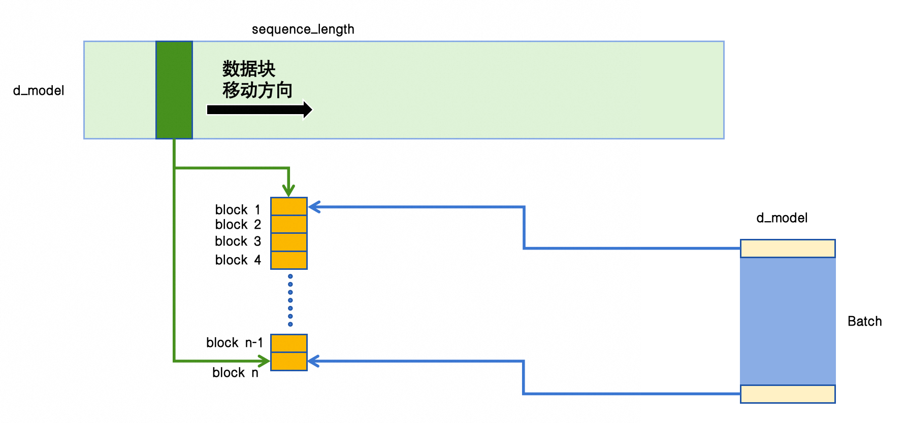

以Q [1000 1 32], KV [1 2048 32]的维度为例，Q-Batch维度上一般会起1000个block，然后每个block会在KV的序列维度遍历，完整读取KV一次

起1000个block就需要读取[1 2048 32]维度的KV各1000次

1. 总访存量: 1000 * 2048 * 32 * 4 * 2 ≈ 512MB 
2. 总计算量: 1000 * 2048 × 32 × 2 ≈ 1.31 × 10^8 FLOPs
3. 计算访存比: ≈ 0.25 FLOPs / Byte

计算访存比相当低下

优化的思路也相当简单，既然每个Q-Batch上的block都需要访问一次完整的KV，那就对Q的Batch维度进行切分，只启动 cdiv(Q-Batch, BLOCK_B) 个block，启动的block数量从千级别下降到几十的量级，每个block还是需要访问一次完整的KV，但是整体的访存量大幅下降。

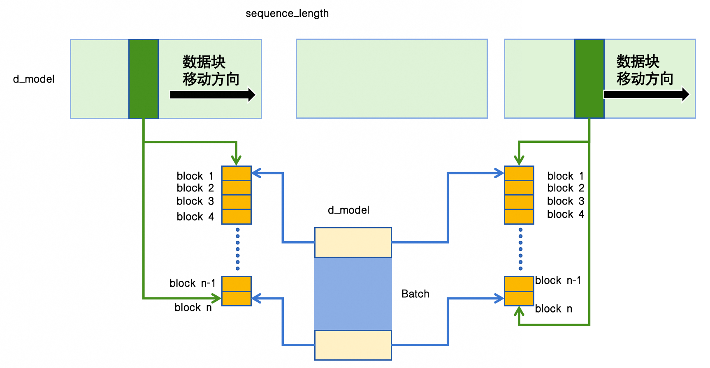

其次，由于KV序列维度太长，导致需要在这个维度上展开循环，那干脆在这个方向也上进行切分，即Split-K的思路，先在第一个kernel上分块计算，然后第二个kernel进行规约。仅考虑第一个kernel, 假设BLOCK_B=16, BLOCK_KV = 128：

1. block数量: tl.cdiv(1000, 16) * tl.cdiv(2048, 128) = 1008
2. 总访存量: 1008 x [2 KB (Q) + 16 KB (K) + 16 KB (V) + 2 KB (Output)] = 35.45 MB
3. 总计算量: 1008 x 2 × BLOCK_B × BLOCK_KV × dim = 1008 x 2 × 16 × 128 × 32 = 132120576 ≈ 1.32 × 10^8
4. 计算访存比: (1.32 × 10^8) / (35.45 × 10^6) ≈ 3.73 FLOPs/Byte

计算访存比有了一个数量级的提升，最终测试下来，Target Attention的性能有了大幅的提升

| 序列长度 | Triton split-k Target-atten (ms) | Triton Flash-attention (ms) | 手写 Attention (ms) | PyTorch SDPA (ms) |
|-----------------|----------------------------------|-----------------------------------|---------------------------|-----------------------------------|
| 2048            | 0.0668                           | 0.2776                            | 0.1764                    | 0.3276                            |
| 4096            | 0.0892                           |                                   | 0.3685                    | 0.6539                            |
| 6144            | 0.0961                           |                                   | 0.5532                    | 0.9878                            |
| 8192            | 0.1236                           |                                   | 0.7551                    | 1.3135                            |
| 10240           | 0.1459                           | 1.6527                            | 0.9578                    | 1.6613                            |


在Target-Attention之外，类似的Split-K思路在一些特定的Q很短，KV很长的生成式场景下也有应用。

在经典的Transfomer Decoder结构中，已生成的token之间做self-attention，已生成的token与Encoder输出结果做cross-attention，在Decoder中交替出现。

搜推场景中，Encoder的输出结果可以看作是对用户行为的一种编码，因此序列维度很长，而已经生成的Token数量一般不会很多，以首猜某个生成式业务为例，最大生成次数低于40次。
这就又面临前面Target-Attention遇到的矛盾，KV序列维度上的并行度不够，同样可以使用split-k的思路进行优化，RTP-Torch对此称之为 Short-Query-Attention optimizer

##### 无mask的紧凑attention计算优化
在一个典型的，没有attn_mask的attention中，假设q k v的序列长度都很短，且维度均很小，例如
1. sequence_length < 64
2. num_head <= 8  && head_dim <= 128

RTP称之为紧凑型(compact)的attention，在经典的Transfomer Decoder结构中，存在self-attn和cross-attn的交替，如果self-attn中不引入casual-mask，即满足我们当前对这种attention的定义

根据这篇ATA [小记: PyTorch里面怎么做维度设计才能让attention跑得更快](https://ata.atatech.org/articles/11020474008), 很容易知道这种简单的attention在scaled_dot_product_attention算子内部，会被dispatch到flash-attention的实现。
通常意义上，我们认为flash-attention的速度是很快的，何况还是那么小的attention计算。体现在TimeLine上也的确如此，kernel的实际执行时间很短。

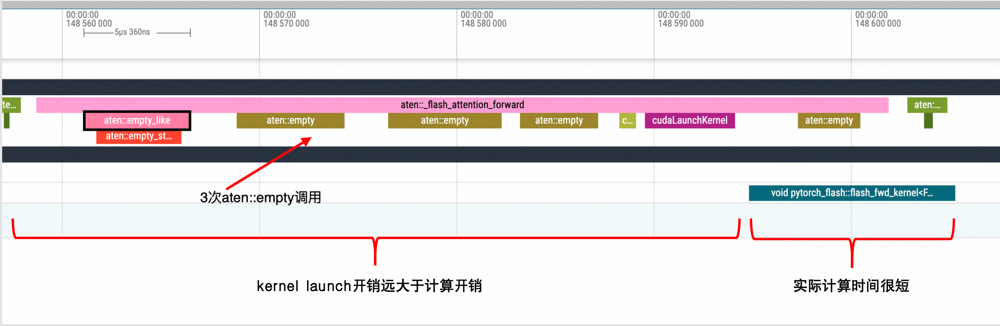

诶? 等等!!! 为什么kernel前面有一大段的空白，远比kernel的计算时间还要长? 时间都去哪了？

1. PyTorch作为一个高层框架，SDPA算子实现具有检查机制，在kernel启动之前会严格检查dtype shape以及查表寻找最优的实际kernel，这在每一步调用的时候都会去做，且没有缓存

2. 熟悉Flash-Attention的各位都知道，在kernel实际执行之前，一定会执行2次显存申请，分别是注意力输出和Log-Sum-Exp值，对应图中的两个aten::empty调用，还有一个empty调用可能是存储随机数状态. 3次empty显存分配在这个场景下会造成比较负面的影响:
    - 与kernel本身极低的计算时间相比，显存分配造成的kernel launch开销相对放大
    - 由于显存分配在算子实现内部，导致不能被AOTInductor codegen过程感知，进一步造成已经申请的显存不能被复用
        * 举一个例子，如果有两次输入输出dtype和shape完全一样的attention调用，第一个kernel申请的显存，完全可以在第二个kernel上复用，但是由于申请操作在算子内部，导致每次执行都需要申请
        * 这在同一个kernel重复次数极多的token by token生成任务上体现更加明显，在一个典型业务场景上，类似的算子出现了380次

说到底，还是这个attention计算实在太小，放大了过程开销。既然知道了原因，我们自己写一个针对性的Flash-Attention Kernel
1. 在Kernel之外显式调用torch.empty，从而在fx graph上留下aten.empty节点，从而被codegen过程感知复用
2. 保存图结构之后，维度和dtype信息已经固定，只需要在编译时检查，运行时无需额外检查

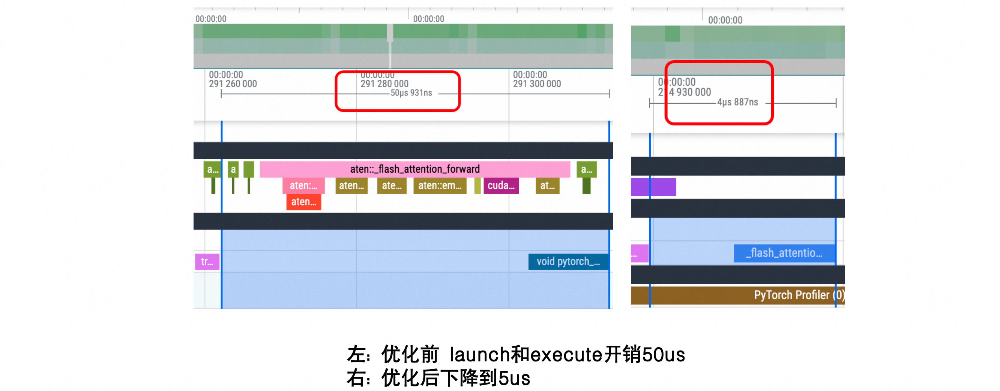

在TimeLine，替换掉原始的SDPA实现之后，kernel launch和execute时间从50us下降到5us，在我们的典型业务上，端到端latency从31ms下降到了27ms，并且几乎无损。RTP-Torch把这种优化抽象为 **无mask的紧凑型attention优化器**（UnmaskedCompactAttnOptimizer）

#### gemv && scatter算子进一步领域特化

PyTorch Inductor会对上层算子进行逐步lowering，逐步得到Inductor IR，最终生成Triton算子替换掉原始的上层算子。
对于一些特殊的算子，比如上文提到的scaled_dot_product_attention，由于本身PyTorch实现已经非常高效，并且lowering规则会非常复杂，例如很难对在线SoftMax计算进行lowering，因此会直接使用PyTorch的原生实现，这个过程在Inductor中称之为fallback

对于gemv计算，在TimeLine上并非是一个Triton调用，而是直接调用了如下的一个cuBLAS函数
```
void gemv2T_kernel_val<int, int, __half, __half, __half, float, 128, 16, 2, 4, false, false, cublasGemvParamsEx<int, cublasGemvTensorStridedBatched<__half const>, cublasGemvTensorStridedBatched<__half const>, cublasGemvTensorStridedBatched<__half>, float> >(cublasGemvParamsEx<int, cublasGemvTensorStridedBatched<__half const>, cublasGemvTensorStridedBatched<__half const>, cublasGemvTensorStridedBatched<__half>, float>, float, float)
```
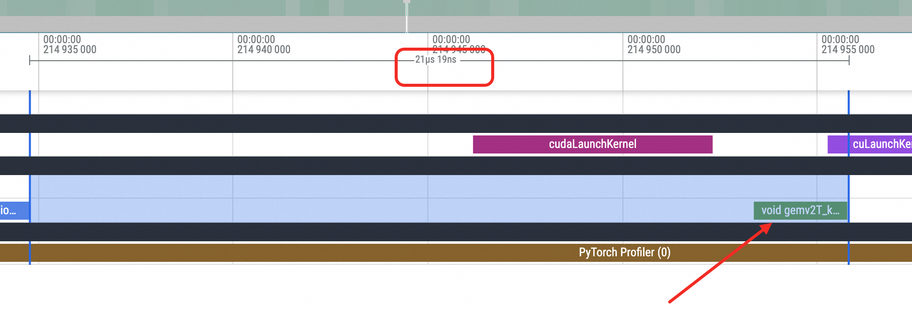

逻辑上gemv操作由于其中一个边的变长不满足16的整数倍(fp16下)，并不能使用TensorCore进行加速，生成的Triton算子相较于cuBLAS实现，在kernel耗时上未必有忧思，直接dispatch到cuBLAS实现上本身是一个合理的选择。可惜在搜推场景中，gemv的维度一般而言都很小，d_in, d_out均小于256，跟前面的小attention的矛盾一样，kernel launch的时间远大于kernel execute的时间，整体耗时达到了21us

另外，由于直接使用了cuBLAS的实现，导致gemv后续的element-wise算子不能与之融合

同样的，一招鲜吃遍天，既然launch开销那么大，那干脆把shape和dtype的检查放在编译期，同时把各种stride和d_in, d_out都定义为编译期常量，同时我们手工把gemv及其之后的ReLU之类的element-wise算子进行一个融合
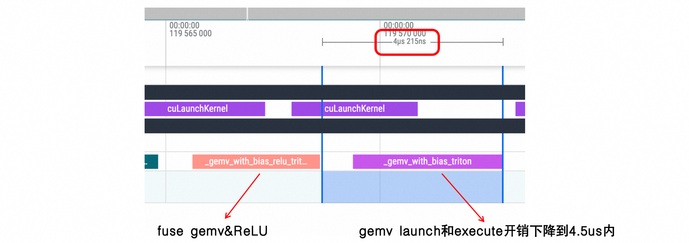

优化后，尽管gemv kernel本身的执行速度并为加快，但是launch及execute耗时之和从21us下降到4.5us以内，在一个典型业务上，端到端latency从27.5ms来到了24.5ms

同理还有torch.ops.aten.scatter.src这个算子，在底层会被dispatch到at::native::_scatter_gather_elementwise_kernel实现上，经过类似的优化手段，launch开销大幅降低
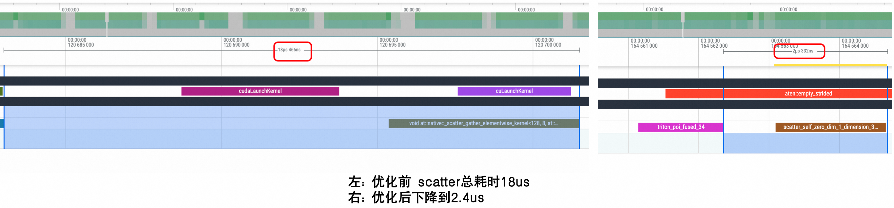

RTP-Torch将这两个优化抽象为gemv_lt512_optimizer和scatter_lt512_optimizer


#### 支持序列长度信息输入的优化编程模板
除了各种特化kernel的优化，某些优化措施需要用户额外输入一些补充信息，需要在用户代码侧进行一定的适配，对此RTP-Torch抽象出了[优化编程模板](https://code.alibaba-inc.com/iTorch/rtp_torch_opt_base_module/tree/master)的概念，由RTP-Torch提供接口定义，用户组装出nn.Module，在导出fx graph的时候会留下标记，经过biz插件的编译过程，将优化kernel编译到最终上线的动态库中。

我们知道对于序列特征，序列长度一般而言是可变的，在大模型推理的过程中，往往将不同batch的不同sequence_length的特征，进行了pack，最终的维度变成了[all_token, d_model]，同时额外有一个表示每个batch边界的offsets，通过这样的操作完全消除了padding，在内存和计算上达到了最优。

在搜推场景里面，并没有像大模型一样高度统一的范式，我们很难消灭实质上的batch，并且在特征处理链路中，也比较难摒弃固定序列长度的概念。反观搜推场景的需求，我们往往对于延迟有着极致的渴望，对于节约显存的需求反而不太明显。那么，我们是否能在op层面传入额外的表示序列长度的信息，然后在底层kernel上对超出有效序列长度的部分直接跳过计算，以此来减少整体的计算强度？

以attention算子为例，一般而言我们会在Q的序列维度上进行切分block，然后每个block在KV的序列长度上进行编译，我们可以额外传入表示Q的有效序列长度Q_lengths，和表示KV的有效序列长度KV_lengths。对于超出Q_lengths的部分，不起block进行计算，对于超出KV_lengths的部分，不进行遍历。
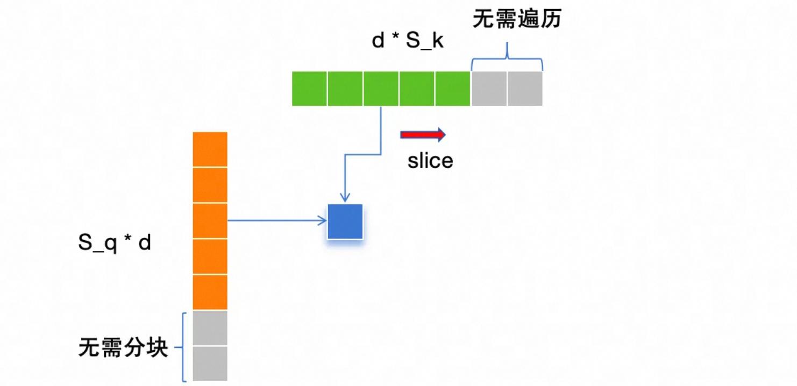

在接口层面，需要额外传入lengths参数，因此需要在用户代码层面进行一定的适配
```Python
torch.ops.rtp_lib.variable_flash_attention(q, k, v, q_lengths, kv_lengths, attn_mask = None, is_causal=True)
```

| 测试条件/method | scaled_dot_product_attention | flash-attention库的可变长实现 | rtp variable_flash_attention | 
|--------------------------|----------------------|------------------------------|--------------------|
|[16 128~1024 4 128] 有效序列长度在128-1024上均匀分布| 318.05ms | 52.21ms | 92.42ms |
|[400, [30-45], 8, 64] 有效序列长度在35-48上均匀分布| 	26.71ms | 24.57ms | 17.67ms |

我们选取了两个测试case, 第一个有效序列长度在128到1024区间内均匀变化，我们的可变长算子弱于flash-attention库中的packing实现，但是远优于PyTorch的SDPA算子；第二个是一个业务上的真实场景，序列长度在30-45区间内均匀变化，我们的可变长算子在三者中表现最优。

除开attention之外，另一个计算开销比较大的是线性投影操作，同样我们也设计了一个支持传入长度参数的addmm算子
```Python
out = torch.ops.rtp_lib.variable_length_addmm(x, weight, bias, lengths)
```
对于有效长度之外的线性投影，op内部直接赋值为0

#### MOE GEMM优化编程模板
MOE需要根据gate网络输出的专家下标，选择对应的专家进行矩阵乘法运算。如何选择对应专家的参数，我们有几种不同的方式

1. 循环遍历每个专家的下标
```Python
results = []
for idx in expert_ids:
    results.append(F.linear(input_x, weights[idx.item()]))
```
但是"遍历tensor进行下标索引"的方式，引入了对实际tensor值的依赖，是一种Pythonic的写法，而非PyTorch自身的语法，是无法被dynamo支持的，换句话说，即便dynamo支持，进行trace的时候，发现当前数据选择了专家3和专家4，"选择专家3和专家4"会被直接固化到fx graph。显然这种方式不能被我们所采用。

2. gather出指定专家的weight进行GEMM
```Python
expert_weights = torch.index_select(weights, 0, expert_idxs)
out = F.linear(input_x, expert_weights)
```
这种方式是能被dynamo所支持的，但是缺点是会有一个中间变量expert_weights，如果专家维度比较大，专家个数比较多，存在一个明显的内存拷贝开销. 例如batch_size=128, 128个专家中选择16个，单个专家的维度是[512, 256], 则expert_weights的大小是
```
128 * 16 * 512 * 256 * sizeof(float32) = 1GB
```
单次推理中，这个量级的显存分配耗时在10ms量级，并且大概率会多次出现，在并发场景有概率造成OOM, 显然是无法被接受的。

为此，RTP引入了一个专门的MOE_GEMM算子
```Python
out = torch.ops.rtp_lib.moe_gemm(x, expert_weights, expert_idxs, num_experts)
# 参数说明:
#     x 输入的tensor, 维度是[batch_size, seq_len, input_dim] torch.float32
#     expert_weights 专家的参数, 维度是[num_experts, input_dim, expert_dim] torch.float32 类型应该是 torch.nn.Parameter
#     expert_idxs 专家的索引, 维度是[batch_size, seq_len, num_selected_expert] torch.int64 (num_selected_expert表示每次选取的专家数量)
#     num_experts 专家的数量
```
避免了显式的gather操作，在算子内部根据索引下标，动态读取对应专家的weights，既维持高性能，同时显存占用也极低。
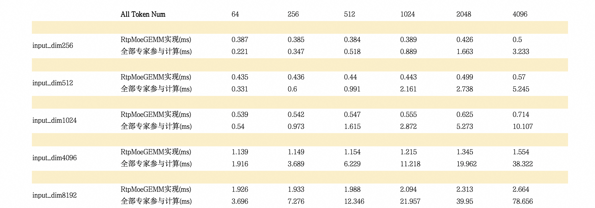

在128个专家选取4个专家，专家维度是[128, input_dim]的情况下，与所有专家都参与计算相比，RtpMoeGEMM的加速比随着token数量和input_dim的增加而更显著.

### 降低框架开销
#### Torch Server 拉远服务
在2024年的ATA上，我们提出要参照TF大规模池化拉远的经验，建设Torch Server，将服务拆分为default和torch两个zone，两者之间依靠RDMA进行通讯，default zone上运行TF实现特征的前处理，torch zone上完全脱离TF环境，完成基于Torch的密集运算。通过这种方式完全解耦TF和Torch，其实也是CPU资源和GPU资源的解耦。

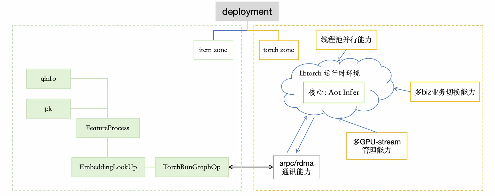

现在Torch Server已经趋于成熟，并且是我们推荐用户部署Torch服务时的首选部署方式。

default zone上需要加载索引，进行特征运算，是一个CPU和RAM重负载的服务；torch zone上仅做密集运算，CPU和RAM资源消耗很小，一般16C 32GB即可，在资源配比上实现了解耦。

以一个最简单的场景为例，受限于物理机的规格，NVIDIA A10所在的机器上很少有超过480GB的内存规格，如果索引量级很大，资源就难以分配。CPU和GPU资源解耦之后，就可以跨越这个限制。

又比如，不同的模型对资源的需求是差异化的，在Torch Server的场景下，对于重特征的服务，可以灵活增加default集群的行数，对于重密集运算的服务也是类似的。解耦实现了更加合理的资源配比和利用率。

在传输量巨大的场景，RTP-Torch也实现了fp16的传输优化，在使用fp16进行密集运算的场景，几乎不带来额外的运算误差，而传输量近乎减半。

#### Tile Optimizer
RTP-Torch使用fx graph来表征前向的计算逻辑，一方面fx graph使用Aten层级的op表示每个Node的计算逻辑，具备一定的可读性。另一方面，图结构为我们进行图编辑提供的条件。

我们知道在训练过程中，user和item的BatchSize是一致的，但是在在线服务的过程中，user只有一个，而item一般有上百上千个。最简单的做法就是将user输入Tile，于item数量对齐。

事实上，这种方式加重了user侧子网络的计算，我们完全可以在与item网络交互之前，使用BatchSize=1进行计算，在与item子网络交互前，插入Tile节点，对齐item的数量。

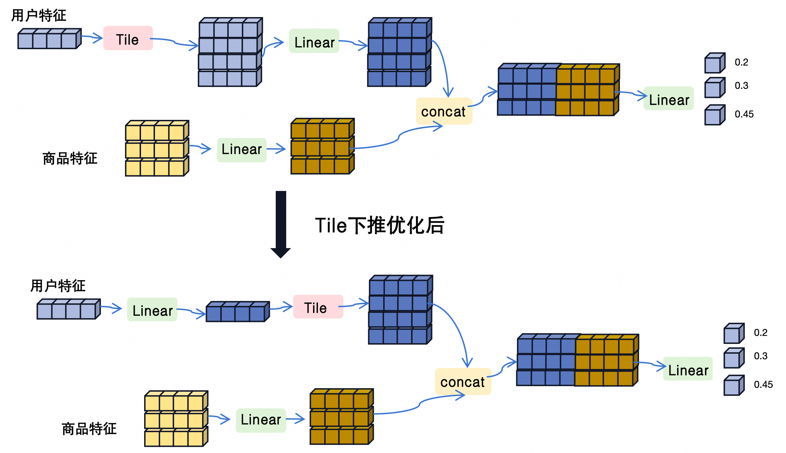

在个性化推荐的网络里面，用户侧的运算往往比item侧要复杂。通过将Tile节点下推的方式，能将user侧网络计算复杂度降低2个数量级。

#### cudagraph

搜推场景下，往往输入特征多，体现在代码层面，forward函数接受的形参往往是数十量级，每个输入的维度一般而言不会很大，并且在前向过程中伴随着诸多mask和concat逻辑，进一步造成了kernel的碎片化。

在Host-Device的执行模型里面，Host并不会等待上一个kernel在Device上运行结束，就会马上launch下一个kernel。如果kernel过分零碎，体现为CPU launch kernel的速度赶不上GPU执行kernel的速度，kernel之间的间隙变大，GPU利用率上不去。

当前RTP-Torch选择的AOTInductor的技术路径，会做零碎算子的融合，会生成中间C++文件，完全摆脱了Python运行依赖，本身kernel launch的效率是相当高的。

但是部分生成式的业务，输入BatchSize恒定为1，单个kernel运算量并不大，加之本身前向过程比较稀碎，仍旧有可能出现kernel之间的间隙过大的情况。为此RTP-Torch引入了cudagraph的能力，无需在CPU端重复提交kernel，大幅降低了kernel之间的bubble:

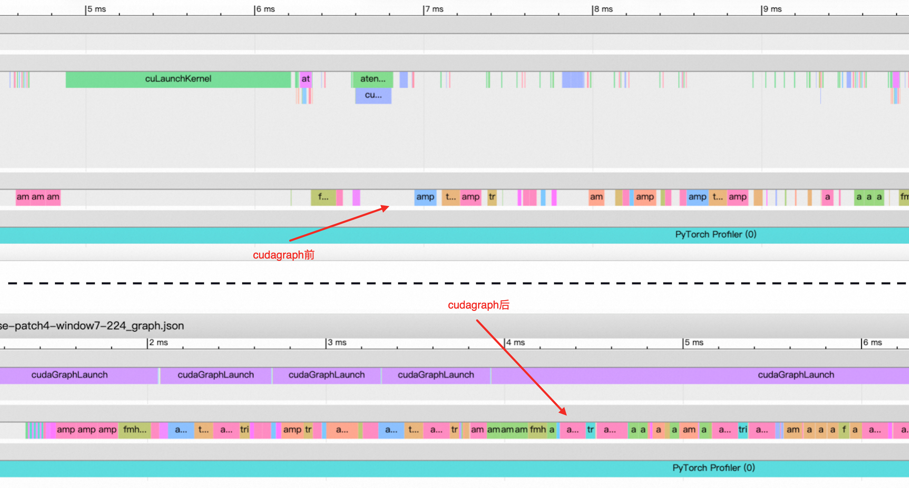


## 追求更易用
高性能和易用并不是天平的两端，但是多数实践中，确实又容易顾此失彼。RTP-Torch在进行性能建设的同时，也在不断根据用户的反馈，提升整体的易用性。

### plugin 构建加速
#### 模型表索引构建加速
模型侧可能存在很多小Embedding，例如user_country, user_ages等，一般维度很小，在[512, 32]以下。

在当前的build service框架中，每一个Embedding是一个单独的index，需要预先分配固定大小的内存，如果小Embedding数量非常多，比如超过上百个，将显著增加builder内存压力，进一步造成资源分配困难和segment的频繁dump，极大拖延构建速度。

为此，RTP将小的Embedding按照一整块Dense Weight的形式，塞入同一张dense_weights的index，即便有更多的小Embedding，也只会共享同一份builder内存资源。

在一个构建速度受限于小Embedding个数的业务上，这样的"合并"措施取得了显著的效果，500GB量级的索引，**构建时间从18h下降到45min以内，builder内存资源从64GB下降到16GB以下**。

<!-- 当前torch_fx类型的模型表需要通过Tre提供的[FsFuse](https://ata.atatech.org/articles/11020197291)功能远程读取DFS上的safetensors分片文件. 由于FsFuse会对每个文件进行prefetch, 如果用户模型的分片数量超过了512片，有概率会造成processor的OOM，同时在构建开始时，需要扫描所有分片文件存储的META信息，逐个打开分片文件耗时也非常高。 -->

当前RTP-Torch只能在有GPU的集群上运行，RTP-Torch以常驻remote集群的方式对O2O(online to offine)功能进行了支持。
一般而言O2O任务没有复杂的特征过程，对CPU资源的要求比较低，因此RTP-Torch支持常驻remote集群为Torch Server拉远集群，可以更灵活的配置资源。

#### biz构建加速
在一个biz构建的过程中，涉及到将torch模型编译为动态库的过程。而biz构建时主要产出一个search图和一个debug图，前者用于在线推理打分，后者用于在离线一致性排查。search图上的torch模型会经历一系列图优化以提高推理性能，而debug图上的torch模型为了避免优化引入的误差，基本和离线模型保持一致。因此，一个biz构建中至少涉及search和debug图上两个torch模型的动态库编译。而且一旦业务中涉及到多个模型，编译数量还会翻倍。

目前，随着模型复杂度的上升，部分模型的编译时间越来越长。如果再叠加上编译数量的增加，可能导致biz构建时间增长到1.5小时以上，一旦线上出现故障，这种构建时间将导致故障难以快速修复。为了加速构建，我们将biz中涉及到的torch模型编译任务进行并行执行，同时添加较大粒度的编译文件cache和较小粒度的triton算子cache，以压缩编译时间。
### TimeLine
为了捕获 PyTorch模型在对单条query进行在线推理时内部的性能事件，以便于性能分析和调优，我们将Torch Profiler集成到SuezOps平台Timeline工具中进行可视化展示。该工具适配Nvidia/ROCM/PPU等多种硬件设备，指定单条query，对于在线打分中涉及到的所有torch模型，分别返回各自对应的gpu算子执行时间。

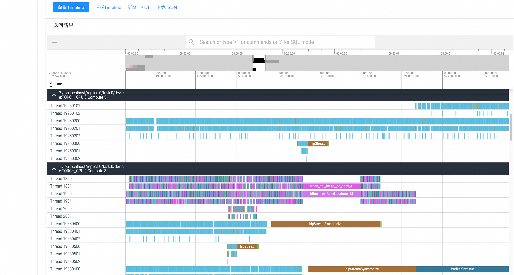

### 多模型推理
部分业务存在依赖前序链路打分结果的现象，以生成式排序这类业务为例，其模型结构普遍为Encdoer-Decoder形式，其中Encoder部分只依赖用户信息qinfo，而decoder部分依赖精排结果作为输入。

但是这类生成式业务因为按序生成的方式，RT较高，将其完全部署在精排后链路容易产生超时，为了隐藏其延迟，可以将其中不依赖精排结果的Encoder部分提前触发计算，将结果缓存下来，待deocder计算触发后进行消费。不同于RTP-TF中使用完整计算图进行模型推理，RTP-Torch将整个torch模型编译为一个动态库进行加载，我们无法在so中触发一部分计算提前进行。因此，需要将原始模型导出为Encoder和Decoder两个模型。目前，RTP-Torch已支持在单个业务中加载任意数量的不同模型进行推理。

### 在离线一致性验证
RTP与AOP训练平台共建了在离线一致性验证的方案，与XDL平台的验证方案也在同步开发中. 

AOP在tf模型在离线一致性对比的基础上，也增加对torch模型的对比功能支持。模型打分在离线对比功能能够方便的帮用户检测在线和离线模型的一致性。主要体现在: 
1. 为在线和离线模型生成同样的样本，获取模型在相同样本下打分的diff率。
2. 支持用户对一条请求的不同节点进行打分，排查可能存在问题的节点。
3. 增加了归因分析，对于不一致的对比结果从Fg/Embedding的角度进行不一致原因排查。

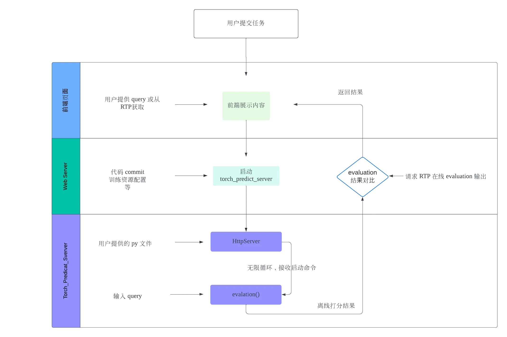

1. 用户从 aop3 网页前端提交打分任务。
2. AOP 后端收到请求后，通过 torchrun 启动 mllib_pytorch/server/predict_server.py，这是一个 HttpServer 任务，用于接收 RTP 侧的推理输入，收到输入后，启动离线推理任务，返回推理结果。
3. 对比离线和在线推理结果，将结果返回前端页面。
4. 除此之外，mllib_pytorch/server/predict_server.py 还提供了2个接口，一个用于返回 server 状态，另一个用于返回 model 的 forward 输出节点的名称。

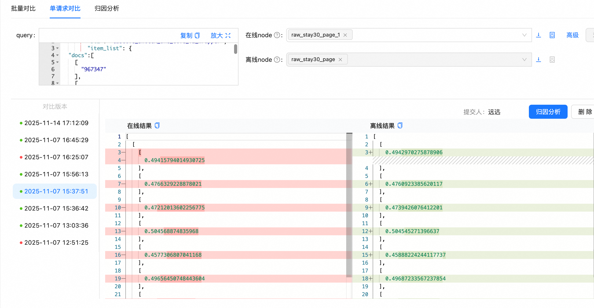

## 结尾
2025年，RTP在高性能和易用性上不断推进RTP-Torch的建设，未来我们也会持之以恒听取用户建议，朝着建设更加搜推的引擎框架而努力。