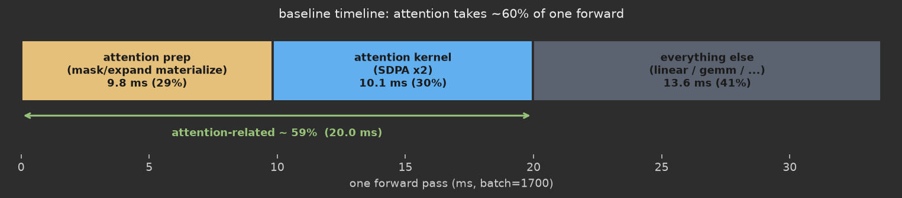
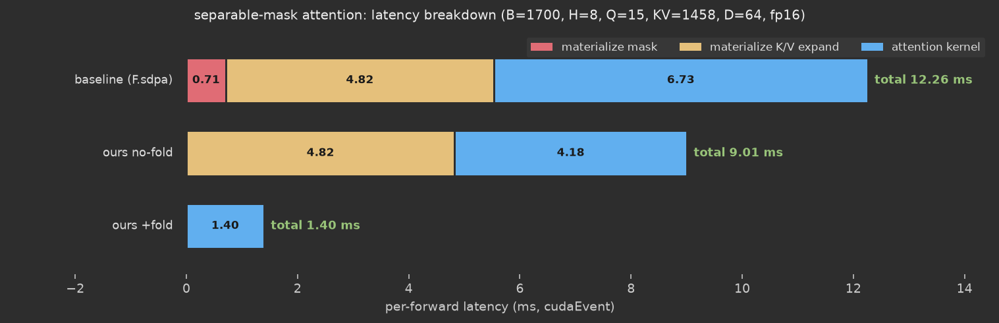
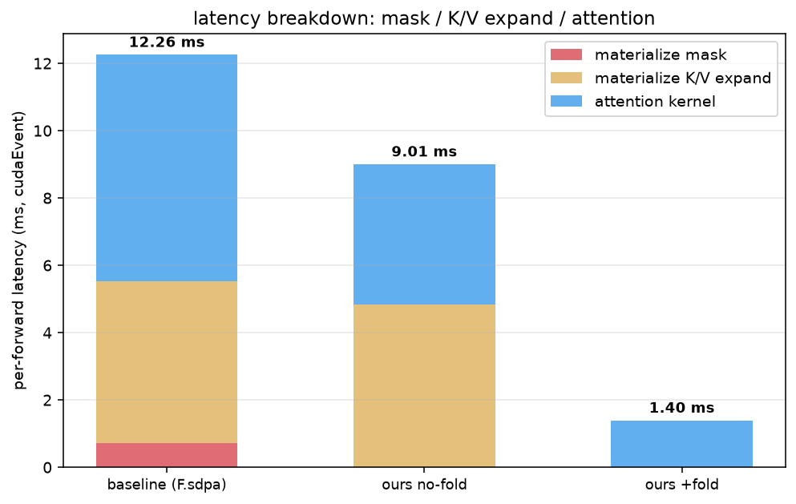

# SDPA 的通用性留下的缝隙: 从数据特点里抠出更快的 Attention

最近接手一个性能稀烂的推理服务, 老规矩, 先抓个 timeline 看大头在哪. 一眼就看到 attention 那一坨占了差不多一次前向的 60%:



attention kernel 本身占 30%, 再加上它前面那堆给 K/V、mask 做 layer_norm / expand / pad 的预处理, 合起来快到 60% 了. 这块不啃, 别的都是零头.

顺着 fx graph 把这几个 attention 节点扒出来看形状(动态 batch, 取晚高峰 `batch=1700`). 这是一个搜推里很常见的 target attention: 少量 target item 去 attend 一段较长的上下文:

```
q     : (1700, 8, 15, 64)     # target, q 序列只有 15
k / v : (1,    8, 1458, 64)   # 上下文, kv=1458, 逻辑上跨 batch 共享
mask  : (1700, 8, 15, 1458)   # 加性 mask
out   : (1700, 8, 15, 64)
```

先给它估个水位, 算个 MFU. 一次 sdpa 的计算量大约是 `4 * B*H*Q*KV*D ≈ 76 GFLOP`(QK 和 PV 两个 matmul, 各算一次乘一次加). 而线上这个 kernel 一次要 ~5ms, 折下来只有 `76e9 / 5e-3 ≈ 15 TFLOP/s`. Pro 5000 的 fp16 tensorcore 峰值是 274 TFLOPS, 也就是 **MFU 只有 5% 左右**. 这么低, 肯定有得挖.

那空间到底在哪? 盯着这个 attention 的数据特点看, 有两处"通用 SDPA 接不住"的缝隙, 恰好是手写 kernel 的机会:

- **mask 是可分离的**(下面会看到它其实是两个小张量的外积), 但 `F.scaled_dot_product_attention` 只能收一张物化好的完整 mask, 没法把两个因子分开传进去 —— 于是那张又大又冗余的 mask 每次都得物化、读一遍.
- **SDPA 不会 lower 成 Triton**, 走的是固定实现. 而它上游"跨 batch 共享"的 K/V, 为了喂进这个不透明算子, 被 `expand` + 物化成了每个 batch 一份的独立拷贝.

这两条都是挺具体的数据特点(甚至可以说是 corner case), 通用算子照顾不到, 但手写 kernel 可以. 下面按我实际排查的顺序来: 先拿 mask 开刀, 写了自定义 kernel 却发现下降不及预期, 再回头揪出 expand 物化, 最后两处一起解决.

版本信息:

- GPU: NVIDIA RTX PRO 5000 72GB (Blackwell, SM120), fp16 tensorcore 峰值 274 TFLOPS
- PyTorch: 2.12.0a0, Triton: 3.7.0, 精度 fp16
- 计时: `torch.cuda.Event` + `synchronize`, warmup 后取两次 event 间隔的平均

## 背景: 这个 attention 的图长什么样

把上面那段在导出的 fx graph 里摊开(精简掉无关的 to.dtype):

```python
# K: layer_norm 后 cast, 再 expand 到 batch
to_57     = torch.ops.aten.to.dtype(layer_norm_57, torch.bfloat16)        # (1, 8, 1458, 64)
expand_51 = torch.ops.aten.expand.default(to_57, [sym_batch, -1, -1, -1]) # (s, 8, 1458, 64)
# V: 同理
to_58     = torch.ops.aten.to.dtype(transpose_43, torch.bfloat16)         # (1, 8, 1458, 64)
expand_52 = torch.ops.aten.expand.default(to_58, [sym_batch, -1, -1, -1]) # (s, 8, 1458, 64)
# mask: 一个可学习 bias 乘上一个 padding mask
mul_121   = torch.ops.aten.mul.Tensor(slice_113, unsqueeze_65)            # (s, 8, 15, 1458)
to_59     = torch.ops.aten.to.dtype(mul_121, torch.bfloat16)             # (s, 8, 15, 1458)
# sdpa
sdpa = torch.ops.aten.scaled_dot_product_attention.default(to_56, expand_51, expand_52, to_59)
```

这里有两个关键观察, 后面都会用到:

1. **mask 是"可分离"的**. `mul_121 = slice_113 * unsqueeze_65`, 其中:
   - `slice_113` 形状 `(1, 8, 15, 1)` — 来自一个可学习参数, 只随 head/query 变;
   - `unsqueeze_65` 形状 `(s, 1, 1, 1458)` — 一个 padding mask, 只随 batch/kv 变.

   也就是 `mask[b,h,i,j] = gamma[h,i] * pad[b,j]`, 是一个秩 1 的外积. 但它最后被物化成了完整的 `(1700, 8, 15, 1458)`.

2. **K/V 是 `expand` 出来的**. 上下文对每个 batch 其实是同一份, 逻辑上是 `(1, 8, 1458, 64)`, 靠 `expand` 广播到 `(1700, 8, 1458, 64)`.

## 第一个怀疑: mask 被物化, memory bound

先算一笔账. 那张 `(1700, 8, 15, 1458)` 的 bf16 mask, 光是它自己就是 `1700*8*15*1458*2 ≈ 595 MB`. 每次前向都要把这 595MB 从 HBM 读一遍(还得先写一遍). 而 attention 本身的计算量并不大(q 只有 15). 直觉上, 这就是个访存 bound, 大头花在读这张又大又冗余的 mask 上 — 毕竟它本质上只是 `(batch, 1458)` 这么点信息, 却被摊平成了 8×15 倍.

思路很自然: **别物化这张 mask, 在 kernel 里现算**. 反正它是 `gamma[h,i] * pad[b,j]`, 两个因子都很小(gamma 才 8×15=120 个数, pad 每个样本一条 1458 的向量), 完全可以进 kernel 里 on-the-fly 乘出来.

## 动手: 把 gamma * pad 塞进 flash-attention kernel

在标准 flash-attention 的 kv 循环里, 每次迭代加载一块 K/V 做 QK^T. 我在这基础上, **每次迭代顺手把 gamma 和 pad 的对应片段拿出来, 外积成这一块的 bias 加到分数上**, 而不是去读物化好的 mask tile:

```python
# gamma 向量在循环外一次性载入: (BLOCK_Q,), 只依赖 head/query
gamma_vec = tl.load(gamma_ptr + bid*sgb + hid*sgh + offs_q*sgs,
                    mask=q_valid, other=0.0).to(tl.float32)

for start_kv in range(0, kv_seq_len, BLOCK_KV_S):
    kv_valid = start_kv + offs_kv < kv_seq_len
    valid = q_valid[:, None] & kv_valid[None, :]
    k = tl.load(k_bp, boundary_check=(1,)).to(tl.float16)
    v = tl.load(v_bp, boundary_check=(0,)).to(tl.float16)

    # pad 向量每次迭代载入当前 kv 块: (BLOCK_KV,), 只依赖 batch/kv
    pad_vec = tl.load(pad_ptr + bid*spb + (start_kv + offs_kv)*sps,
                      mask=kv_valid, other=0.0).to(tl.float32)

    qk = tl.dot(q, k)
    # 可分离 mask 现算: bias[i,j] = gamma[i] * pad[j], 不读物化的 mask
    bias = gamma_vec[:, None] * pad_vec[None, :]
    bias = tl.minimum(tl.maximum(bias, -1.0e4), 1.0e4)
    qk = qk + bias * 1.44269504
    qk = tl.where(valid, qk, -float("inf"))

    m_new = tl.maximum(m_i, tl.max(qk, axis=1))
    alpha = tl.math.exp2(m_i - tl.where(m_new == -float("inf"), 0.0, m_new))
    p = tl.math.exp2(qk - m_new[:, None])
    p = tl.where(valid, p, 0.0)   # valid 之外必须置零, 否则被 mask 的位置会漏进分母 l_i
    acc *= alpha[:, None]
    acc += tl.dot(p.to(tl.float16), v.to(tl.float16))
    l_i = l_i * alpha + tl.sum(p, axis=1)
    m_i = m_new
    ...
```

两个容易踩的点:

- **每次 kv 循环都要重新载 pad_vec** (它随 kv 位置变), 而 gamma_vec 只依赖 query, 循环外载一次就够;
- **`p = tl.where(valid, p, 0.0)` 这行不能省**. `exp2(-inf) `理论上是 0, 但边界那几列(padding 到 BLOCK 的部分)如果不显式置零, 会把脏值累加进分母 `l_i`, softmax 就错了.

## 结果: 下降不及预期

为了能逐段拆开、也方便复现, 我拿生产 shape(B=1700, H=8, Q=15, KV=1458, D=64)单独搭了个 microbench, 用 cudaEvent 把 **mask 物化 / K/V expand 物化 / attention** 三段分别计时(下面的数就是这么来的; 注意隔离出来的 `F.sdpa` 会比线上那个 fmha backend 慢一点, ~6.7ms vs 线上 ~5ms, 但趋势一样).

把 mask 物化干掉了, 按理该有明显收益. 实测(就是那张图的前两行):

| 变体 | mask 物化 | K/V expand 物化 | attention | 合计 |
|---|---|---|---|---|
| baseline (F.sdpa) | 0.71 | 4.82 | 6.73 | **12.26 ms** |
| 自定义 kernel(未折叠) | 0 | 4.82 | 4.18 | **9.01 ms** |

嗯? 合计从 12.26 只降到 9.01, 才 -27%. attention kernel 从 6.73 降到 4.18, 也没到我期待的量级. 说好的访存 bound 呢, 怎么砍掉 mask 之后只挪动了这么点?

盯着这张表看, 问题很明显: 中间那一列 **`K/V expand 物化 = 4.82ms` 纹丝没动**, 而且它比我优化的 attention 本身还贵. 我一直在盯着 mask, 结果真正的大头在旁边。

## 回头查上游: expand 被物化了

去看 AOTInductor 生成的 wrapper.cpp, 直接看我这个自定义算子拿到的 K/V 到底是什么. 一看就明白了:

```cpp
// 折叠前: K/V 被分配成完整的 (s, 8, 1458, 64), batch stride = 746496 (不是 0!)
int_array_1028[] = {s10, 8, 1458, 64};
int_array_1029[] = {746496, 93312, 64, 1};
aoti_torch_empty_strided(4, {s10,8,1458,64}, ..., &buf1195);   // 真分配了一整块
call_..._expand_...(..., buf1195, ...);                        // 写满它

call__sep_mask_attn(buf1194/*q*/, buf1195/*k*/, buf1196/*v*/, ...,
                    7680, 746496, 746496, ...);   // q_b, k_b, v_b
```

K/V 的 batch stride 是 `746496`, 不是 0 — 说明 inductor **给每个 batch 都造了一份独立的物理拷贝**, 把逻辑上"跨 batch 共享"的 `(1,8,1458,64)` 摊成了实打实的 `(1700,8,1458,64)`. K + V 加起来 `1700*8*1458*64*2*2 ≈ 5 GB`, 每次前向先写这 5GB, 再让 attention kernel 读回来.

为什么会这样? 因为我的自定义算子对 inductor 来说是个黑盒, 它没法把一个 stride=0 的广播 view 传进一个不透明 op, 只能先老老实实 realize 成一块连续张量. 于是 `expand` 就被物化了.

这也解释了**为什么 attention kernel 本身也没快到位**: 每个 CTA 处理一个 (batch, head), 从各自独立的 DRAM 区域读 K/V, 13600 个 CTA 读的是 13600 份互不相同的数据, L2 完全没法复用 — kernel 被这 5GB 的 K/V 回读拖成了访存 bound, 跟 mask 没啥关系.

## 再度解决: 把 expand 前的张量直接纳入 op

既然根因是"inductor 为了喂黑盒算子而物化了 expand", 那就别让它有机会物化: 在做图匹配 / 替换的时候, **发现 K/V 是 batch 维的 `expand`, 就直接把 expand 之前的 `(1,8,1458,64)` 接进自定义 op**, 让 inductor 根本不需要 realize 那块大的.

匹配侧, unwrap 掉 batch-expand:

```python
def _maybe_unwrap_batch_expand(self, node):
    # K/V 常常是 expand((1,H,KV,D) -> (B,H,KV,D)); 把 expand 前的接进来
    if not (isinstance(node, fx.Node) and node.op == "call_function"
            and node.target == torch.ops.aten.expand.default):
        return node
    src = node.args[0]
    pre, post = src.meta["val"].shape, node.meta["val"].shape
    # 仅当 expand 只作用在 batch 维 (dim0: 1 -> B, 其余不变) 时折叠
    if pre[0] == 1 and all(pre[i] == post[i] for i in (1, 2, 3)):
        return src
    return node
```

kernel 的 host wrapper 里, 对 K/V 也做 `size==1 -> stride=0` 的置零(折叠后 K/V 的 batch 维 size=1, 必须把 batch stride 置 0, 否则 `bid * stride` 会越界):

```python
def sz0(t):
    s = list(t.stride())
    for i in range(4):
        if t.size(i) == 1:
            s[i] = 0
    return s
sk, sv = sz0(k), sz0(v)   # batch stride 变成 0, 全 batch 共享同一份
```

这样 grid 仍然按 q 的 batch 起 13600 个 CTA, 但每个 CTA 读 K/V 时 `bid * 0 = 0`, 读的都是同一份地址.

改完再看 wrapper.cpp, K/V 的分配从 `(s,8,1458,64)` 变成了 `(1,8,1458,64)`, 传进 kernel 的 batch stride 也变成了 0:

```cpp
int_array_1067[] = {1L, 8L, 1458L, 64L};                 // ~1.9MB, 不再是 2.5GB
call__sep_mask_attn(buf1194, buf1195, buf1196, ...,
                    7680, 0, 0, ...);   // k_b = 0, v_b = 0
```

## 结果: 大幅下降, 连 attention 自己都快了 3 倍



| 变体 | mask 物化 | K/V expand 物化 | attention | 合计 |
|---|---|---|---|---|
| baseline (F.sdpa) | 0.71 | 4.82 | 6.73 | **12.26 ms** |
| 自定义 kernel(未折叠) | 0 | 4.82 | 4.18 | **9.01 ms** |
| 自定义 kernel(折叠 expand) | 0 | **0** | **1.40** | **1.40 ms** |



两件事一起发生了:

1. **上游那个物化 expand 的 kernel 直接没了**(4.82 -> 0). expand 物化本身就是实打实的 5GB 读写, 这块凭空省掉.
2. **attention kernel 自己从 4.18 掉到 1.40**, 快了 3 倍. 这个才是最反直觉的.

这块业务模型端到端的整图 GPU busy time 也从 ~336ms 掉到 ~167ms, 差不多砍半, 跟这里的微基准对得上.

## 为什么 attention 自己也快了 3 倍

kernel 代码一个字没改, FLOPs 也完全一样, 变快纯粹是**访存模式从"打满 DRAM"变成了"命中 L2"**.

kernel 里每个 CTA 读 K 的地址是 `k_ptr + bid * stride_k_b + hid * stride_k_h`:

- **折叠前 `stride_k_b = 746496`**: 每个 batch 落在不同的物理地址. 13600 个 CTA = 13600 份互不相同的 K/V, 总计 5GB **全得从 DRAM 读**, L2 没法复用. `5GB / ~1.3TB/s ≈ 3.8ms`, 正好对上那 4.18ms — kernel 是 DRAM 带宽 bound.
- **折叠后 `stride_k_b = 0`**: `bid * 0 = 0`, 同一个 head 的所有 batch 读的是**完全相同的地址**. 真实数据只有 8 份 K + 8 份 V, 一共 ~3MB, 第一个 CTA 拉进 L2 之后其余全是 L2 命中. DRAM 流量从 5GB 掉到 ~3MB, kernel 立刻不再受显存带宽约束.

一句话: 物化 expand 相当于把"逻辑上共享、本该被 L2 复用"的 K/V, 变成了"每个 batch 一份、必须逐份从 DRAM 读"的独立拷贝. 折叠掉之后, `stride=0` 才让硬件 L2 真正吃到了跨 batch 的复用.

## 总结

1. **别只盯着自己怀疑的那个点**. 我一开始笃定是 mask 物化, 干掉之后只降了 27%, 才发现旁边的 expand 物化(4.82ms)比 mask(0.71ms)大一个量级. 分段计时(mask / expand / attention 各测一段)是快速定位的关键.
2. **自定义算子会让 inductor 物化它的输入**. 一个 stride=0 的 `expand`/广播 view, 一旦喂给不透明的自定义 op, 就会被 realize 成完整的连续张量. 如果这个维度很大(这里是 batch=1700), 代价就是几个 GB 的额外读写.
3. **对策是把 expand 前的张量直接接进 op**, 让 kernel 内部用 `stride=0` 去读共享数据, 而不是让上游先物化. 匹配时 unwrap 掉 batch-expand, wrapper 里把 size==1 的维 stride 置 0.
4. **物化不只贵在那一下的读写, 还会破坏 L2 复用**. 同一份数据被复制成 N 份独立拷贝后, 消费它的 kernel 也会从"L2 命中"退化成"打满 DRAM". 所以折叠 expand 是一石二鸟: 省掉物化 kernel + 让 attention 自己也回到 L2。
5. 数字: 这段 attention 从 baseline 的 12.26ms 降到 1.40ms, 其中 attention kernel 本身 6.73 -> 1.40ms. 数值上 fold 版和 F.sdpa 的最大误差 0.0039 (fp16), 在容忍范围内.

最后回到开头那个 MFU. attention kernel 从 ~5ms 干到 1.40ms, MFU 从 ~5% 提到了 ~20%(`76e9 / 1.4e-3 ≈ 54 TFLOP/s`, 对 274 峰值) —— 访存 bound 基本解掉了, 但离峰值还差得远. 剩下的坑很清楚: q 只有 15, tensor core 的 M 维只用到 16, 算力天生喂不饱. 下一步可以做 batch grouping —— 反正 K/V 跨 batch 共享, 把多个 batch 的 q 摞起来做一次大 matmul, 把 M 撑到 64 以上. 不过那是从"访存 bound"迈到"算力 bound"之后的事了, 有机会再写一篇.
