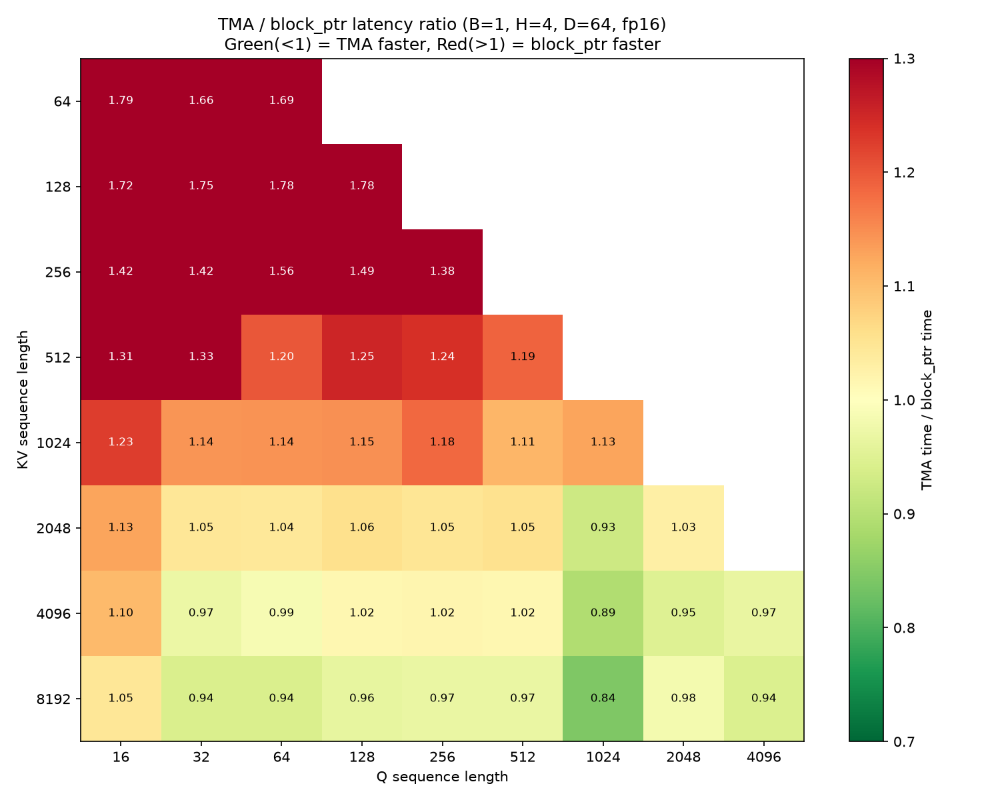
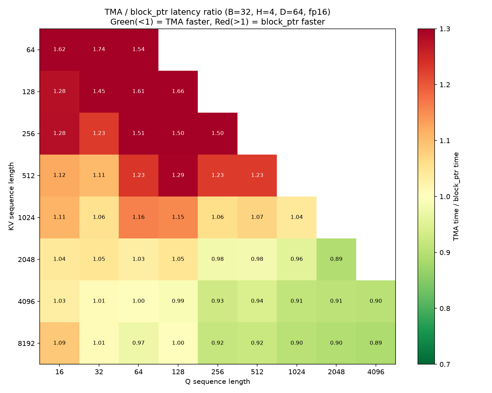
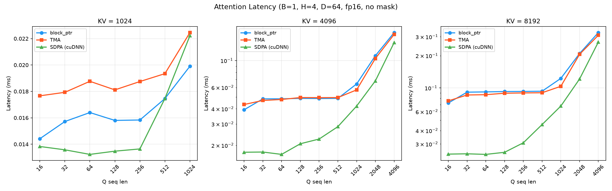
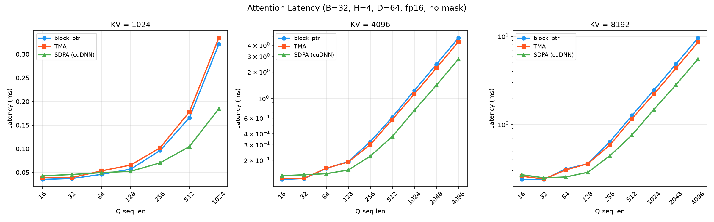

# SM120 上的 Triton TMA 入门: 从 Attention 说起

最近在 Blackwell 卡上折腾 Triton kernel 优化, 顺手把 NVIDIA 在 Hopper 架构上引入的 TMA (Tensor Memory Accelerator) 玩了一遍. 这个东西在 Triton 3.7 里已经比较成熟了, API 叫 `tl.make_tensor_descriptor`. 本文用一个最经典的 FlashAttention kernel 做例子, 看看 TMA 怎么用、汇编层面到底有什么不同、以及性能上到底有没有赚.

版本信息:
- GPU: NVIDIA RTX PRO 5000 72GB (Blackwell, SM120, Compute Capability 12.0)
- PyTorch: 2.12.0a0+git0d62256
- Triton: 3.7.0
- 精度: fp16

## 背景: make_block_ptr 和 make_tensor_descriptor

在 Triton 里写 structured memory access 历史上有两套 API:

1. `tl.make_block_ptr` — Triton 2.x 时代引入, 用 `tl.load` + `tl.advance` 遍历数据. 底层生成的是标准的 `LDG`/`STG` 指令, 走 L1/L2 cache.

2. `tl.make_tensor_descriptor` — Triton 3.x 引入, 在 cc>=9.0 的 GPU 上使用 TMA 硬件. TMA 是 Hopper 架构开始有的一个专用硬件单元, 可以把一块连续(或有规律 stride 的)全局内存直接搬到 shared memory, 不需要每个线程自己算地址、发 load 指令.

Triton 3.7 已经把 `make_block_ptr` 标记为 deprecated 了. 不过这不代表性能变化 — 只是 API 层面统一方向. `make_block_ptr` 底层依然不走 TMA.

## 从 Attention 的角度看怎么用

一个标准的 FlashAttention kernel 的内循环大概长这样: 在 KV 序列维度上循环, 每次迭代加载一块 K 和 V, 做 QK^T 矩阵乘, 然后 online softmax 累加.

### block_ptr 写法 (传统)

```python
# 创建 block pointer (注意 K 做了转置: shape 和 strides 是翻转的)
q_bp = tl.make_block_ptr(base, (q_seq, d_model), (stride_s, stride_d),
                          (qid * BLOCK_Q, 0), (BLOCK_Q, d_model), order=(1, 0))
k_bp = tl.make_block_ptr(base, (d_model, kv_seq), (stride_d, stride_s),
                          (0, 0), (d_model, BLOCK_KV), order=(0, 1))
v_bp = tl.make_block_ptr(base, (kv_seq, d_model), (stride_s, stride_d),
                          (0, 0), (BLOCK_KV, d_model), order=(1, 0))

q = tl.load(q_bp, boundary_check=(0,))

for _ in range(0, kv_seq, BLOCK_KV):
    k = tl.load(k_bp, boundary_check=(1,))    # 已经是转置形状
    v = tl.load(v_bp, boundary_check=(0,))
    qk = tl.dot(q, k)                          # Q @ K^T
    # ... online softmax ...
    k_bp = tl.advance(k_bp, (0, BLOCK_KV))     # 移动到下一块 KV
    v_bp = tl.advance(v_bp, (BLOCK_KV, 0))
```

特点: K 的转置在创建 block_ptr 时通过翻转 shape/strides 来完成, `order=(0,1)` 告诉 Triton 按列优先访问. 用 `tl.advance` 在循环中推进指针.

### TMA 写法 (make_tensor_descriptor)

```python
# 创建 tensor descriptor (必须按物理布局描述, 最后一维 stride 必须是 1)
q_desc = tl.make_tensor_descriptor(base, [q_seq, d_model], [stride_s, stride_d],
                                    [BLOCK_Q, d_model])
k_desc = tl.make_tensor_descriptor(base, [kv_seq, d_model], [stride_s, stride_d],
                                    [BLOCK_KV, d_model])
v_desc = tl.make_tensor_descriptor(base, [kv_seq, d_model], [stride_s, stride_d],
                                    [BLOCK_KV, d_model])

q = q_desc.load([qid * BLOCK_Q, 0])

for start_kv in range(0, kv_seq, BLOCK_KV):
    k = k_desc.load([start_kv, 0])              # 按物理布局加载
    v = v_desc.load([start_kv, 0])
    qk = tl.dot(q, k.trans(1, 0))              # 显式转置 K
    # ... online softmax ...
    # 不需要 advance, 下次迭代用 start_kv + BLOCK_KV 直接索引
```

区别一眼就能看出来:
1. K 的转置不再藏在 descriptor 创建里, 而是 load 之后显式 `.trans(1, 0)`.
2. 循环推进不再需要 `tl.advance`, 直接用循环变量做 offset.
3. `make_tensor_descriptor` 要求最后一维 stride 必须是 1, 外层 stride 必须是 16 字节对齐.

还有一个容易忽略的点: 使用 `make_tensor_descriptor` 之前, 需要注册一个 allocator:

```python
triton.set_allocator(lambda size, align, stream: torch.empty((size,), device="cuda", dtype=torch.int8))
```

这个 allocator 是给 TMA descriptor (一个 128 字节的 `CUtensorMap` 结构体) 分配 device memory 用的. 不注册的话会直接报错.

## 汇编层面的区别

口说无凭, 直接看 SASS (GPU 汇编) 验证.

编译两个最简单的 kernel: 一个用 `make_block_ptr`, 一个用 `make_tensor_descriptor`, 功能都是加载两个 2D tensor 相加后写回. 然后用 `cuobjdump -sass` 反汇编生成的 cubin.

### block_ptr 版本的 SASS

```
global_scratch_size: 0 (无 TMA descriptor 分配)
TMA 相关指令: 无
```

生成的是标准的 `LDG`(global load) 和 `STG`(global store) 指令. 这跟手写 `tl.load` 的效果一样, 每个线程独立计算地址并发起访存请求.

### TMA 版本的 SASS

```
global_scratch_size: 384 (分配了 device-side TMA descriptor 内存)

TMA 专用指令:
  UTMACCTL.IV [UR8]   // TMA Cache Control - Invalidate descriptor
  UTMACMDFLUSH        // 刷新 TMA 命令队列, 确保 descriptor 写入完成
```

出现了 `UTMACCTL` 和 `UTMACMDFLUSH` 这两条 Blackwell 特有的 TMA 指令. `UTMACCTL.IV` 负责管理 descriptor 在硬件缓存中的状态, `UTMACMDFLUSH` 确保之前写入 descriptor 的操作已经落到 global memory.

`global_scratch_size = 384` 说明 Triton 编译器在 device memory 上预留了一块空间来存放 TMA descriptor. 每个 `CUtensorMap` 结构体是 128 字节, 需要 128 字节对齐.

所以结论很清楚: `make_tensor_descriptor` 确实走了 TMA 硬件; `make_block_ptr` 走的是传统的 cache 路径.

## 性能对比

终于到正题了. 固定 `num_heads=4, d_model=64`, 分别用 `batch=1`(GPU 欠载, 能看出单 CTA 效率差异) 和 `batch=32`(GPU 满载, 接近实际生产场景), 变化 Q 和 KV 的序列长度从 16 到 8192, 看三方的耗时对比.

### 热力图: TMA 耗时 / block_ptr 耗时

**Batch = 1:**



**Batch = 32:**



图中绿色表示 TMA 更快, 红色表示 block_ptr 更快. 两张图都能看到同一个趋势:

- 左上角(短 KV + 短 Q)一片红, block_ptr 快 30-80%
- 右下角(长 KV + 长 Q)开始转绿, TMA 胜出
- **交叉线大约在 kv_seq=4096 附近** — 超过这条线 TMA 开始赢

B=1 时 TMA 的优势更明显一些(最大 16%), 因为 GPU 不满载时 pipeline 效率差异更容易暴露.

### 绝对耗时对比

**Batch = 1:**



**Batch = 32:**



几个直观的观察:

1. **SDPA (cuDNN)** 在无 mask 场景全面碾压我们的手写 kernel. 无论 TMA 还是 block_ptr, 都打不过. 人家毕竟是 NVIDIA 自家调了几年的库, 各种 tile 和 pipeline 策略都是针对具体硬件手工调的.
2. KV=1024 时, block_ptr 和 TMA 基本重叠(TMA 稍慢一点点).
3. **KV=4096 和 KV=8192 时, TMA 明确快于 block_ptr**, B=1 最大快 16%, B=32 快 8-11%.
4. 但即使 TMA 快于 block_ptr, 仍然追不上 SDPA — 差距在 30-50%.

## 为什么 TMA 在短序列 Attention 里反而慢, 长序列才有用

从数据里能看到一个很清晰的分界:
- kv_seq <= 2048: block_ptr 赢 (TMA 慢 5-80%)
- kv_seq >= 4096: TMA 赢 (快 6-16%)

原因其实就一条: **TMA 的 descriptor 创建有固定开销, 需要足够长的循环来摊薄.**

FlashAttention 的循环是在 KV 序列维度上展开的:
- KV=256, BLOCK_KV=64 → 循环 4 次
- KV=1024 → 循环 16 次
- KV=4096 → 循环 64 次
- KV=8192 → 循环 128 次

TMA 的核心优势在于异步预取 — 当前迭代做计算的时候, 下一迭代的数据已经在搬了. 但这个 pipeline 需要填满才能发挥效果. 循环只有 4 次的话, pipeline 刚建起来就结束了, descriptor 的创建开销反而成了大头.

**循环 64 次以上时, pipeline 的效果终于体现出来了**: TMA 把 global memory → shared memory 的搬运和 tensor core 的计算重叠起来, 有效地隐藏了访存延迟. 这时候哪怕每次 descriptor 创建多花了一点时间, 总体也是赚的.

顺带说一下 SDPA 为什么更快: cuDNN 内部的 FlashAttention 实现大概率也用了 TMA (毕竟是 NVIDIA 自家卡的 NVIDIA 自家库), 但人家还做了很多我们没做的事 — persistent kernel、warp specialization、更激进的 tile 策略等等. 手写 Triton 能打平已经不错了, 想超过还得继续卷.

## 总结

1. **怎么用**: `tl.make_tensor_descriptor` 比 `make_block_ptr` 写法更直觉(按物理布局描述, 显式 `.trans()`), 但有 stride 对齐要求(最后一维 stride=1, 外层 stride 16B 对齐).
2. **汇编验证**: `make_tensor_descriptor` 确实生成了 TMA 指令 (`UTMACCTL`, `UTMACMDFLUSH`); `make_block_ptr` 走传统 `LDG`.
3. **性能**:
   - kv_seq < 4096: **block_ptr 更快**, TMA 的 descriptor 开销摊不回来
   - kv_seq >= 4096: **TMA 开始胜出**, B=1 时快 6-16%, B=32 时快 8-11%
   - 两者都打不过 cuDNN SDPA (无 mask 场景下 cuDNN 快 30-50%)
4. **什么时候用 TMA**: kernel 在某个维度有 **64 次以上循环迭代**(对应 kv_seq >= 4096, BLOCK_KV=64), 且每次 load 的数据块 >= 8KB (BLOCK_KV × d_model × 2B). 满足这两个条件, TMA 能稳定带来 10% 左右的加速.
5. **什么时候不用**: 短序列、循环少、计算量小的场景, block_ptr 更好. 以及如果你的场景 PyTorch SDPA 已经能覆盖(无自定义 mask 需求), 直接用 SDPA 是最省心的选择.

Triton 把 `make_block_ptr` 标记 deprecated 了, 长期来看 `make_tensor_descriptor` 是唯一的结构化访存 API. 但在当前版本(3.7), 编译器并不会自动帮你选"该不该真的走 TMA" — 你写了 `make_tensor_descriptor`, 它就一定走 TMA. 所以了解什么时候用、什么时候不用, 还是有必要的.
