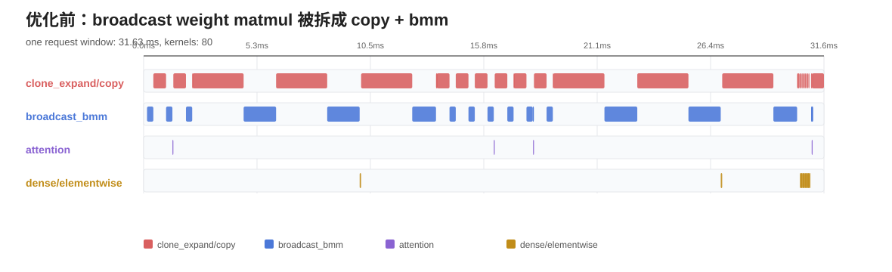
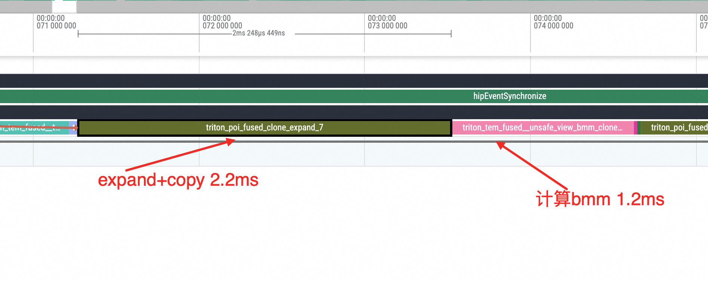
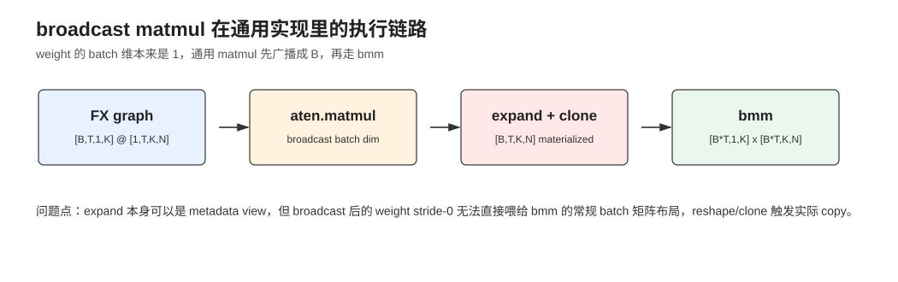
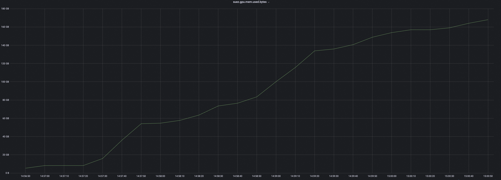
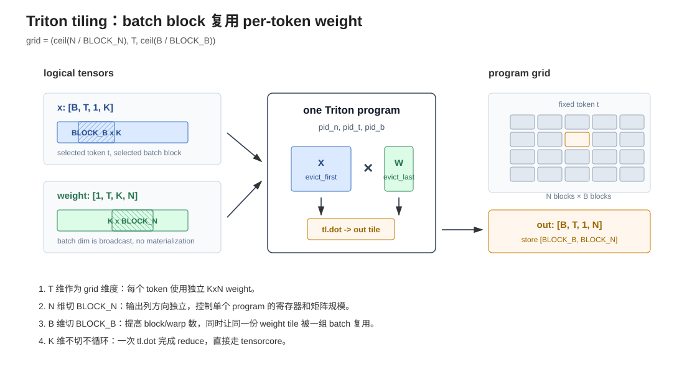
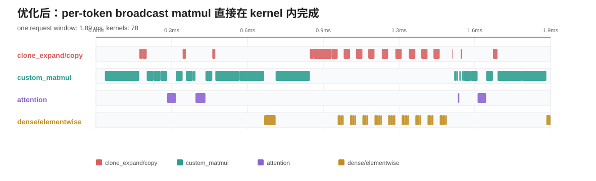
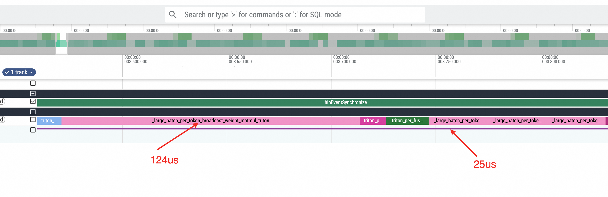
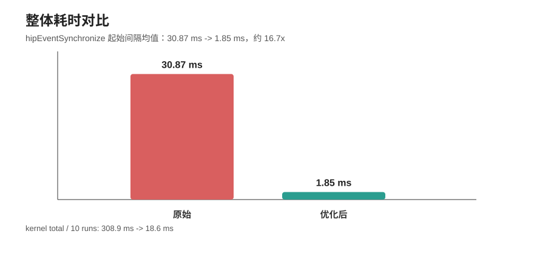

## PyTorch下典型per-token ffn推理优化与Triton Tiling技巧

最近在看一个直播推荐业务的模型推理优化, 里面用到了per-token的ffn, 大概写法如下
```python
>>> x = torch.randn(1280, 128, 64).cuda()                       
>>> w = torch.randn(128, 64, 32).cuda()                      
>>> res_2 = torch.matmul(x.unsqueeze(-2), w.unsqueeze(0)).squeeze(-2)
```

读过我之前系列文章的同学应该知道, rtp-torch推理平台会将算法平台交付的fx-graph进行图优化之后, 编译成AOTInductor 产物, 发送到线上的纯C++环境中载入执行. 

线上压测过程中发现在1280个候选的打分商品时, 即`batch-size=1280`下 耗时非常夸张. 先看 timeline: 

<div style="text-align: center;">



*图: 优化前一个请求窗口内, 大量时间花在 broadcast weight 的 expand/copy/bmm 上*
</div>


好家伙, 最显眼的不是 attention, 也不是常规 addmm, 而是几组 `clone_expand` 和带 `bmm_clone_expand` 的 Triton kernel. 但是我反复检查了fx graph, 并没有那么多显式的`clone`调用, 我跟算法同学应该都不至于那么蠢, 在每个ffn前手动写一个clone才对. 

按 10 次重复统计, 原始 trace 里面最重的 kernel 是: 

```text
139022 us  60x  triton_poi_fused_clone_expand_7
 58654 us  40x  triton_tem_fused__to_copy__unsafe_view_bmm_clone_expand_unsqueeze_view_8
 52924 us  90x  triton_poi_fused_clone_expand_4
 22050 us  20x  triton_tem_fused__unsafe_view_bmm_clone_expand_mul_silu_squeeze_unsqueeze_view_10
 14627 us  50x  triton_tem_fused__unsafe_view_bmm_clone_expand_unsqueeze_view_5
```

单看名字就很别扭. `expand` 按理说只是 metadata view, 为什么会和 `clone/copy` 绑在一起, 并且成为整个图的大头？我的直觉告诉我肯定有人在搞破坏

---

### 先回到 FX Graph 上看 shape

这里先不急着看 Inductor 产物, 而是直接解析模型里的 FX Graph. 这个 FX Graph 是 RTP-Torch 推理平台的标准交付物, 里面保留了完整的算子拓扑. 把每个节点的 shape 打印出来之后, 慢 kernel 对应的 FX 节点非常典型. 别问怎么看出来的, 干多了基本对照fx graph和timeline就是一眼的事情, 直接扔给大模型也一样: 

```python
# shape: b__frozen_param18 -> placeholder b__frozen_param18 -> shape=(1, 18, 128, 128), dtype=torch.float16, stride=(294912, 16384, 128, 1)

# shape: reshape_18 -> call_function aten.reshape.default -> shape=(1280, 18, 128), dtype=torch.float16, stride=(2304, 128, 1)
reshape_18 = torch.ops.aten.reshape.default(transpose_15, [sym_size_int_2, 18, 128])

# shape: unsqueeze_18 -> call_function aten.unsqueeze.default -> shape=(1280, 18, 1, 128), dtype=torch.float16, stride=(2304, 128, 128, 1)
unsqueeze_18 = torch.ops.aten.unsqueeze.default(reshape_18, -2)

# shape: matmul_18 -> call_function aten.matmul.default -> shape=(1280, 18, 1, 128), dtype=torch.float16, stride=(2304, 128, 128, 1)
matmul_18 = torch.ops.aten.matmul.default(unsqueeze_18, b__frozen_param18)
```

也就是说, 这不是一个普通的 batch matmul, 而是: 

```text
x      : [B, T, 1, K]     = [1280, 18, 1, 128]
weight : [1, T, K, N]     = [1, 18, 128, 128]
out    : [B, T, 1, N]     = [1280, 18, 1, 128]
```

这个形状一看就是 per-token FFN: 每个 token/position 有自己独立的一组 FFN weight, 但是 weight 本身不带 batch 维, 需要在 batch 维上广播. 

从语义上讲, 这个广播完全没有必要物化. 计算第 `b,t,n` 个输出时, 只需要读取: 

```text
out[b, t, 0, n] = sum_k x[b, t, 0, k] * weight[0, t, k, n]
```

这里的 `weight[0, t, k, n]` 天然可以被所有 batch 复用, 没必要真的展开成 `[1280, 18, K, N]`. 

---

### AOTInductor 产物里发生了什么

AOTInductor 编译产物经过 `unzip` 解压之后, 里面会有 GCC 编译前的 C++ 文件. 这个文件里的注释保留了 kernel 对应的 FX source node 和 ATen source op, 所以非常适合反查编译链路. 

慢 kernel 的注释已经把来源写得很直接: 

```cpp
// Topologically Sorted Source Nodes: [matmul_18], Original ATen: [aten.expand, aten.clone]
call_triton_poi_fused_clone_expand_4(_frozen_param18, buf69, 294912L*s15, ...)

// Topologically Sorted Source Nodes: [matmul_18], Original ATen: [..., aten.expand, aten.clone, aten._unsafe_view, aten.bmm]
call_triton_tem_fused__unsafe_view_bmm_clone_expand_unsqueeze_view_5(...)
```

这就解释了 timeline 里为什么会出现一组奇怪的 `clone_expand + bmm_clone_expand`: 

<div style="text-align: center;">


*图: 通用 matmul 为了走 bmm, 会把 batch broadcast 之后的 weight 物化*
</div>

从图上看, `aten.matmul([B,T,1,K], [1,T,K,N])` 最终被拆成: 

1. 对 weight 做 batch 维 broadcast. 
2. 对 broadcast 后的 stride-0 view 做 reshape. 
3. reshape 无法保持 bmm 需要的常规 batch 矩阵布局, 于是触发 clone/copy. 
4. 再走 `bmm([B*T,1,K], [B*T,K,N])`. 

这个过程在通用 matmul 语义下当然是正确的, 但对 per-token FFN 这个 shape 来说非常亏. 

更要命的是, 这个 clone 不是一个“小拷贝”. 以 `[1280,18,128,128]` fp16 为例, 单次物化就是 `1280*18*128*128*2` bytes, 约 `720MiB`；如果是 `[1280,18,128,512]`, 单次物化会到 `2.8GiB` 左右. 且不说这种纯粹为了适配通用 bmm 布局产生的 copy会不会大量消耗显存带宽, 显存容量扛不扛得住都是一个问题. 

在压测的时候, 我看了一下监控, 果不其然, 上来就奔着170GB显存占用去了



---

### 难不成是 Inductor lowering 的锅?

一开始我怀疑是 AOTInductor lowering 把一个本来可以 lazy broadcast 的算子变成了显式 copy. 为了确认这件事, 我单独在 Python eager 环境里跑了一个最小实验, 不经过 Inductor(torch.compile), 直接看一下这种类型的matmul会被dispatch到什么kernel上去:

```python
lhs = torch.randn((1280, 18, 1, 128), device="cuda", dtype=torch.float16)
rhs = torch.randn((1, 18, 128, 128), device="cuda", dtype=torch.float16)

out = torch.ops.aten.matmul.default(lhs, rhs)
```

用 `torch.profiler` 抓 timeline, 结果并不乐观: 

```text
aten::matmul
  aten::expand
  aten::reshape
  aten::clone
  aten::copy_
  aten::bmm
```

GPU kernel 上也能看到一个 `direct_copy_kernel` 加一个真正的 batched GEMM. 单次实验里, copy 大约 2.26ms, bmm 大约 0.83ms. 也就是说, 不经过 Inductor, PyTorch eager 的 matmul 自己也会走 `expand + clone/copy + bmm`. 

我去, 这下搞清楚了: 根源不是 Inductor “凭空引入”了低效操作, 而是 `aten.matmul` 对高维 broadcast matmul 的通用实现本身就会走这条路径. Inductor 只是把这个计算过程继续 lowering 成了编译产物, PyTorch 全责!

---

### PyTorch 源码里的证据

matmul实现源码在 `pytorch/aten/src/ATen/native/LinearAlgebra.cpp` 的 `_matmul_impl`, 我用的版本是PyTorch 2.9.0

对 3D 及以上输入, PyTorch 会先推导 broadcast 后的 batch shape, 然后把两侧 tensor expand, 再 reshape 成 bmm 需要的 3D tensor: 

```cpp
auto output_shape = infer_size_dimvector(batch_tensor1, batch_tensor2);
const int64_t expand_batch_product = c10::multiply_integers(output_shape);

const auto tensor1_expanded = tensor1.expand(tensor1_expand_size)
                                     .reshape({expand_batch_product, n, m1});

auto tensor2_expanded = tensor2.expand(tensor2_expand_size);
tensor2_expanded = tensor2_expanded.reshape({expand_batch_product, m2, p});

return at::_unsafe_view(tensor1_expanded.bmm(tensor2_expanded), output_shape);
```

这段逻辑对通用 broadcast matmul 有那么点合理性: 最终都规约到 `bmm`, 复用成熟 GEMM 路径. 

但这个场景的特殊点是 weight 的 batch 维是 1, 而且 batch 很大. `weight.expand([1280,18,K,N])` 之后 batch 维 stride 为 0, 逻辑上所有 batch 读的是同一份 weight；为了喂给常规 bmm, reshape 阶段需要把它整理成 `[1280*18,K,N]`, 于是就把广播出来的 weight 真的拷贝了一遍. 作为一个成熟的开源框架, 没有考虑到广播维度可能会非常巨大, 导致重copy, 实在不应该. 

这也是为什么 timeline 上 copy 比 bmm 还要显眼. 

---

### 专门写一个 per-token broadcast weight matmul

又到了我最喜欢的写Triton环节, 既然问题来自通用 matmul 的实现, 那优化方向就很直接: 写一个只处理这个 shape 的 Triton kernel, 不物化 batch broadcast. 

算子命名为: 

```python
rtp_lib::large_batch_per_token_broadcast_weight_matmul
```

per-token FFN 的 shape 非常固定, 所以 FX pass 里不需要做复杂的数据流推理, 简单匹配下面这种 matmul 形状就能拿到目标算子: 

```text
x      : [B, T, 1, K]
weight : [1, T, K, N]
out    : [B, T, 1, N]
```

算子名字被我取得那么长, 也是有含义在的:

1. `large_batch`: 优化目标就是大 batch, 小 batch 下收益不一定明显. 
2. `per_token`: T 维每个 token 有独立 weight, 不是普通 shared weight linear. 
3. `broadcast_weight`: 被广播的是 weight 的 batch 维, 不是 activation. 
4. `matmul`: 语义仍然等价于 `aten.matmul`. 

最终 FX pass 匹配 4D `aten.matmul`, 把它替换成自定义 op. 优化后的 graph 里一共替换了 22 处: 

```text
torch.ops.rtp_lib.large_batch_per_token_broadcast_weight_matmul(...)  22x
torch.ops.aten.matmul.default(...)                                    0x
```

---

### Triton Tiling 怎么切

这个 kernel 的计算并不复杂, 真正重要的是 tiling. 

<div style="text-align: center;">


*图: 每个 program 负责一个 token、一个 batch block、一个 d_out block*
</div>

Triton grid 是: 

```python
grid = (
    triton.cdiv(d_out, BLOCK_N),
    num_tokens,
    triton.cdiv(batch_size, BLOCK_B),
)
```

也就是每个 program 计算: 

```text
x tile      : [BLOCK_B, K]
weight tile : [K, BLOCK_N]
out tile    : [BLOCK_B, BLOCK_N]
```

这里有几个取舍. 

第一, `T` 维直接作为 grid 的一维, 不在一个 block 里面合并多个 token. 因为 per-token FFN 的 weight 在 T 维上不同, `t=0` 和 `t=1` 访问的是完全不同的 `[K,N]` weight. 强行合并 token 会把地址计算和 mask 搞复杂, 也没有明显复用. 

第二, `N` 维适合切 `BLOCK_N`. 输出列方向天然独立, 切 N 不会增加 x 的读取量: 同一个 `[BLOCK_B,K]` 的 x tile 可以和不同的 `[K,BLOCK_N]` weight tile 相乘. 对这个 case, `N=128/512` 都存在, 切 N 可以控制单个 program 的寄存器和矩阵规模. 

第三, `B` 维必须切, 但不能切得太碎. 如果不切 batch, 那么 block 数是 `T * ceil(N/BLOCK_N)`, 以 `T=18,N=128,BLOCK_N=64` 为例只有 36 个 block. 一般来说, 为了让调度和流水更稳定, 活跃 warp 数量至少要到 CU/SM 数量的 8-10 倍这个量级；典型 AMD MI308X 有 80 个 CU, 36 个 block 显然完全不够.   
但如果 batch 维按 1 切, 每个 block 都重复读取同一个 token 的 weight, weight 复用完全浪费掉, 计算访存比会大幅下降. 所以这里用 `BLOCK_B` 做折中: 一个 program 同时算多个 batch, 把同一个 weight tile 复用给一组 batch. 计算和访存做一个trade-off, 具体选择哪一组参数交给triton autotune

第四, `K` 维不做 split-k. 搜广推网络对在线时延非常敏感, 网络结构设计上一般也不会在这种 per-token FFN 里使用特别巨大的 K 值；业务里主要是 128/512. 当前主流 GPU 的 shared memory 大概在 80-200KB 这个量级, 这种 K 尺寸下的 `x tile` 和 `weight tile` 完全装得下. 因此这个方向上既不切 block, 也不写循环, 直接一次 `triton.language.dot` 调用 tensorcore 完成 reduce. Split-K 会引入中间结果和额外归约, 对这个小 M、大 B、固定 T 的形状不划算. 

核心 kernel 逻辑就是: 

```python
x = tl.load(
    x_ptr + offset_b[:, None] * stride_x_b
          + pid_t * stride_x_t
          + offset_k[None, :] * stride_x_d,
    eviction_policy="evict_first",
)

w = tl.load(
    w_ptr + pid_t * stride_w_t
          + offset_k[:, None] * stride_w_k
          + offset_n[None, :] * stride_w_n,
    eviction_policy="evict_last",
)

out = tl.dot(x, w)
```

`tl.load` 的 eviction policy 策略跟Tiling是相对应的: 

1. `x` 用 `evict_first`: 同一个 x tile 只服务当前 program 的一个输出 tile, 用完基本没有跨 program 复用价值. 
2. `weight` 用 `evict_last`: 同一个 `pid_t/pid_n` 下, 不同 `pid_b` 会反复读取同一块 weight, 应该尽量留在 cache 里. 

这正好利用了 broadcast weight 的本质: weight 不随 batch 变化, batch 方向切 block 之后还能复用同一份 weight tile. 

---

### 优化后的 timeline

替换之后再看同一个 batch_size=1280 的 timeline: 

<div style="text-align: center;">


*图: 优化后 clone_expand/bmm_clone_expand 大头消失, 主要耗时变成自定义 matmul 和其他 dense kernel*
</div>

新的主耗时变成: 

```text
 9872 us  220x  _large_batch_per_token_broadcast_weight_matmul_triton
 2367 us   90x  triton_tem_fused__to_copy_add_addmm_cat_elu_native_layer_norm_select_squeeze_t_view_10
 1134 us   30x  _large_batch_lt32_seq_lt32_d_flash_attention_triton
 1006 us   90x  triton_tem_fused_addmm_elu_t_11
```

原来那些 `clone_expand` / `bmm_clone_expand` 大头已经没了. 剩下的 `_to_copy` 更多是图里其他 dtype/elementwise 融合路径上的小 copy, 不再是 broadcast weight matmul 的物化拷贝. 

这里新的第一大项 `_large_batch_per_token_broadcast_weight_matmul_triton` 恰好就是我们替换进去的 Triton 算子. 也就是说, 原来 timeline 上最重的一组 `expand/copy/bmm`, 现在被 220 次自定义 per-token broadcast matmul 接住了；它成为主耗时是符合预期的, 因为这部分正是原始图里真正需要完成的 FFN 矩阵乘计算. 


而我们写的算子内广播的per-token ffn算子, 根据K, N的不同, 耗时在25-124us之间, 跟原始3ms的耗时相比, 直接下降了1-2个数量级

整体数据对比: 

<div style="text-align: center;">


*图: 按 hipEventSynchronize 起始间隔估算的单次请求耗时*
</div>

```text
原始 kernel total / 10 runs : 308.9 ms
优化后 kernel total / 10 runs:  18.6 ms

原始单次 sync gap : 30.87 ms
优化后单次 sync gap:  1.85 ms

整体加速约 16.7x
```

这里的 16.7x 不是某个单 kernel 的 micro-benchmark, 而是这一段 AOTInductor 产物在 trace 里 10 次重复的整体收益. 核心原因也很直接: 原来每次 per-token FFN matmul 都要先物化 broadcast weight, 现在直接在 kernel 里按 `weight[0,t,k,n]` 读, 没有那坨巨大 copy. 

---

### 总结

这个 case 最有意思的地方在于, 它不是“reshape 造成拷贝”这么简单, 而是一个通用算子语义和业务特殊 shape 之间的错配: 

1. FX 图上没有显式 `expand`, 只有一个很正常的 4D `aten.matmul`. 
2. AOTInductor 产物里出现 `expand + clone + bmm`, 看起来像 lowering 问题. 
3. Python eager 不经过 Inductor 也会出现同样的 `expand + clone/copy + bmm`. 
4. PyTorch 源码里 `_matmul_impl` 的高维 matmul 路径确实会先 broadcast batch, 再 reshape 成 bmm. 
5. 对 `[B,T,1,K] @ [1,T,K,N]` 这种 large-batch per-token broadcast-weight matmul, 通用路径会把本来不该物化的 weight 广播物化掉. 
6. 专用 Triton kernel 直接在地址计算里表达 broadcast, 替换 22 个 matmul 后, 整体从 30.87ms 降到 1.85ms. 

所以这类优化的关键不是“把 matmul 再写一遍”, 而是先识别出通用 matmul 隐藏掉的业务结构: 大 batch、小 M、固定 token 数、per-token weight、batch 维 broadcast. 只要这个结构成立, 手写 kernel 就能把原本浪费在 expand/copy 上的时间直接拿掉. 
