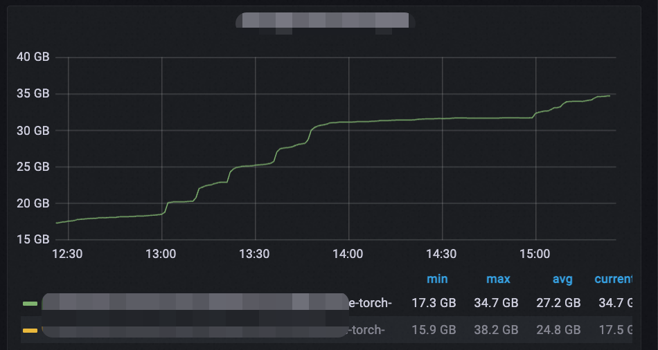
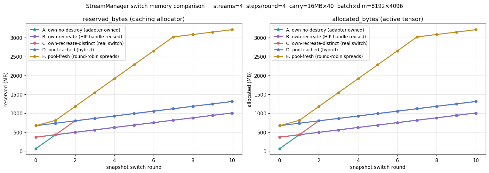
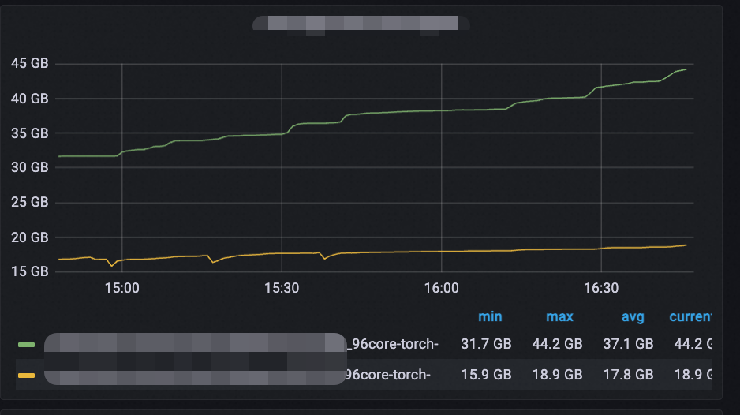

## 一次因 cudaStream 频繁 create/destroy 导致的 PyTorch 显存"泄漏"排查

当前我所支持的搜推在线服务框架支持业务热更新, 站在GPU集群的角度，每次业务更新就是下发一个新的AOTInductor编译产物，然后框架载入新的产物进行前向推理。 

已有业务的版本更新, 或者是某个业务下线，都会触发一次AOTInductor产物的卸载或者装载，框架层面将这种产物的更新和其他一些资源的更新抽象为一种状态的切换 —— 内存里抽象出一个 snapshot, 新的 snapshot 接管, 旧的析构. snapshot 持有一组 cuda stream 资源, 在构造的时候 `cudaStreamCreate` 一组新 stream, 析构的时候 `cudaStreamDestroy` 释放掉. 前向推理的时候设置这条stream为当前的current stream，当然真实情况比这个要复杂，需要考虑multi-stream等场景。

业务上没毛病, 但服务长跑下来观察到一个现象: **每次业务切换, GPU 显存都会阶梯式上涨一档**. 单次涨幅不大, 一两 GB 这个量级, 但是积少成多, 一两天后就足以触发 OOM. 起初我怀疑是PyTorch的CachingAllocator的原因，于是切换结束之后立即调用 `c10::cuda::CUDACachingAllocator::emptyCache()` , 从监控上看虽然能收回部分显存，但是大头收不回来.

<div style="text-align: center;">


*图: 长跑下随每次业务切换显存阶梯式上升*
</div>

如果是普通应用层 tensor 漏, `emptyCache` 应该能解决. 现在 `emptyCache` 也基本不管用, 那就不是普通的引用没释放, 直觉上盲猜可能 PyTorch caching allocator 内部某个我们没意识到的地方block住了.

下面记录一下排查过程. 说是排查过程其实也不对，因为从问题一开始就高度怀疑是Stream频繁Create和Destroy造成的，排查过程只是"命题作文"，或者说"先开枪再画靶子"而已

---

### 第一个怀疑方向: caching allocator 按 stream 分桶

排查之前先回顾一个已知事实: **PyTorch caching allocator 在管理 free chunk 的时候, 是按 stream 分桶的**.

意思是, 用户写 `x = torch.randn(...)` 然后 `del x`, 这块显存不会真还给 driver, 而是放到 caching allocator 内部一个 free list 里, 等下次同样大小的请求来直接复用. 但这个 free list 不是一个全局池子, 而是 **按当初分配时所在的 cuda stream 切成多个 bucket**.

为什么这么设计? 因为 GPU 上的 alloc / free 是异步的. 一个 tensor 在 stream A 上 launch 了一堆 kernel 还没跑完, 用户 `del` 它的时候这块物理内存其实还在被这些 kernel 读写; 这时候如果立刻把这块内存交给 stream B 的下一个 alloc, 一旦 B 的 kernel 启动跟 A 还没跑完的 kernel 撞上, 就出现 race. 要避免这件事, 要么跨 stream 复用前显式 sync, 要么 allocator 自己管. PyTorch 选择了后者: 每个 free block 记下它当初的 alloc stream, **同 stream 的下一次 alloc 直接复用, 跨 stream 想复用得先同步**.

源码里这个语义体现得很直接. `c10/cuda/CUDACachingAllocator.cpp:3313-3315`:

```cpp
auto it = pool.blocks.lower_bound(&p.search_key);
if (it == pool.blocks.end() || (*it)->stream != p.stream())
    return false;
```

`get_free_block` 找空闲块时严格匹配 stream, 找不到匹配的就 fallback 去做 `cudaMalloc`.

知道了这个事实, 第一个怀疑方向就出来了: **服务每次切换都把整组 stream 销毁重建, 那 free list 里那些挂在旧 stream 名下的 block, 会变成什么样?**

---

### 一个小实验

因为 `torch.cuda.Stream(priority=0)` 在 Python 层走的是 PyTorch 上游的 stream pool, 不会真的 `cudaStreamCreate / cudaStreamDestroy`, 模拟不了我们 C++ 服务里手动管 stream 的行为. 那干脆直接用 `ctypes` 直接调 HIP runtime 的接口（我用的是AMD显卡的开发机 CUDA同理）, 然后用 `torch.cuda.ExternalStream` 把外部 stream 包给 PyTorch:

```python
import ctypes
hip = ctypes.CDLL("/opt/rocm/lib/libamdhip64.so")

raw = ctypes.c_void_p()
hip.hipStreamCreate(ctypes.byref(raw))
ext = torch.cuda.ExternalStream(raw.value, device=0)
# ... 在 ext 上跑 forward ...
hip.hipStreamDestroy(raw)
```

这样就能还原 "自己 cudaStreamCreate, 用 PyTorch 跑 forward, 然后 cudaStreamDestroy" 这条链路.

设计了五种行为模式做对照:

1. `own-no-destroy`: 进程开始时一次建 N 条, 永不 destroy.
2. `own-recreate`: 每轮 destroy 旧 N 条, 再 create 新 N 条.
3. `own-recreate-distinct`: 每轮**先 create 新, 再 destroy 旧** —— 模拟真实切换中新旧 snapshot 短暂共存（切换是上新下旧）
4. `pool-cached`: 进程开始时从 PyTorch pool 拿 N 条, 缓存复用.
5. `pool-fresh`: 每轮重新从 pool 拿 N 条.

每轮模拟一次业务切换, 轮内做若干次 forward (matmul + gelu), 末尾留一个 carry tensor 跨轮持有, 模拟模型内部的常驻 buffer.

跑出来的曲线长这样:



`round 1 → round 10` 的 reserved 显存:

```
A. own-no-destroy        432 MB → 1008 MB   (+576 MB)
B. own-recreate          432 MB → 1008 MB   (+576 MB)   ← 跟 A 完全一致
C. own-recreate-distinct 432 MB → 1312 MB   (+880 MB)
D. pool-cached           736 MB → 1312 MB   (+576 MB)
E. pool-fresh            812 MB → 3212 MB   (+2400 MB)
```

A 和 D 没什么悬念, stream 数量固定, 涨幅都来自 carry tensor 的累积, 是合理的业务增长. C 和 E 都涨, 但涨幅差异很大, 后面再说.

诡异的是 B —— **每轮都 destroy 重建了, 居然跟 A 完全一致, 一点没漏**. 这跟我们 "stream 切换造成显存累积" 的预期完全相反.

别急, 这跟 HIP runtime 的 stream handle 复用有关系, 打印一下就清楚了:

```
连续 destroy / create:
  round 0: stream=0x55a8e2e03f10  NEW
  round 1: stream=0x55a8e3679c20  NEW
  round 2: stream=0x55a8e3679c20  REUSED
  round 3: stream=0x55a8e3679c20  REUSED
  ...

并行持有 4 条, 全 destroy, 再 create 4 条:
  round 0: ['0x...3679c20', '0x...3621d50', '0x...371ec00', '0x...3729490']
  round 1: ['0x...3729490', '0x...371ec00', '0x...3621d50', '0x...3679c20']  ← 仅顺序变化
  round 2: ['0x...3679c20', '0x...3621d50', '0x...371ec00', '0x...3729490']
```

HIP runtime 用 slab 分配器存 stream 对象, destroy 是放回 slab, 下次 create 优先复用最近释放的槽位. 单线程顺序 "destroy 旧 → 立刻 create 新" 这种时序下, **handle 值压根没变**. 而 caching allocator 按裸 `cudaStream_t` 句柄索引 free list, 句柄没变就等于 stream 没变, free list 复用一切如常.

但这个特性只在单线程顺序时序下成立. 我们服务里的真实切换不是这个时序 —— 旧 snapshot 的析构有一段 `waitUseCount` 等在途请求处理完, **新 snapshot 早就 init 完了, 持有自己的新 stream; 同时旧 snapshot 还活着, 还持有旧 stream**. 新旧 stream 短暂并存, HIP 必然给新 stream 分新句柄.

这正是 mode C 模拟的时序: 先 create 新, 再 destroy 旧. 看 C 的曲线, round 1 → 2 直接跳了 +368 MB, 这就是新 stream 的 free list bucket 跟旧 stream 不在一组, allocator 视角看到的 stream 数从 4 涨到 8 的代价.

到这一步，其实也没证明啥，也没具体的"状态打印"来佐证说上一个stream的free list没被回收，但是起码证明了stream频繁切换，显存真的会往上涨(笑)，而且大概率就是没释放

---

### 为什么 emptyCache 救不了

实验告诉我们 stream 切换会让显存涨, 但还没解释 `emptyCache` 为什么也回收不下来. 要回答这个, 得搞清楚 PyTorch 内部具体怎么管理这块显存.

#### Segment 和 Block

caching allocator 不是每次 alloc 都直接 `cudaMalloc`, 那样太慢. 它的策略是 **一次 cudaMalloc 申请一大块连续显存 (称为 segment), 然后内部切成多个 Block 给用户**.

`CUDACachingAllocator.cpp:195-220`, Block 关键字段:

```cpp
struct Block {
  cudaStream_t stream;  // alloc_stream: 这块当初是在哪条 stream 上分配的
  size_t size;
  bool allocated;       // 是否被用户持有
  Block* prev;          // 同 segment 前一块
  Block* next;          // 同 segment 后一块
  ...
};
```

每个 Block 通过 prev/next 串成双向链表, **链表头 (`prev == null`) 是这个 segment 的起点**. 假设连续在同 stream 上 alloc 了 4 次, 物理上 allocator 拿了一块连续显存, 逻辑上是这样:

```
Segment 起点 (一次 cudaMalloc 拿到的地址)
│
▼
┌──────────┬──────────┬──────────┬──────────┐
│ Block A  │ Block B  │ Block C  │ Block D  │
│  active  │  active  │  active  │  active  │
└──────────┴──────────┴──────────┴──────────┘
   prev=null   prev=A    prev=B    prev=C
```

#### emptyCache 的回收策略

`emptyCache` 走的是 `release_cached_blocks`. 看 `CUDACachingAllocator.cpp:3618-3620`:

```cpp
release_blocks(large_blocks, context);
release_blocks(small_blocks, context);
```

它会遍历 pool, 对**完全合并后、不再被 split 的 segment 整体**调一次 `cudaFree` 还给 driver. 关键是这个"完全合并" —— 只有当 segment 内**所有 Block 都是 free 状态**, 它们才能合并成一个完整的 segment-sized block 被 release.

也就是说, **只要 segment 内有任何一个 Block 还在被用户持有, 整个 segment 都不会被 cudaFree**.

#### 卡住的状态

把这两件事拼起来. 假设当前在 stream X 上做了下面这些事:

```
Segment (stream X 上 cudaMalloc 拿到):
┌──────────┬──────────┬──────────┐
│ Block A  │ Block B  │ Block C  │
│  active  │  free    │  free    │   ← B 和 C 已经 del, 进入 free list
│ alloc_stream=X, X, X            │
└──────────┴──────────┴──────────┘
```

此时 stream X 被 destroy, 而 Block A 还活着 (它是某个常驻 tensor, 比如 cuBLAS workspace, 比如模型内部 cache, 不会随 stream destroy 消失).

接下来:

1. 新 stream Y 想 alloc 同样 size: `get_free_block` 严格匹配 stream, B 和 C 的 alloc_stream 是 X 不是 Y, 匹配失败, fallback 去 cudaMalloc 新 segment. 新申请的显存进入 reserved.
2. `emptyCache` 想回收这个 segment: A 还 active, 整段不能合并, 整段不能 cudaFree. **B 和 C 占着的物理空间永远卡在这个 segment 内, 既不能被任何新 stream 复用, 也不能还给 driver**. 接近一种 "泄漏".

```
"卡住" 的 segment: 
┌──────────┬──────────┬──────────┐
│ Block A  │ Block B  │ Block C  │
│  active  │ STUCK    │ STUCK    │   ← alloc_stream 指向已 destroy 的 stream
└──────────┴──────────┴──────────┘
       ↑ A 钉住整段, 不能 cudaFree
       ↑ B/C 不能被任何新 stream 复用
```

每次切换都会产生若干个这样的 segment, 累积起来就是阶梯上升的显存. 这也解释了 `emptyCache` 为什么救不了 —— 它不是不想回收, 是物理上回收不了.

---

### PyTorch 自己怎么管 stream

到这一步因果链已经基本清楚, 但还有个进一步的问题: **既然这是个明显会出问题的 gap, PyTorch 自己怎么没踩坑? 它内部用 stream 是怎么管的?**

翻一下 PyTorch 自己 stream pool 的实现 (`c10/cuda/CUDAStream.cpp`), 第一眼就看到这段非常诚实的注释 (line 34-38):

```
The streams are "leaked": they are created but never destroyed because the
destruction of global variables could happen after the CUDA runtime has
already been destroyed and thus invoking cudaStreamDestroy could lead to a
crash. It's likely an issue in CUDA, but to be safe - let's just "forget"
the destruction.
```

翻译过来: **PyTorch 故意不 destroy 自己的 stream, 让它们伴随进程到死**.

具体实现也很直接 (`CUDAStream.cpp:19-20, 48-53`):

```cpp
constexpr int kStreamsPerPoolBits = 5;
constexpr int kStreamsPerPool = 1 << kStreamsPerPoolBits;   // 32

std::array<
    std::array<
        std::array<cudaStream_t, kStreamsPerPool>,
        C10_COMPILE_TIME_MAX_GPUS>,
    c10::cuda::max_compile_time_stream_priorities>
    streams;
```

每 device 每 priority 固定 32 条 stream, 全局静态数组. `getStreamFromPool` 拿 stream 时 round-robin 从这 32 条里挑一条返回. 整个 PyTorch 代码库里, `grep cudaStreamDestroy c10/cuda/CUDACachingAllocator.cpp` 是空的 —— allocator 完全不需要面对 "stream 死掉了" 这件事.

PyTorch 自己不会踩这个坑, 因为它压根就不让 stream 死.

这也回头解释了小实验里 mode E 的暴涨为什么那么夸张: `torch.cuda.Stream(priority=0)` 走的就是这个 pool, 每次调用 round-robin 取一条不同的 stream. 我们每轮调 4 次, 6~7 轮把 32 条全走了一遍, allocator 内 32 个 free list bucket, 同 size 的 block 在不同 bucket 之间不能复用, 显存就这么吹起来了.

---

### 修复

到这一步因果链已经非常清楚, 修复方向也水到渠成: **不要每次切换都重建 stream, 让 stream 资源跨 snapshot 复用, 跟 PyTorch 自己的策略对齐**.

具体做法是把 stream 资源从 snapshot 内部提升到更高一层的常驻对象上, 进程开始时一次 `cudaStreamCreate`, 进程退出时才 (或者干脆不) `cudaStreamDestroy`. 切换 snapshot 时新 snapshot 持有的是同一组 stream 句柄, allocator 视角看到的 stream 集合稳定, free list 持续可复用.

线上验证, 显存占用确实平稳了:

<div style="text-align: center;">


*图: 修复后显存随业务切换平稳, 不再阶梯上涨(黄线) 其中绿线为修复前的baseline*

</div>
---

### 总结

这个问题有点dirty，最后我也没有去细究为什么某一个segment里面存在一个block一直没释放，可能是AOTInductor某个中间变量持续持有了。不过有意义的是, 问题的根源可能可以总结为是两个组件的设计假设之间不对齐:

1. PyTorch caching allocator 默认 stream 句柄至少跟它管理的 block 同样长寿. 它用裸 `cudaStream_t` 索引 free list, 没有任何 "stream 死掉了" 的 hook.
2. 应用层自己 `cudaStreamCreate` / `cudaStreamDestroy` 时, 并不知道这个隐含假设. `getStreamFromExternal` 只是把外部 stream 透传进来, 没有任何注册或 ownership 接管.

两边假设一对不上, 就是这种"看起来一切正确但显存就是涨"的现象:

1. 应用层视角: 旧 snapshot 析构时 forward 都跑完了, GPU tensor 也都释放了, 没问题.
2. allocator 视角: 那些"释放掉的" tensor 其实进了 free list, alloc_stream 还指向旧 stream 的句柄; 跨 forward 持有的常驻 buffer (workspace, 模型 cache 等) 钉住了 segment; stream 一 destroy, 整段卡住.

排查里 HIP runtime 复用 stream handle 这个细节让现象一度很误导 —— 单线程顺序 destroy/create 时显存是稳的, 你会觉得 "我做对了". 但只要时序变一变 (新旧短暂共存, 跨线程切换, 等等), handle 不复用, 问题立刻就出来. 这种依赖隐式行为的"正确"是不可靠的.

正确的姿势是: 如果在 C++ 里手工管 cudaStream 然后用 PyTorch tensor, 最好的策略就是 "永远不 destroy", 让Stream伴随服务始终
