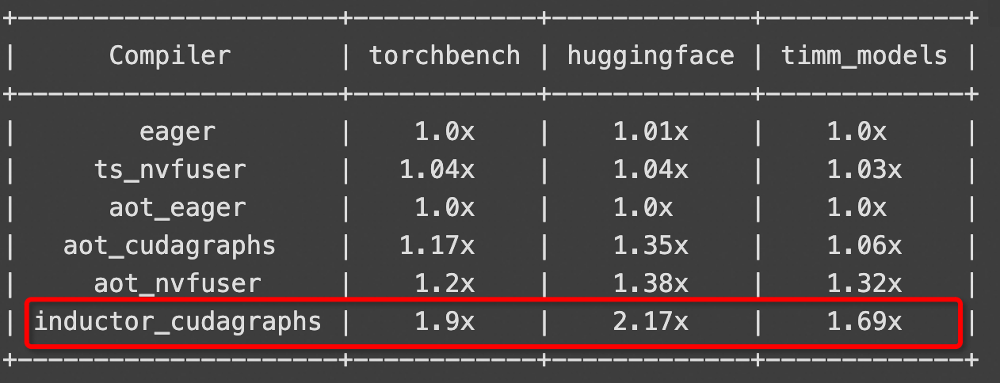
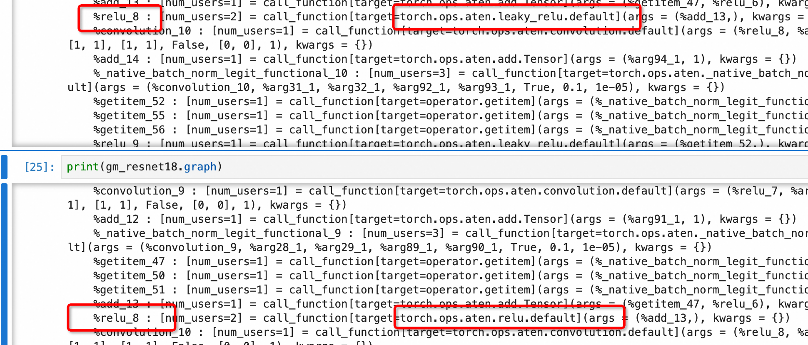

# 基于图追踪和AOT(ahead of time)技术的Pytorch 2+模型部署链路初探(一)
笔者以前很少记录自己的学习过程，这次试用期答辩主管建议可以写点blog什么的，笔者想了想通过写blog来与同学们分享交流也是一个很不错的途径。这是笔者第一次写博客，可能存在很多不太严谨的地方，还希望大家伙轻喷，也欢迎各位前辈指正，并希望能在讨论中得到一些启发
## 背景
在Pytorch 1+的时代，我们训练得到一个网络模型，怎么进行推理部署是一个不太收敛的问题。为了脱离python运行环境特别是GIL的限制，各种部署方法五花八门。

起码笔者在实验室读研的时候，接触过的就有libtorch、onnx和TensorRT多种途径来做部署。

由于笔者读研的实验室主要是做嵌入式的设备，英伟达在软硬件上提供了NVIDIA Geforce显卡训练-->onnx导出 --> TensorRT加速 --> NVIDIA Jetson嵌入式开发板部署的一条龙解决方案。并且视觉相关的模型，例如ResNet、YOLO等在Github上有大量现成的导出TensoRT engine文件的路径可以参考。例如[TensorRT cpp部署视觉模型](https://github.com/wang-xinyu/tensorrtx)。在英伟达成熟的链路上轻松是很轻松，但是容易被NV惯坏，有硬件依赖，并且NV的设备可不便宜。另一点是onnx-->TensorRT这条路径不太灵活，例如想要对计算过程做一定的修改，就不是很方便。

而torch.jit.script相当于是把nn.Module的执行过程建立成一个抽象语法树AST，再编译成只适用于torch的一种中间IR，扔给Libtorch去解析执行。总感觉想卸下包袱，但是卸的不够彻底。


Pytorch 2引入了一个很重要的新特性，inductor优化。具体来说则是在前端实用TorchDynamo来捕获pytorch的计算图，后端使用静态编译把计算图转换为机器码。并且对计算图实现了动态的调优，我理解就是为计算图选择最优的后端实现，例如通用的torch::atem::op和更高效但是场景严格的triton生成cuda/ptx
具体起源可以参考[这篇讨论](https://dev-discuss.pytorch.org/t/torchinductor-a-pytorch-native-compiler-with-define-by-run-ir-and-symbolic-shapes/747)，这边先贴一下作者给出的加速测试

这边加速比能接近2，实际我测试下来还要更高。

捕捉计算图和AOT编译在功能上是两个正交的模块，可以是串联的过程，比如先使用前者捕获nn.Module的计算图，做图的优化，再使用后者进行编译加速。也可以毫不相干，例如我直接对nn.Module进行编译也毫无问题。

对于多数情况来说，捕捉计算图的意义可能没有AOT编译进行加速那么大，比如我读研所在的视觉实验室只有加速需求，没有修改计算图的需求，反正训练和部署送进去的都是图像，真的要更改计算图直接训练的时候改模型就好了，并且读研的实验室也没有开发一套高性能推理算子的条件。

在链路更深的搜推场景或者对性能有极致要求的场景，因为训练和部署的数据来源不同，或者本身有一套仅用于推理的更高性能的算子实现，修改计算图是有意义的。

对捕捉计算图没有兴趣的同学可以直接跳到AOT编译动态库部分。

## 实操
既然是Pytorch的新特性，那原理我们先抛到一边（况且我也对原理还一知半解），直接实操看看这究竟是个啥玩意。
需要提前说明的是，无论是aot也好，jit.trace也好，对forward逻辑里面的pythonic的if else条件分支支持都是有限的(例如forward里传参一个bool值)，对pythonic但是非Torch的内置方法也是支持有限的，例如len函数。这也很好理解——做推理部署的时候，希望是尽量跟python运行环境解耦的，没有python运行时，python内置方法和函数自然也无从谈起。


### 捕获计算图
捕获计算图的api我用到的有两个，分别是torch.fx和torch.export.export。
前者捕获粗粒度的计算图，后者捕获aten层面细粒度的计算图。粗细是什么层面的概念呢？我这边用一个大家都熟知的torch.nn.Linear全链接层来举例，大家都知道fc的计算可以表示为x * weight * bias，即一次矩阵乘和一次矩阵加。
torch.fx导出的粗图长下面这样：
```python
graph():
    %input_1 : torch.Tensor [num_users=1] = placeholder[target=input]
    %weight : [num_users=1] = get_attr[target=weight]
    %bias : [num_users=1] = get_attr[target=bias]
    %linear : [num_users=1] = call_function[target=torch._C._nn.linear](args = (%input_1, %weight, %bias), kwargs = {})
    return linear
```
linear节点即是Linear运算操作，可以看到它是调用了torch._C._nn.linear函数，这张图的粗细程度在torch.nn层面 

torch.export.export导出的细图长下面这样：
```python
graph():
    %arg0_1 : [num_users=1] = placeholder[target=arg0_1]
    %arg1_1 : [num_users=1] = placeholder[target=arg1_1]
    %arg2_1 : [num_users=1] = placeholder[target=arg2_1]
    %t : [num_users=1] = call_function[target=torch.ops.aten.t.default](args = (%arg0_1,), kwargs = {})
    %addmm : [num_users=1] = call_function[target=torch.ops.aten.addmm.default](args = (%arg1_1, %arg2_1, %t), kwargs = {})
    return (addmm,)
```
其中的addmm层即为Linear层运算，addmm是一个融合算子，包含一次矩阵乘和一次矩阵加。这是比torch._C._nn.linear更加深层次的调用，达到了aten算子层，aten算子可以理解为是pytorch底层真正调用的函数，torch.nn和torch.functional中基本上所有的Tensor操作最终都会转换成aten层面的操作(其实Tensor这个数据结构实际就是aten::Tensor)，然后调用libtorch_cpu.so或libtorch_cuda.so里面暴露的aten C++函数接口完成实际运算。

图越细，越接近于底层的计算逻辑，就越脱离python runtime而贴近C++算子层

下面的内容直接用视觉里面常用的resnet18模型来做一个示例：

#### torch.fx
torch.fx提供了一个非常简单的函数接口symbolic_trace，传入nn.Module，返回torch.fx.GraphModule对象，torch.fx.GraphModule是一个nn.Module的子类，可以直接当做一个nn.Module来用，例如forward或者state_dict方法等

```python
import os
import torch
from resnet import resnet50, resnet18
print(torch.__version__)

resnet18 = resnet18()
resnet18_gm = torch.fx.symbolic_trace(resnet18)

print(resnet18_gm.graph)
print(resnet18_gm.code)
resnet18_gm.graph.print_tabular()
```

打印resnet18_gm.graph可以看到这张图的粗细，fx会把nn.Module的调用解析为call_module、call_function、placeholder、call_method、get_attr五种节点。
```bash
graph():
    %x : torch.Tensor [num_users=1] = placeholder[target=x]
    %conv1 : [num_users=1] = call_module[target=conv1](args = (%x,), kwargs = {})
    %bn1 : [num_users=1] = call_module[target=bn1](args = (%conv1,), kwargs = {})
    %relu : [num_users=1] = call_module[target=relu](args = (%bn1,), kwargs = {})
    %maxpool : [num_users=2] = call_module[target=maxpool](args = (%relu,), kwargs = {})
    %layer1_0_conv1 : [num_users=1] = call_module[target=layer1.0.conv1](args = (%maxpool,), kwargs = {})
    %layer1_0_bn1 : [num_users=1] = call_module[target=layer1.0.bn1](args = (%layer1_0_conv1,), kwargs = {})
    %layer1_0_relu : [num_users=1] = call_module[target=layer1.0.relu](args = (%layer1_0_bn1,), kwargs = {})
    %layer1_0_conv2 : [num_users=1] = call_module[target=layer1.0.conv2](args = (%layer1_0_relu,), kwargs = {})
    %layer1_0_bn2 : [num_users=1] = call_module[target=layer1.0.bn2](args = (%layer1_0_conv2,), kwargs = {})
    %add : [num_users=1] = call_function[target=operator.add](args = (%layer1_0_bn2, %maxpool), kwargs = {})
    ............
```

这个粒度说实话太粗了，对于编辑graph来说不是很方便。比如call_module的含义就很模糊，call_module[target=layer1.0.conv1]，这个layer1.0.conv1是写网络的时候的一个子module，想要看到这个module的具体结构，需要打印resnet18_gm.layer1。

resnet18_gm.code是把forward函数按照解析出来的graph重新写了一遍
```bash
code()
def forward(self, x : torch.Tensor) -> torch.Tensor:
    conv1 = self.conv1(x);  x = None
    bn1 = self.bn1(conv1);  conv1 = None
    relu = self.relu(bn1);  bn1 = None
    maxpool = self.maxpool(relu);  relu = None
    layer1_0_conv1 = getattr(self.layer1, "0").conv1(maxpool)
    layer1_0_bn1 = getattr(self.layer1, "0").bn1(layer1_0_conv1);  layer1_0_conv1 = None
    layer1_0_relu = getattr(self.layer1, "0").relu(layer1_0_bn1);  layer1_0_bn1 = None
    layer1_0_conv2 = getattr(self.layer1, "0").conv2(layer1_0_relu);  layer1_0_relu = None
    layer1_0_bn2 = getattr(self.layer1, "0").bn2(layer1_0_conv2);  layer1_0_conv2 = None
    add = layer1_0_bn2 + maxpool;  layer1_0_bn2 = maxpool = None
```

你可能觉得torch.fx.symbolic非常鸡肋，其实我也是这么觉得的。不过torch.fx.GraphModule对象提供了一个很好用的方法to_folder，可以把解析之后的网络和权重保存到一个文件夹
```python
resnet18_gm.to_folder("resnet", "resnet18")
```
文件夹结构长这样：
```bash
$ls resnet
avgpool.pt  __init__.py  layer1.pt  layer2.pt  layer3.pt  layer4.pt  maxpool.pt  module.py  relu.pt  state_dict.pt
```
其中pt后缀文件表示权重，module.py是一个相当clean的网络结构
```python
from torch.nn import *
class resnet18(torch.nn.Module):
    def __init__(self):
        super().__init__()
        self.conv1 = Conv2d(3, 64, kernel_size=(7, 7), stride=(2, 2), padding=(3, 3), bias=False)
        self.bn1 = BatchNorm2d(64, eps=1e-05, momentum=0.1, affine=True, track_running_stats=True)
        ......
    
    def forward(self, x : torch.Tensor) -> torch.Tensor:
        conv1 = self.conv1(x);  x = None
        bn1 = self.bn1(conv1);  conv1 = None
        relu = self.relu(bn1);  bn1 = None
        maxpool = self.maxpool(relu);  relu = None
        layer1_0_conv1 = getattr(self.layer1, "0").conv1(maxpool)
        ......
```
我现在喜欢跟训练的同学约定好，我们之间交付的产物就是fx to_folder方法导出的文件夹，这样做有几个好处
1. 一大坨文件包括dataset、loss以及各自工具脚本之类的我不关系，我只想要网络的前向推理部分
2. 如果给我torch.save保存的整个网络的话，一个单独的pt文件我看不到网络的代码细节
3. to_folder方法的得到的干净的网络和权重代码对于我做接下来的编译或者部署都很省心
4. 最关键的：torch.gx.symbolic_trace对网络进行trace的过程，如果遇到不支持的torch语法糖或者非torch的python语法，会直接报错。如果可以导出fx的图，后续aot成动态库大概率也没问题，相当于是先做了一遍检查。(关于哪些语法是不支持的，后续章节再谈)

#### 自定义的tracer的torch.fx
前面提到的symbolic_trace方法确实是有些鸡肋，torch.fx也提供了自定义tracer的接口来实现一些自定义的trace操作。
假设这样一个场景，写模型代码的同学把计算loss的过程也放在了forward函数里面
```python
class MyModel(nn.Module):
    def __init__(self):
        super().__init__()
        self.resnet18 = resnet18()
        self.predict = None
    def forward(self, x, label):
        self.predict = self.resnet18(x)
        loss = nn.CrossEntropyLoss()(self.predict, label)
        return loss

mymodel_gm = torch.fx.symbolic_trace(MyModel())
```
很遗憾，由于nn.CrossEntropyLoss对象在forward里面实例化，而非在__init__函数里面实例化，symbolic_trace遇到子module的时候自会在自己的成员变量里面查找。所以找不到这个sub module
```bash
Traceback (most recent call last):
  File "<stdin>", line 1, in <module>
  File "/home/admin/miniforge3/envs/recommend/lib/python3.8/site-packages/torch/fx/_symbolic_trace.py", line 1193, in symbolic_trace
    graph = tracer.trace(root, concrete_args)
  File "/home/admin/miniforge3/envs/recommend/lib/python3.8/site-packages/torch/fx/_symbolic_trace.py", line 793, in trace
    (self.create_arg(fn(*args)),),
  File "<stdin>", line 8, in forward
  File "/home/admin/miniforge3/envs/recommend/lib/python3.8/site-packages/torch/fx/_symbolic_trace.py", line 771, in module_call_wrapper
    return self.call_module(mod, forward, args, kwargs)
  File "/home/admin/miniforge3/envs/recommend/lib/python3.8/site-packages/torch/fx/_symbolic_trace.py", line 489, in call_module
    module_qualified_name = self.path_of_module(m)
  File "/home/admin/miniforge3/envs/recommend/lib/python3.8/site-packages/torch/fx/_symbolic_trace.py", line 444, in path_of_module
    raise NameError("module is not installed as a submodule")
NameError: module is not installed as a submodule
```
最好的办法当然是让写模型的同学别怎么写，把计算loss的逻辑放在forward的之外，或者把nn.CrossEntropyLoss放在MyModel对象的__init__函数里面初始化。
另一个好消息是，在推理的过程中，我们完全不关系loss，我只想拿到predict的结果，这个时候我们可以重载tracer，把计算loss的过程屏蔽掉，返回第一个参数：
```python
class MyTracer(torch.fx.Tracer):    
    def call_module(self, module, forward, args, kwargs):
        # 如果目标模块是 nn.Dropout nn.loss类型，我们直接返回输入参数
        if isinstance(module, (nn.Dropout, nn.CrossEntropyLoss)):
            return args[0]
        # 对于其他类型的模块，继续执行常规追踪流程
        return super().call_module(module, forward, args, kwargs)
tracer = MyTracer()
mymodel_gm : torch.fx.Graph  = tracer.trace(model)
mymodel_gm = torch.fx.GraphModule(model, graph_module)
```
重写tracer之后的捕获图长这样，直接返回全链接层的输出结果 不再计算Loss：
```
%resnet18_avgpool : [num_users=1] = call_module[target=resnet18.avgpool](args = (%resnet18_layer4_1_relu_1,), kwargs = {})
%flatten : [num_users=1] = call_function[target=torch.flatten](args = (%resnet18_avgpool, 1), kwargs = {})
%resnet18_fc : [num_users=1] = call_module[target=resnet18.fc](args = (%flatten,), kwargs = {})
return resnet18_fc
```
这个例子也只是抛砖引玉，python或者pytorch语法太灵活，捕获图和AOT想要方方面面支持几乎是不可能的，如果写模型的同学不准守常见的代码规范，例如在forward中实例化对象、或者在forward中引入非torch的Pythonic写法，那么遇到fx解析失败的情况并不少见。

#### torch.export.export
前面的torch.fx胜在可以自定义tracer，并且使用简单，我一般使用自定义的tracer过滤掉一些不支持或者不需要的操作，然后可以将其产物作为算法和工程的交互对象。

但是只能导出一张粗粒度的计算图，尽管粗粒度适合看懂代码，但对于我们进行计算逻辑的编辑是远远不够的。torch.export.export是另一个导出细粒度图的api，上代码：
```python
import os
import torch
from resnet import resnet18
print(torch.__version__)

resnet18 = resnet18()
exported_resnet18 = torch.export.export(
    resnet18, 
    tuple([torch.randn(128, 3, 224, 224)])
    )

print(exported_resnet18.graph)
```

可以看到这张图上除了取数据的节点之外，其他算子节点都是"ATen-level"级别的操作
```
%add_13 : [num_users=1] = call_function[target=torch.ops.aten.add.Tensor](args = (%getitem_47, %relu_6), kwargs = {})
%relu_8 : [num_users=2] = call_function[target=torch.ops.aten.relu.default](args = (%add_13,), kwargs = {})
%convolution_10 : [num_users=1] = call_function[target=torch.ops.aten.convolution.default](args = (%relu_8, %arg30_1, None, [2, 2], [1, 1], [1, 1], False, [0, 0], 1), kwargs = {})
%add_14 : [num_users=1] = call_function[target=torch.ops.aten.add.Tensor](args = (%arg94_1, 1), kwargs = {})
%_native_batch_norm_legit_functional_10 : [num_users=3] = call_function[target=torch.ops.aten._native_batch_norm_legit_functional.default](args = (%convolution_10, %arg31_1, %arg32_1, %arg92_1, %arg93_1, True, 0.1, 1e-05), kwargs = {})
```
而Aten-level函数在pytorch里面总共是180+左右，aten是pytorch的底层张量库，是pytorch的 C++ API，提供了张量操作所需的基本数据结构和函数。可以查看torch库的libtorch_cpu.so符号表信息：
```bash
$nm -D libtorch_cpu.so | grep _aten_
00000000057810e0 T _ZN5torch3jit10tensorexpr11nnc_aten_mmElPPvPlS4_S4_PalS4_
00000000057811e0 T _ZN5torch3jit10tensorexpr11nnc_aten_mvElPPvPlS4_S4_PalS4_
0000000005789760 T _ZN5torch3jit10tensorexpr13nnc_aten_freeElPPv
0000000005779980 T _ZN5torch3jit10tensorexpr13nnc_aten_meanElPPvPlS4_S4_PalS4_
0000000005779cc0 T _ZN5torch3jit10tensorexpr14nnc_aten_addmmElPPvPlS4_S4_PalS4_
```

有了这张细粒度的图，我们可以在图节点的层面方便的对计算逻辑进行优化和修改，比如我想把resnet18里面的relu节点替换成leaky_relu，为了方便对比，我这边没有更改op node的名字：
```python
for node in exported_resnet18.graph.nodes:
    if node.op == "call_function" and node.target == torch.ops.aten.relu.default:
        node.target = torch.ops.aten.leaky_relu.default

# 编译更改之后的graph
new_resnet18_gm = torch.fx.GraphModule(resnet18, exported_resnet18.graph)
print(new_resnet18_gm.graph)
```
替换后和替换前的对比，对于relu_8(我们没有更改node name，方便对比)，调用的aten算子从relu替换为了leaky_relu


这边的例子只是做一个抛砖引玉的作用，毕竟应该没有人真的需要把训练好权重的模型的激活函数做替换。但是有这张解析出来的图之后，很多基于节点的优化变成了可能，例如：
1. 把其中某个子图做合并，替换成自定义的大算子，减少数据传输的开销
2. 去除没有意义的节点或者对结果影响很小的子图

等等

### AOT编译动态库
pytorch2+引入的第二个重要特性是AOT编译。功能上跟上面的捕获计算图和进行追踪是正交的，也就是说是否经过捕获计算图然后优化，跟能否送到AOT中编译得到动态库，功能上是完全独立的。

但是AOT在实现上跟捕获计算图是有重叠的，也就是说AOT和torch.export.export捕获计算图都用到了torch._dynamo进行trace，而torch._dynamo又依赖了torch.fx。


这也是为什么我在前面说用torch.fx.symbolic_trace能导出一张粗粒度的图，后续的AOT过程也大概率会顺利。用torch.fx.symbolic_trace的产物进行交付，可以提前把问题在trace过程中就暴露出来，而无需等到编译的时候再折回去处理。

关于dynamo这一套前端解析成图的pytorch代码实现的细节有机会开另一篇再谈，我们先看一下aot的用法，aot的上层接口非常简单，torch._export.aot_compile

#### python interface
我们先导出一个cpu上的resnet18试一下
```python
import os
import torch
from resnet import resnet18

resnet18 = resnet18().eval()

# 指定输入形参x的batch size可变
batch_dim = torch.export.Dim("batch", min=1, max=1024)
dynamic_shapes = {'x': {0: batch_dim}}

dynamicLib_path = torch._export.aot_compile(
    resnet18, # 模型
    args = tuple([torch.randn(256, 3, 224, 224)]), # 模型真实输入 batchsize > 1
    dynamic_shapes = dynamic_shapes,
    options={
            "aot_inductor.output_path": 'resnet18_cpu.so', # 动态库路径
            "max_autotune": True    # 开启最大sm优化
            },
)
print(dynamicLib_path)
```
该接口直接返回导出的动态库的file_path。上面是导出CPU上的动态库，如果想导出CUDA上的动态库也很简单，只需要把模型和数据都放在CUDA上即可，这边不做重复的演示了

简单来说，适用CPU上的动态库导出的整体工作流程是：
1. 捕获Aten-level计算图 算子优化(例如bn+pool+relu融合成一个op)
2. 生成C++代码
3. 调用gcc进行编译
CUDA还多了生成cubin后缀文件的步骤，代码生成的过程以后有机会再开一章节。

导出的动态库怎么用呢？首先pytorch2.3提供了一个aot_load接口，在python环境中载入动态库进行快速的验证：
```python
# 载入cpu动态库
resnet18_cpu = torch._export.aot_load('resnet18_cpu.so', device = 'cpu')
predict = resnet18_cpu(torch.randn(256, 3, 224, 224))

# 载入cuda动态库
resnet18_cuda = torch._export.aot_load('resnet18_cuda.so', device = 'cuda')
predict = resnet18_cpu(torch.randn(256, 3, 224, 224).to('cuda'))
```

即然刚好有这个接口，我们编写一段脚本来测试动态库推理和调用nn.Module的forward进行推理的速度对比。

1. 测试模型：resnet18
2. 测试数据：torch.randn(512, 3, 224, 224)
3. 循环推理200次，计算后100次的时间开销
4. 平台 Intel(R) Xeon(R) Platinum 8369B CPU + NVIDIA Tesla A10 + cuda-12.2

|测试条件/resnet18|  nn.Module cpu   | cpu动态库  | nn.Module cuda | cuda动态库 |
|---| ----  | ----  | ----  | ----  |
|时间/秒| 280.26  | 92.69 | 13.13 | 9.74 |

CPU上的加速比超过3，但是CUDA上的加速比似乎没有达到理想的两倍以上。可能是resnet里面以卷积为主，aot对convolution这些比较早的结构优化较少，在我另一个以二维序列数据为主，存在大量torch.where和torch.mul的推荐小模型上，取batch size=1024时，加速比可以达到3左右，这边也贴一下当时的测试数据
|测试条件/user_model    |  nn.Module cpu   | cpu动态库  | nn.Module cuda | cuda动态库 |
|---| ----  | ----  | ----  | ----  |
|时间/秒| 12.76  | 3.71 | 1.29 | 0.48 |

误差上，与nn.Module在CPU的运行结果相比，CPU动态库的误差在1e-8量级，CUDA动态库的误差在1e-5量级，基本可以忽略不计

#### C++ interface
得到动态库之后，想必大家应该有想脱离python runtime的冲动了。很幸运，torch提供了直接载入动态库尽心infer的C++接口，位置在torch/csrc/inductor/aoti_runner下面的头文件里面，我们用上面导出的GUDA上的ResNet18_cuda.so写一个示例：
```C++
#include <iostream>
#include <vector>
#include <memory>

#include <torch/torch.h>
#include <torch/csrc/inductor/aoti_runner/model_container_runner.h>
#include <torch/csrc/inductor/aoti_runner/model_container_runner_cpu.h>
#include <torch/csrc/inductor/aoti_runner/model_container_runner_cuda.h>

int main()
{
    const std::string modelFilePath = "./resnet18_cuda.so";
    
    typedef std::shared_ptr<torch::inductor::AOTIModelContainerRunner> AOTIModelContainerRunnerPtr;
    AOTIModelContainerRunnerPtr _aotiModelContainerRunner;

    _aotiModelContainerRunner = std::make_shared<torch::inductor::AOTIModelContainerRunnerCuda>(modelFilePath);

    std::vector<torch::Tensor> input{torch::ones({4, 3, 224, 224}).to(torch::kCUDA)};
    auto outputs = _aotiModelContainerRunner->run(input);

    std::cout << outputs[0] << std::endl;
    return 0;
}
```
继承自torch::inductor::AOTIModelContainerRunner的AOTIModelContainerRunnerCuda和AOTIModelContainerRunnerCpu提供了对外的run接口完成动态库的调用，输入和输出都是std::vector<torch::Tensor>。并且这个类的封装遵循RAII原则，对于CUDA资源的申请和释放在类内完成，对外只暴露run接口。


## 总结
这篇博客作为PyTorch2时代计算图追踪和AOT编译技术的初探，主要是介绍一下具体的使用方法。

相较于onnx tensorRT等方法，这两项技术具有更好的灵活性；而相较于torch.jit.script这种基于AST和中间IR表示的方法，这两项技术在脱离python runtime的道路上更进一步，更向C++靠拢，也更具有性能优势。同时dynamo计算图捕获和AOT编译特性将来也会随着PyTorch2.0的不断迭代而更加完善。