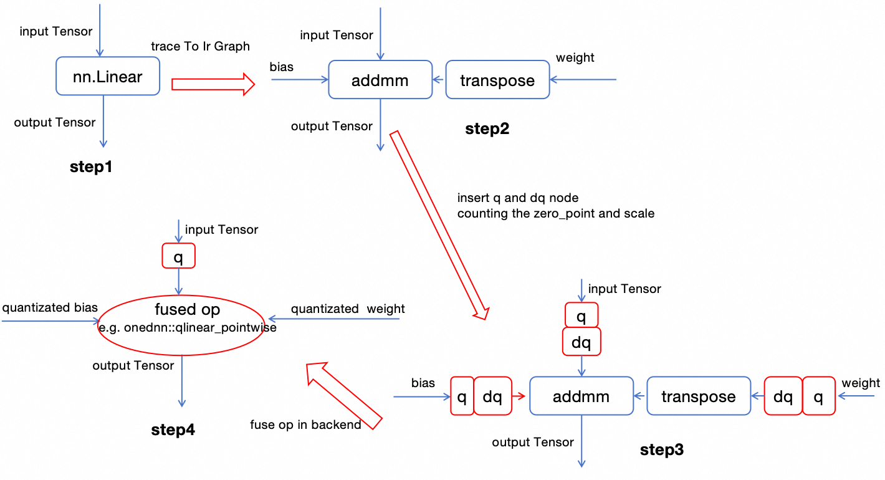
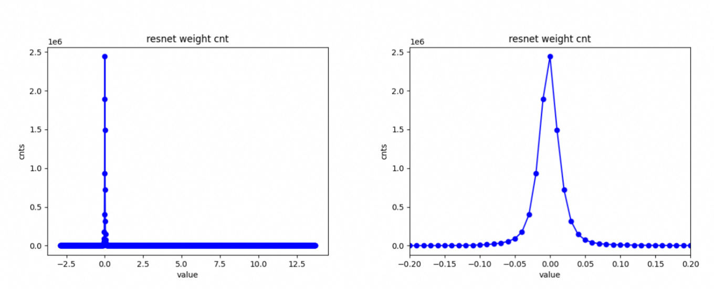

# Speed Up PyTorch Model Inference on CPU with Intel OneDNN Integration


This joy tutorial is a record of a [GitHub issue](https://github.com/pytorch/pytorch/issues/130822) I initiated, where two open-source developers @leslie-fang-intel @chunyuan-w from Intel provided immense help in getting the tests running smoothly. They demonstrated both professionalism and enthusiasm throughout the process. I am deeply grateful for their earnest assistance in resolving my rather elementary inquiries.

Before diving into the main content, let's consider an intuitive question: The default numerical precision for PyTorch models is generally FP32. However, PyTorch is continuously advancing the use of half-precision training and inference to save computational resources and memory, for instance, with the autocast API. Nevertheless, whether it's FP32 or half-precision, the numerical range they represent is far greater than the 256 values that int8 can represent. So, why can we still use int8 to simulate FP32 and maintain relatively high computational precision? Here, I've written a simple script to analyze the numerical distribution range of pretrained ResNet18 weights:

Although the weights are generally distributed in the range of [-3, 14], nearly all values are concentrated within the range of [-0.1, 0.1].

In broad terms, the Post-Training Static Quantization (PTSQ) process using PyTorch 2+ can be outlined in four steps. 
- Firstly, a trained network is obtained. 
- Secondly, the nn.Module is traced to derive an aten-level computation graph. 
- Thirdly, quantization and dequantization (q-dq) nodes are inserted before and after the nodes slated for quantization. By forwarding data through this setup, the q-dq operations gather statistics on the input data distribution, enabling the calculation of zero-points and scales. 
- Lastly, operator fusion is carried out, where sequences such as dq->aten::linear->q are combined into a single quantized operator that operates with both input and output in int8 format. For example, the onednn's qlinear_pointwise node. 

## PyTorch's Support for Quantization
In the era of PyTorch 2.0, PyTorch has introduced the (prepare_pt2e, convert_pt2e) APIs to streamline and simplify the quantization process. For more detailed introductory tutorials, please see: 
- [PyTorch 2 Export Post Training Quantization](https://pytorch.org/tutorials/prototype/pt2e_quant_ptq.html)
- [PyTorch 2 Export Quantization-Aware Training (QAT)](https://pytorch.org/tutorials/prototype/pt2e_quant_qat.html)

Let us proceed to write a straightforward program that illustrates the tasks accomplished by PyTorch's prepare_pt2e and convert_pt2e interfaces. 

We import the required tools and define a simple model which only has a nn.linear layer. 

```python
import os
import torch
from torch.ao.quantization.quantize_pt2e import prepare_pt2e, convert_pt2e
import torch.ao.quantization.quantizer.x86_inductor_quantizer as xiq
from torch.ao.quantization.quantizer.x86_inductor_quantizer import X86InductorQuantizer
from torch._export import capture_pre_autograd_graph

class M(torch.nn.Module):
    def __init__(self, bias):
        super().__init__()
        self.linear = torch.nn.Linear(10, 30, bias)

    def forward(self, x):
        return self.linear(x)
    
model = M(bias=True)
model = model.eval()

x = torch.randn(56, 10)
example_inputs = (x,)
```

Then we call the capture_pre_autograd_graph api to obtain an aten-level graph:

```python
with torch.no_grad():
    exported_model = capture_pre_autograd_graph(
        model,
        example_inputs
    )
print(exported_model.graph)
```

This aten-level graph looks like below. Pay attention to the aten.linear node.
```
graph():
    %arg0_1 : [num_users=1] = placeholder[target=arg0]
    %_param_constant0 : [num_users=1] = get_attr[target=linear_weight]
    %_param_constant1 : [num_users=1] = get_attr[target=linear_bias]
    %linear : [num_users=1] = call_function[target=torch.ops.aten.linear.default](args = (%arg0_1, %_param_constant0, %_param_constant1), kwargs = {})
    return [linear]
```


Then we use default X86InductorQuantizer and call prepare_pt2e and convert_pt2e api to process the exported_model:
```python
quantizer = X86InductorQuantizer()
quantizer.set_global(xiq.get_default_x86_inductor_quantization_config())    

prepared_model = prepare_pt2e(exported_model, quantizer)
prepared_model(*example_inputs)

converted_model = convert_pt2e(prepared_model)

print(converted_model.graph)
```

After processing with prepare_pt2e and convert_pt2e, the graph sees notable modifications, with a quantization-dequantization pair inserted before both the bias , weight and nn.linear operations
```
graph():
    %arg0_1 : [num_users=1] = placeholder[target=arg0]
    %quantize_per_tensor_default : [num_users=1] = call_function[target=torch.ops.quantized_decomposed.quantize_per_tensor.default](args = (%arg0_1, 0.021406318992376328, 130, 0, 255, torch.uint8), kwargs = {})
    %dequantize_per_tensor_default : [num_users=1] = call_function[target=torch.ops.quantized_decomposed.dequantize_per_tensor.default](args = (%quantize_per_tensor_default, 0.021406318992376328, 130, 0, 255, torch.uint8), kwargs = {})
    %linear_scale_0 : [num_users=1] = get_attr[target=linear_scale_0]
    %linear_zero_point_0 : [num_users=1] = get_attr[target=linear_zero_point_0]
    %_frozen_param0 : [num_users=1] = get_attr[target=_frozen_param0]
    %dequantize_per_channel_default : [num_users=1] = call_function[target=torch.ops.quantized_decomposed.dequantize_per_channel.default](args = (%_frozen_param0, %linear_scale_0, %linear_zero_point_0, 0, -128, 127, torch.int8), kwargs = {})
    %_param_constant1 : [num_users=1] = get_attr[target=linear_bias]
    %linear : [num_users=1] = call_function[target=torch.ops.aten.linear.default](args = (%dequantize_per_tensor_default, %dequantize_per_channel_default, %_param_constant1), kwargs = {})
    return [linear]
```
Relating back to our initial four-step quantization workflow diagram, we are now at step three. By feeding a few batches of data into the converted_model, the inserted quantization and dequantization operators automatically determine the optimal zero-points and scales. 

Can PyTorch take the final step further in our four-step process, replacing operators with actual quantized versions? Unfortunately, PyTorch currently lacks this capability; it doesn't provide an int8 quantization backend implementation. Thus, third-party tools like TensorRT, oneDNN, or ONNX are necessary to finalize the process. On Intel CPUs, oneDNN serves as a viable option for this last step, with the caveat that AVX512 support on your CPU is crucial for optimal performance.

## Complete the Final Step of Quantification with Onednn
Onednn has now been integrated into PyTorch, you can call it through torch.ops.onednn, for example torch.ops.onednn.qlinear_pointwise. In my understanding, this is also the reason why we can directly optimize model on CPU with onednn through the torch interface later.

First of all, ensure to set the environment variable: 
```bash
export TORCHINDUCTOR_FREEZING=1
```

Then we use ResNet18 as the test model.
```python
import torchvision.models as models
user_model= models.resnet18(pretrained=False)
```
And follow the above steps to get the converted_model of ResNet18. Calibrate the converted_model by inputting multiple batches of data. Maybe like below:
```python
for data in calibrrate_dataloader:
    converted_model(data)
```

### Applying oneDNN Quantization in Python Runtime
By calling torch.compile on comverted_model, we can lower the model into Inductor and for linear it will be executed with oneDNN backend. Please be sure to operate under torch.no_grad():
```python
with torch.no_grad():
    optimized_model = torch.compile(comverted_model)
    optimized_model(*inputs_list) # This step is necessary for apply onednn optimization 
```
After obtaining the quantized optimized_model, let's conduct a simple speed test. My server has two Intel(R) Xeon(R) Platinum 8369B CPU processors, totaling 128 physical cores, and an NVIDIA A10 GPU. Repeat the inference loop 100 times using a tensor generated by torch.ones(32, 3, 224, 224) as input, and record the average time consumed.

| condition / CPU     | Time / ms |
| ----------- | ----------- |
| raw resnet18      | 76.09       |
| torch._export.aot_compile   | 25.03        |
| quantized + torch._export.aot_compile   | 9.18        |


| condition / CUDA     | Time / ms |
| ----------- | ----------- |
| raw resnet18      | 8.71       |
| torch._export.aot_compile   | 7.16        |

In my tests, the inference error after quantization is around 1e-3. Because I am not using the pre-trained weight, the weight is not convergent enough, and it should actually be lower.

### Running Outside Python Runtime
Use torch._export.aot_compile to compile the model into a dynamic library, so that it can be called in C++ without the python runtime. Fortunately, aot_compile also supports compiling models post-quantization with oneDNN. 

The specific code enabling oneDNN optimizations is located in torch/_inductor/fx_passes/quantization.py. To utilize this, ensure you've set the environment variable first: 
```bash
export TORCHINDUCTOR_FREEZING=1. 
```
Failure to do so will not only prevent aot_compile from performing oneDNN operator substitutions but also compile quantization and dequantization operators into the dynamic library, inadvertently leading to reduced speed and accuracy. 

```python
batch_dim = torch.export.Dim("batch", min=1, max=1024)
dynamic_shapes = {'x': {0: batch_dim}}
example_input = [torch.randn(16, 3, 224, 224)]

dynamicLib_path = torch._export.aot_compile(
    quantized_model,
    args = tuple(example_input),
    dynamic_shapes = dynamic_shapes,
    options={
            "aot_inductor.output_path": os.path.join('dynamicLib', "quantized_model_cpu_fp32.so"), 
            "max_autotune": True
            },
)
```
After obtaining the dynamic library, you can invoke and perform inference within either C++ or Python. In Python, for instance, you can proceed as follows:
```python
resnet18 = torch._export.aot_load(dynameLib_path, device='cpu')
output = resnet18(*example_input)
```

In C++, referring to dynamic libraries involves a slightly different approach. You may find a practical demonstration in the final example code within my blog post accessible at this [link](https://github.com/sujuyu/ZhangYu-s-Blog/tree/main/torch_fx_aot_chapter).