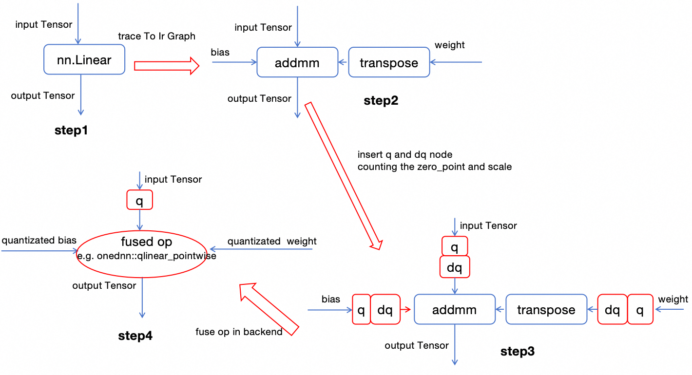
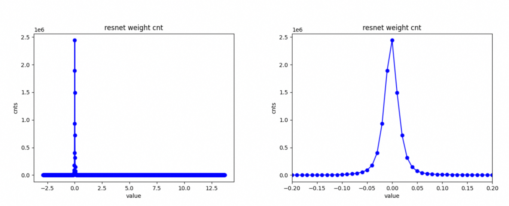

# 加速比2.5！使用 Intel OneDNN 加速在 CPU 上的 PyTorch 模型推理


这篇教程记录了我在 [GitHub issue](https://github.com/pytorch/pytorch/issues/130822)  中发起的一个关于onednn量化的入门问题，在这个过程中，来自英特尔的两位开源开发者 @leslie-fang-intel 和 @chunyuan-w 提供了巨大帮助。

在正文开始之前，我们思考一个很直观的问题，一般PyTorch模型的默认数值精度是fp32，当然现在torch也在不断推进半精度的训练和推理来节约计算和显存开销，例如autocast api。但无论是fp32还是半精度浮点，表示的数值范围都要远大于int8表示的256个数值。那为什么我们还可以用int8来模拟fp32并且保持相对高的运算精度呢？这边我简单写了一个脚本统计预训练的ResNet18权重的数值分布范围:

尽管权重整体分布在[-3, 14]的区间范围，但是几乎所有的数值范围都集中在[-0.1, 0.1]的区间之内。

广义上，使用 PyTorch 2+ 进行训练后静态量化 (PTSQ) 的过程可以概括为四个步骤。

- 首先，获得一个训练好的网络。
- 其次，追踪 nn.Module 以导出一个 aten 级的计算图。
- 第三，在计划量化的节点之前和之后插入量化和去量化 (q-dq) 节点。通过在这个设置中传递数据，q-dq 操作会收集输入数据分布的统计信息，从而计算零点和比例。
- 最后，执行算子融合，将诸如 dq->aten::linear->q 这样的序列合并成一个单一的量化算子，该算子以 int8 格式处理输入和输出。例如，onednn 的 qlinear_pointwise 节点。

## PyTorch对量化的支持
在 PyTorch 2.0 时代，PyTorch 引入了 (prepare_pt2e, convert_pt2e) API，以简化和优化量化过程。有关更详细的入门教程，请参见：
- [PyTorch 2 Export Post Training Quantization](https://pytorch.org/tutorials/prototype/pt2e_quant_ptq.html)
- [PyTorch 2 Export Quantization-Aware Training (QAT)](https://pytorch.org/tutorials/prototype/pt2e_quant_qat.html)

让我们编写一个简单的程序，展示 PyTorch 的 prepare_pt2e 和 convert_pt2e 接口干了什么事情。

我们导入所需的package，并定义一个只有 nn.Linear 层的简单模型。

```python
import os
import torch
from torch.ao.quantization.quantize_pt2e import prepare_pt2e, convert_pt2e
import torch.ao.quantization.quantizer.x86_inductor_quantizer as xiq
from torch.ao.quantization.quantizer.x86_inductor_quantizer import X86InductorQuantizer
from torch._export import capture_pre_autograd_graph

class M(torch.nn.Module):
    def __init__(self, bias):
        super().__init__()
        self.linear = torch.nn.Linear(10, 30, bias)

    def forward(self, x):
        return self.linear(x)
    
model = M(bias=True)
model = model.eval()

x = torch.randn(56, 10)
example_inputs = (x,)
```

然后用capture_pre_autograd_graph api来获取aten-level的graph:

```python
with torch.no_grad():
    exported_model = capture_pre_autograd_graph(
        model,
        example_inputs
    )
print(exported_model.graph)
```

这张aten-level graph长成下面这样 主要看linear这个node, 是一个aten.linear的OP
```
graph():
    %arg0_1 : [num_users=1] = placeholder[target=arg0]
    %_param_constant0 : [num_users=1] = get_attr[target=linear_weight]
    %_param_constant1 : [num_users=1] = get_attr[target=linear_bias]
    %linear : [num_users=1] = call_function[target=torch.ops.aten.linear.default](args = (%arg0_1, %_param_constant0, %_param_constant1), kwargs = {})
    return [linear]
```

然后我们使用默认的 X86InductorQuantizer 并调用 prepare_pt2e 和 convert_pt2e API 来处理 exported_model:
```python
quantizer = X86InductorQuantizer()
quantizer.set_global(xiq.get_default_x86_inductor_quantization_config())    

prepared_model = prepare_pt2e(exported_model, quantizer)
prepared_model(*example_inputs)

converted_model = convert_pt2e(prepared_model)

print(converted_model.graph)
```
在使用 prepare_pt2e 和 convert_pt2e 处理后，计算图发生了明显改变，在 bias、weight 和 nn.Linear 操作之前插入了一对量化-反量化节点

```
graph():
    %arg0_1 : [num_users=1] = placeholder[target=arg0]
    %quantize_per_tensor_default : [num_users=1] = call_function[target=torch.ops.quantized_decomposed.quantize_per_tensor.default](args = (%arg0_1, 0.021406318992376328, 130, 0, 255, torch.uint8), kwargs = {})
    %dequantize_per_tensor_default : [num_users=1] = call_function[target=torch.ops.quantized_decomposed.dequantize_per_tensor.default](args = (%quantize_per_tensor_default, 0.021406318992376328, 130, 0, 255, torch.uint8), kwargs = {})
    %linear_scale_0 : [num_users=1] = get_attr[target=linear_scale_0]
    %linear_zero_point_0 : [num_users=1] = get_attr[target=linear_zero_point_0]
    %_frozen_param0 : [num_users=1] = get_attr[target=_frozen_param0]
    %dequantize_per_channel_default : [num_users=1] = call_function[target=torch.ops.quantized_decomposed.dequantize_per_channel.default](args = (%_frozen_param0, %linear_scale_0, %linear_zero_point_0, 0, -128, 127, torch.int8), kwargs = {})
    %_param_constant1 : [num_users=1] = get_attr[target=linear_bias]
    %linear : [num_users=1] = call_function[target=torch.ops.aten.linear.default](args = (%dequantize_per_tensor_default, %dequantize_per_channel_default, %_param_constant1), kwargs = {})
    return [linear]
```

回到我们文章开头的四步量化工作流程图，我们现在处于第三步。通过将几个批次的数据输入到 converted_model，插入的量化和反量化OP自动检索最佳的zero point和scale。

PyTorch 能不能完成我们四步流程中的最后一步，把操作符替换成实际的量化计算OP呢？很不幸，PyTorch 目前不具备这个能力；它不提供 int8 量化后端实现，通俗理解就是aten里面并没有原生的int8的算子。因此，需要使用像 TensorRT、oneDNN 或 ONNX 这样的第三方工具来完成这个过程。在 Intel CPU 上，oneDNN 是完成这最后一步的一个可行选项，但需要注意的是，你的 CPU 必须支持 AVX512 (有AMX或者AVX512vnni更好)才能获得最佳性能。linux上面可以lscpu来查看是否支持:
```bash
lscpu | grep avx512
```

## 借助onednn完成量化四部曲的最后一步
OneDNN现已集成到PyTorch中，可以通过torch.ops.onednn调用它，例如torch.ops.onednn.qlinear_pointwise。按照我的理解，这也是我们稍后可以通过torch接口直接在CPU上使用OneDNN优化模型的原因。

首先，我们要设置一下环境变量：
```bash
export TORCHINDUCTOR_FREEZING=1
```

我这边用ResNet18作为测试模型
```python
import torchvision.models as models
user_model= models.resnet18(pretrained=False)
```

上述第三步插入了量化后反量化OP之后，需要喂数据进行矫正，其实就是让Q-DQ OP去检索最佳的zero point和scale。
检索算法在TensorRT量化的介绍里面会写，就是尝试多种取值，随着scale的增加，被截断的浮点数减少，从这点来说精度会增加；但另一方面，int8整数之间覆盖的浮点数会更宽，比如0.1和0.3都会被映射到0，从这点来说精度会降低。两厢抵消，寻找中间的最佳平衡点。代码类似于下面这样，送数据进去forward：
```python
for data in calibrrate_dataloader:
    converted_model(data)
```

获得量化后的 optimized_model 后，让我们进行一个简单的速度测试。我用的服务器有两个 Intel(R) Xeon(R) Platinum 8369B CPU 处理器，总共128个物理核心，我的显卡是NVIDIA A10。重复推理循环100次，并使用由 torch.ones(32, 3, 224, 224) 生成的张量作为输入，取平均时间消耗。

| condition / CPU     | Time / ms |
| ----------- | ----------- |
| raw resnet18      | 76.09       |
| torch._export.aot_compile   | 25.03        |
| quantized + torch._export.aot_compile   | 9.18        |


| condition / CUDA     | Time / ms |
| ----------- | ----------- |
| raw resnet18      | 8.71       |
| torch._export.aot_compile   | 7.16        |


在我的测试场景中，量化后的推理误差约为1e-3量级。由于我的ResNet18没有经过预训练，weight没有收敛，所以量化效果会差一点。

## 脱离Python Runtime
使用 torch._export.aot_compile 将模型编译为动态库，这样可以在 C++ 中调用，而不依赖于 Python 运行时。幸运的是，aot_compile 也支持在使用 oneDNN 进行量化后的模型编译。

启用 oneDNN 优化的具体代码位于 torch/_inductor/fx_passes/quantization.py 文件中。要使用这些优化，首先设置环境变量：
```bash
export TORCHINDUCTOR_FREEZING=1. 
```

如果不这样做，不仅会阻止 aot_compile 使用 oneDNN 算子替换Q+aten.linear+DQ，还会将量化和反量化操作编译到动态库中，导致速度和精度双双降低。

```python
batch_dim = torch.export.Dim("batch", min=1, max=1024)
dynamic_shapes = {'x': {0: batch_dim}}
example_input = [torch.randn(16, 3, 224, 224)]

dynamicLib_path = torch._export.aot_compile(
    quantized_model,
    args = tuple(example_input),
    dynamic_shapes = dynamic_shapes,
    options={
            "aot_inductor.output_path": os.path.join('dynamicLib', "quantized_model_cpu_fp32.so"), 
            "max_autotune": True
            },
)
```

在获得动态库后，你可以在 C++ 或 Python 中调用并进行推理。例如，在 Python 中可以这样操作：
```python
resnet18 = torch._export.aot_load(dynameLib_path, device='cpu')
output = resnet18(*example_input)
```

在 C++ 中引用动态库的方法稍有不同。可以参照我的上一篇博客，或者我的github的博客[link](https://github.com/sujuyu/ZhangYu-s-Blog/tree/main/torch_fx_aot_chapter).