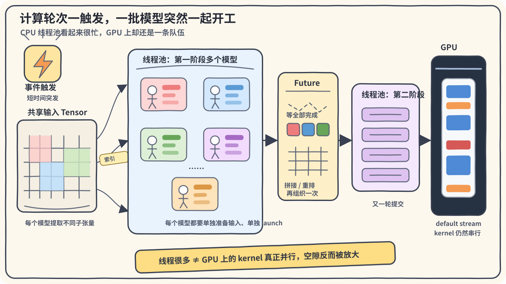
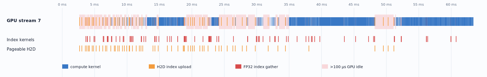
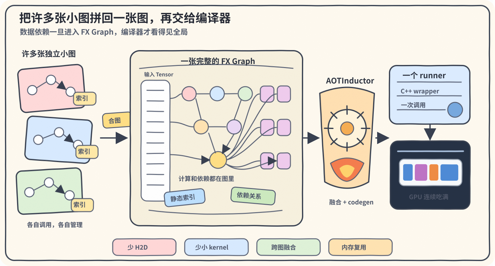
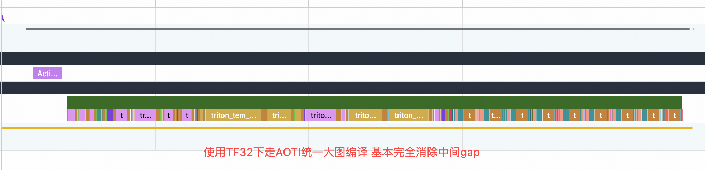

# 从分散模型到整图编译：一次突发型多模型推理链路的初步重构

最近新接触了一套具有明显突发特征的多模型推理框架。

它的负载很有节奏: 平时相对安静, 上游事件一到, 数十个甚至更多model的计算需求会突然一起涌进来。这样的计算轮次在运行期间会反复出现。

这里先说“并发”, 不说“并行”。这些任务会在同一时刻被提交, 不代表它们最终会在GPU上同时执行。为了方便说明, 后文统一使用“多个第一阶段模型、少量第二阶段模型”作为抽象示例。

这套框架已经稳定跑了很久, 中间也叠加了不少针对负载特点的优化。不过当模型数量、触发密度和显存占用一起往上涨时, 原来一些还算堪用的设置开始漏风了。房子住久了就该翻新, 我也打算给这套玩意翻修翻修。

框架诞生时还在PyTorch 1.x时代, 当时相对成熟的部署方式是TorchScript。模型提前转换并保存成ScriptModule, 服务启动时通过 `torch.jit.load` 加载, 再由Python线程池并发提交给GPU。这个选择在最初设计的时候堪用, 也就这样一路沿用了下来。

所以这次翻修有两条线。

第一条是执行后端: 把单个模型从TorchScript迁移到PyTorch 2.x的AOTInductor, 目标是借助Inductor的编译能力, 降低调用开销和常驻显存。

第二条是执行框架: 把原来依靠线程池、Future、拼接和重排串起来的几十个模型, 重新合成一张完整的FX Graph, 再交给AOTInductor整体编译。

这次改造不会只换一个算子, 也不会止步于把 `torch.jit.load` 换成另一个加载接口。模型怎么加载、任务怎么调度、线程池怎么使用、数据怎么流过整条链路, 最终都需要重新梳理。

不过事情得一步一步来。在动执行框架之前, 先要回答一个更朴素的问题:

> 把单个模型从TorchScript迁移到PyTorch 2的Inductor链路, 到底有没有收益?

如果单模型都没有变快, 甚至还变得更占显存, 那么后面对框架做再大的手术也没有意义。我们先从单个模型开始梳理, 再回到整条多模型推理链路, 看看单模型省下来的时间为什么会被分散的模型调度重新吃掉。

## 背景: 任务触发后, 模型集中开跑

每个计算轮次被触发时, 框架会集中启动一批模型。这些模型并不完全独立, 而是分成前后两个阶段:

- 绝大多数属于第一阶段, 轮次触发后就可以立即执行。
- 少量属于第二阶段, 必须等第一阶段全部完成, 再使用前者的输出继续计算。

原框架使用线程池执行这套流程。先把大量第一阶段模型全部提交进去, 通过Future等待它们完成；收齐并整理输出以后, 再把少量第二阶段模型提交到线程池。

```text
                计算轮次触发
                    │
                    v
       大量第一阶段模型提交到线程池
                    │
                    v
                   GPU
                    │
                    v
          等待Future、收集模型输出
                    │
                    v
       少量第二阶段模型再次提交到线程池
                    │
                    v
                   GPU
```

一次推理轮次中的大部分模型都集中在第一阶段。为了尽快把这些任务送上GPU, 使用线程池并发提交TorchScript模型, 从CPU编程的视角看是一种很自然的设计。

### 挑战一: 并发不是免费的

线程池可以让多个任务同时向前推进, 但线程数量增加并不等于GPU利用率会等比例增加。

对于这批以小模型为主的任务, 一次前向经常不到1ms。此时端到端耗时里不只有矩阵乘法, 还有Python线程池调度、每个TorchScript Module的调用与参数封装, 以及一串小kernel的launch。尤其是数据的重新组织: 第一阶段模型全部结束后, 需要对输出进行重排, 才能满足第二阶段模型的输入要求。在Python runtime中通过索引重新组织数据, 本身就是一项不小的开销。

### 挑战二: 还没开始算, 显存先快装满了

由于服务需要维护较大的模型集合, 触发间隔又非常短, 来不及临时加载, 因此程序启动时就需要加载全部模型。

线上使用多张数据中心GPU。当前所有模型常驻以后, 模型本身就会吃掉单卡大半显存, 还没算并发推理的波峰。这还是大量模型权重已经使用低精度格式以后的结果。后续模型数量继续增加时, 留给输入、输出、中间workspace和并发执行的空间只会越来越少。

我们最终要同时回答两个问题:

- 突发、小batch和高并发下, 新后端能不能减少单模型执行开销?
- 模型常驻并完成预热以后, 新后端能不能少占一些显存?

## AOTInductor值得换

原环境使用PyTorch 1.13。为了接入完整的Dynamo、Export、Inductor和AOTInductor链路, 测试环境升级到了PyTorch 2.12。

使用 `TS2EPConverter` 可以把TorchScript格式文件转换为 `ExportedProgram`, 也就是后续Inductor能够接手的FX Graph, 再分别进入Inductor和AOTInductor:

```text
TorchScript
     │
     │ TS2EPConverter
     v
ExportedProgram
     │
     ├──> torch.compile / Inductor
     │
     └──> AOTInductor package (.pt2)
```

这批模型只有batch维度会变化, 其余输入维度固定。因此转换时只需要把batch标成动态维度, 不必为每种batch分别生成一份模型。当然, 理论上为每个batch bucket分别生成产物更容易获得最佳性能, 但显存不允许。按照我的经验, 这里选取一个中等规模的代表性batch进行 `max_autotune`, 可以作为动态batch下的折中方案。

AOTI package也只离线生成一次。编译开启:

```python
inductor_configs={"max_autotune": True}
```

### TorchScript、torch.compile和AOTInductor到底差在哪

| 方案 | 模型怎么来 | 运行时形态 |
| --- | --- | --- |
| TorchScript | 加载序列化的ScriptModule | Python发起调用, TorchScript图由C++ runtime执行, 算子进入ATen/CUDA |
| `torch.compile` | Dynamo捕获模型, Inductor生成代码 | 从Python wrapper进入编译图, 调用时仍需处理guard和包装逻辑 |
| Python AOTI | Export后提前编译成 `.pt2` package | Python调用package runner, 前向主体由生成的C++ wrapper执行 |
| C++ AOTI | 加载同一份AOTI package | C++直接调用package, 不再经过Python入口 |

AOTInductor并不是换了一套完全不同的kernel编译器。它和 `torch.compile` 背后都使用Inductor, 关键差别在运行时。

默认的 `torch.compile` 路径仍然由Python wrapper充当胶水: 处理guard和输入参数, 再依次启动Inductor生成的融合CUDA kernel以及cuBLAS等外部库算子。AOTInductor则提前把图、生成的C++ wrapper和CUDA代码打进package。使用Python的 `aoti_load_package()` 时, 服务当然还在Python里, 每次前向也仍然要经过一次Python/pybind入口；但进入runner以后, 模型前向的主体已经由C++ wrapper负责。

线程并发调用大量短模型时, 少做一些Python对象操作、少在GIL附近绕几圈、少经过几层通用dispatch, 可能比优化GEMM更加划算🤔。C++ wrapper提交kernel的固定开销也更低, 理论上很适合这种“计算短、调用密”的负载。

### 一批代表性模型的测试结果

我们选取了数十个具有代表性的模型进行测试:

- 同时覆盖FP32和BF16模型。
- 同时覆盖第一阶段模型和第二阶段模型。
- 覆盖多种输入shape和模型规模。

每个模型的AOTI package仍然只用一个代表性batch生成一次, 性能统计则按照一组混合batch分布加权。

| 模型类型 | 加权GPU加速比中位数 | 加权GPU加速比均值 |
| --- | ---: | ---: |
| 小型FP32第一阶段模型 | 1.94x | - |
| BF16第一阶段模型 | 1.36x | 1.49x |
| 其余FP32第一阶段模型 | 1.02x | 1.02x |
| FP32第二阶段模型 | 0.994x | 1.01x |

结果没有整齐到“所有模型一律快30%”, 反而更接近真实世界。

小型FP32第一阶段模型收益最明显, BF16第一阶段模型也有比较稳定的收益。其余FP32第一阶段模型大多只是略快, 第二阶段模型整体则接近持平。

如果只按单模型延迟做局部最优, 似乎应该保留一部分TorchScript。但是改都改了, 那就彻底一点: 应转尽转, 全部切换到AOTI链路, 减少心智负担。

### 显存结果比预想中更整齐

显存统计分成两部分:

- **整卡增量**: 从加载模型到完成预热, 观察GPU实际多占用了多少显存。
- **推理allocator增量**: 单次推理过程中, PyTorch caching allocator额外申请的峰值。

先看线上容量规划中的整卡增量:

| 模型类型 | 常驻显存中位数变化 |
| --- | ---: |
| 小型FP32第一阶段模型 | -36.5% |
| 其余第一阶段模型 | -34.3% |
| 第二阶段模型 | -29.2% |

性能结果还有快有慢, 显存结果却非常一致: 抽样模型全部下降, 三类模型的中位数降幅在29%到37%之间。

再看推理过程中的allocator峰值:

| 模型类型 | 观察 |
| --- | --- |
| 小型FP32第一阶段模型 | AOTI workspace有所增加 |
| 其余第一阶段模型 | AOTI更低 |
| 第二阶段模型 | AOTI约为原来一半 |

小型FP32第一阶段模型的临时workspace有所上涨, 但它的模型常驻部分下降更多, 整卡峰值最终仍然更低。

### 转换正确性: BF16的绝对误差为什么看起来有点大

在谈替换之前还得确认输出。

现有数百个TorchScript模型全部完成了加载和TS2EP转换, 在多个batch下, 转换后的ExportedProgram与TorchScript输出完全一致。这一步说明图转换本身没有改坏模型语义。

进入Inductor以后, FP32模型的误差很小:

| 模型类型 | 最大绝对误差 |
| --- | ---: |
| 小型FP32第一阶段模型 | 3.75e-5 |
| FP32第二阶段模型 | 1.43e-5 |

BF16第一阶段模型观察到的最大绝对误差为4.0。单看这个数字确实有点吓人, 但对应样本的输出绝对值最大达到812, 平均绝对值约105.57:

- 最大误差 / 最大输出约为0.493%。
- 平均误差 / 平均输出约为0.0975%。
- 相对L2误差约为0.225%。

BF16在 `[256, 512)` 区间的相邻可表示数间隔约为2, 到 `[512, 1024)` 区间会扩大到4。也就是说, 这里看到的2到4并不是输出凭空漂了几个单位, 而是大数值区间里一两个BF16 ULP的差异。

所以结论不是“第一阶段误差很大”, 而是**输出本身数值较大, 绝对误差被BF16的表示粒度放大了；换成相对误差后, 结果与BF16精度预期一致**。

## AOTI相较于TorchScript有整体性的收益

这轮测试抛开了框架，确认了:

1. 现有TorchScript模型可以批量进入Export和AOTInductor链路, 动态batch不需要生成多份package。
2. 对小型FP32第一阶段模型和BF16第一阶段模型, AOTI已经给出了比较稳定的性能收益。
3. 抽样模型的加载与预热显存全部下降, 给后续统一迁移提供了比单纯延迟更强的理由。

## 从调度层面出发: 聚合分散模型做整图编译

第一轮改造只是把每个模型单独换成AOTInductor。这样做验证了新后端值得用, 但没有改变模型之间原来的组织方式: 该进线程池的还是进线程池, 该等Future的还是等Future, 该拼接和重排的地方也一点没少。

结果是单个模型明明变快了, 整批模型放回去以后, 端到端却只能快一点点, 因为很大一部分开销其实耗在分散数据的组织、重排和线程池调度上。

### 高并发是一阵暴雨, 不是一直下雨

沿用前面的抽象示例, 多个第一阶段模型和少量第二阶段模型之间存在上下游依赖关系, 执行过程如下:

```text
共享输入 Tensor
  ├── 提取子张量1 ──> 模型1 ──┐
  ├── 提取子张量2 ──> 模型2 ──┤
  ├── 提取子张量3 ──> 模型3 ──┤
  └── ...                     │
                              v
                     等待、拼接、恢复顺序
                              │
              ┌───────┬───────┼───────┬───────┐
              v       v       v       v       v
           模型A    模型B    模型C    ...    模型N
```

伪代码表示:

```python
first_jobs = []
for model, index_set in first_stage_models:
    model_input = select_subtensor(shared_input, index_set)
    first_jobs.append(pool.submit(model, model_input))

first_outputs = [job.result() for job in first_jobs]
merged = torch.cat(first_outputs, dim=1)
merged = reorder(merged)

second_jobs = [
    pool.submit(model, merged)
    for model in second_stage_models
]
results = [job.result() for job in second_jobs]
```

第一批先哼哧哼哧塞进线程池, 主线程守着Future等结果; 收齐以后再哼哧哼哧拼Tensor、做重排; 最后把第二批重新塞回线程池。再考虑异常处理、设备分配、模型缓存和多个计算轮次, 真正的代码只会比这更绕。

<!--
ChatGPT App重绘prompt：
请生成一张16:9横版、用于中文GPU工程博客的手绘卡通信息图。暖白色纸张背景, 马克笔和蜡笔质感, 线条轻微抖动, 柔和的红蓝绿橙配色, 画面专业但有一点幽默感。画面从左到右表达：一个事件触发器表示新的计算轮次开始；一块很大的共享输入Tensor；许多小模型从Tensor里提取不同颜色的子张量, 被一群忙碌的CPU小人塞进线程池；中间有一个收集Future票据、等待全部完成并重新整理彩色方块的工作台；随后少量第二阶段模型进入第二个线程池；最右边是一块GPU, GPU内部只有一条窄窄的传送带, 不同颜色的kernel方块排成一列且中间有明显空隙。重点表现“CPU线程很多, GPU仍然只有一条队伍”。不要出现任何项目名、业务名、公司名、logo或水印。图片内部不要生成文字, 只用图形和箭头表达流程, 留出干净边距。
如果采用ChatGPT生成图, 建议保存为burst-inference-thread-pool-chatgpt.png, 并替换下一行图片引用。
-->



这样的计算轮次会在运行期间反复出现。同样一套线程池、Future、拼接和重排也会不断重复, 模型越多, 复杂度越高。

### 线程池很努力, GPU不一定领情

如果这是纯CPU程序, 线程池往往是一个很自然的选择。一个线程对应一份计算, 操作系统把它们放到不同CPU core上, 大家确实可以同时向前跑。只要任务足够重, 调度成本通常能被并行收益摊掉。

GPU不是这么工作的。

Python线程调用一个CUDA算子时, 大多数时候只是向GPU提交一个异步任务。线程可以有很多个, 但如果这些任务最后都进入同一条stream, kernel仍然要一个接一个执行。我们抓到的timeline也正是这样: 所有GPU activity都落在同一条default stream上（这里确实还有另一种改进思路: 使用multi-stream, 不过我没有选择这条路线）。

所以这里的线程池主要是在**并发提交**, 不是让几十个kernel在GPU上真正并行。它可能让CPU准备输入和提交任务的过程互相覆盖, 但每个小模型仍然要单独支付一遍固定成本:

1. Python线程拿到任务, 准备参数并进入框架。
2. 从共享输入Tensor中提取当前模型需要的子张量。
3. Python list或NumPy索引被转换成GPU上的索引Tensor, 产生一次很小的H2D。
4. GPU执行索引kernel和模型kernel。
5. Python侧拿到返回的Tensor对象, 等待Future收集。

模型主体只跑几百微秒时, 几十微秒的launch、H2D、dispatcher和线程调度已经足够贵。几十个模型轮一遍, 小开销就连成了大空洞。

下面是合图前的一次真实timeline。蓝色是计算, 橙色和红色是索引相关工作, 淡粉色区域是超过100微秒的GPU空闲。最直观的感觉不是哪个kernel特别慢, 而是整条stream被切得稀稀拉拉:



这次回放中一共出现了63次pageable H2D。它们搬的不是大块输入数据, 很多只是几十、几百个整数索引。字节数小得几乎不值得讨论, 但每次都可能带来一次H2D、一次索引kernel以及下一次launch前的host gap。

CPU编程里常说“把任务拆小以后扔进线程池”。放到GPU上得多问一句: **拆小以后, 计算有没有真的并行, 还是只把一次大调用拆成了几十次小launch?**

### 把几十张小图重新拼回一张图

既然这些模型本来就有明确的数据依赖, 那就不要继续靠Python线程池来表达这层依赖。我们把原来的多张FX Graph融合成一张更大的FX Graph, 多个第一阶段模型的计算、输出整理以及少量第二阶段模型之间的关系全部写进图里, 然后把整张图一次性交给AOTInductor编译。


```text
Python负责调度几十个model
```

变成:

```text
一张FX Graph负责描述完整计算
Python只调用一个model
```

<!--
ChatGPT App重绘prompt：
请生成一张16:9横版、用于中文GPU工程博客的手绘卡通信息图。暖白色纸张背景, 马克笔手绘风, 线条轻微抖动, 柔和的红蓝绿橙配色。画面从左到右表达：左侧散落着许多张小计算图纸, 每张图纸上只有几个圆点和箭头, 周围散落着索引小纸条；这些小图被一个漏斗或双手合并成中间一张很大的FX Graph卷轴, 大图内部清楚画出共享输入、静态分支、前后依赖和多条输出支路；大图进入一个像熔炉一样的编译器, 有齿轮和火花；右侧输出一个整齐的软件包和C++ wrapper, 最后送进GPU。GPU内部是一条连续紧凑的kernel传送带, 方块之间几乎没有空隙。底部用四个无文字图标分别暗示：减少H2D、减少小kernel、跨图融合、内存复用。不要出现项目名、业务名、公司名、logo或水印。图片内部不要生成文字, 只使用图形和箭头, 留出干净边距。
如果采用ChatGPT生成图, 建议保存为fx-graph-merge-chatgpt.png, 并替换下一行图片引用。
-->



合图以后, 首先消失的是运行时索引。

每个模型需要哪一部分输入、第一批输出应该按照什么顺序交给第二批, 这些索引规则在运行前就是固定的。留在Python里时, 它们表现为list、NumPy array、H2D和一串index kernel; 进入大图以后, 编译器看到的是常量。固定的子张量选择可以固化进codegen的地址计算, 也可以融合进后续kernel; 固定重排则可以让前一个kernel直接写到目标位置, 不必先写一份结果再单独搬一次。

这里也不需要把话说成“所有索引都会凭空消失”。非连续读取仍然要读, 某些下游kernel也可能要求contiguous输入。关键是它不再需要Python临时造索引Tensor, 也不再天然对应一个独立的H2D和小kernel。最后到底是view、融合读取还是直接写入目标布局, 由codegen决定。

第二个变化是运行时只剩一个model。线程池、Future、几十个runner以及两轮任务提交都可以拿掉。Python只负责准备一次输入并调用一次package, 完整前向由AOTInductor生成的C++ wrapper向下执行。

C++ wrapper并不会让CUDA launch这条API突然变快。真正省掉的是几十次Python对象处理、dispatcher边界和模型调用包装。

同时，编译器终于能跨过原来的模型边界看图。以前模型1的最后一个算子和模型2的第一个算子属于两个独立runner, 再像也没有机会一起优化; 现在它们位于同一张图里, Inductor可以继续做算子融合、常量传播和内存规划。生命周期不重叠的中间Tensor也有机会复用存储, 减少临时buffer和allocator抖动。

### timeline

同一个固定请求的结果如下:

| 执行方式 | P50 | CUDA kernel数 | 大于100微秒的gap | 相对原链路 |
| --- | ---: | ---: | ---: | ---: |
| 原线程池 + 多模型TorchScript | 57.55 ms | 651 | 57 | 1.00x |
| 合图AOTI, TF32 | 20.92 ms | 275 | 0 | 2.75x |
| 合图AOTI, 不使用TF32 | 39.91 ms | 271 | 0 | 1.44x |

TF32会明显缩短GEMM时间, 原始的TorchScript路径是默认开启的。即使不使用TF32, timeline中间的bubble仍然几乎消失, 整体还有1.44x。

下面是合图并整体编译后的实际timeline:



前一张图里到处都是空白, 后一张图基本变成一条连续色带。kernel数量从651下降到275, 大于100微秒的gap从57个变成0。GPU终于不再频繁等Python线程“准备下一道菜”。

profiler里看到runner内部H2D为0, 并不表示整条服务从此不用把输入传到GPU。公共输入在进入runner之前仍然需要上传, 这部分是两条路径共同承担的成本。这里消失的是模型执行过程中反复构造和上传的静态索引。

### 后面还能继续做什么

目前完成的主要是执行框架和编译边界重构: 把几十个模型重新还原成一张完整的数据流图, 再让AOTInductor统一codegen。我们还没有深入到kernel层重新设计矩阵乘的组织方式, 没有针对特殊shape写Triton kernel, 也没有系统处理不同计算对TF32的精度偏好。
