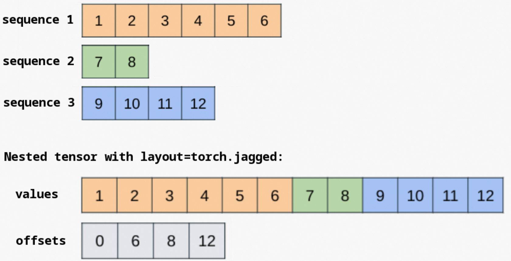

# 小记: PyTorch里面怎么做维度设计才能让attention跑得更快

### 先说结论
关于这个问题, 我先把结论放在开头
#### 必选项
  1. 使用nn.MultiHeadAttention或者F.scaled_dot_product_attention等PyTorch官方提供的attention接口, 非必要不要自己手搓
  2. 使用multi-head注意力机制, 即便num_head=1, 也不要省略head维度
  3. head_dim是8的倍数, 且<256, 最好<192
  4. qkv batch_size尽量一致


#### 建议选项
  1. 使用amp混合精度等措施, 在半精度下进行训练和推理
  2. 如果qkv的batch_size不对齐, 即batch维度存在broadcast的情况, 如果不能自己写算子, 考虑通过expand对齐batch_size
  3. 优先考虑使用is_casual, 无法满足再使用attn-mask, 充分利用attn-mask可以在各个维度上进行broadcast的特性
  4. attention中不要使用dropout

## 正文
2025年的今天, 卷积早早式微, Transfomer大行其道. 我们的模型主干部分很可能是由层层的attention算子堆叠组成的

模型设计的越是坦坦荡荡, 比如形似大模型里面的decoder-only结构, 那么瓶颈越有可能卡在attention这里；

相反, 模型设计的越是弯弯绕绕, 比如判别式的推荐模型里面往往存在对一堆输入特征的小kernel计算, 则瓶颈更有概率在一些小kernel的overhead和访存上

时至今日, PyTorch自身有原生的nn.MultiHeadAttention类, 也有更加底层的F.scaled_dot_product_attention方法. 

前者把qkv的线性投影也封装在类内, 然后调用后者；后者可以更灵活地设计attention前后的处理方法

当然也不乏现在还有一些比较上古的程序员喜欢自己用torch.matmul, transpose, div, torch.nn.softmax来手搓一个attention

$$
\text{Attention}(Q, K, V) = \text{softmax}\left(\frac{QK^T}{\sqrt{d_k}}\right) V
$$

当然我强烈不建议自己手搓, 因为PyTorch官方在scaled_dot_product_attention算子中进行了大量的优化, 相较于自己手搓的版本, 可能会有几倍的性能差距

## PyTorch的优先级策略
从简考虑, 我们只看CUDA上的实现, 默认情况下
```C++
  std::array<at::SDPBackend, at::num_sdp_backends> sdp_priority_order = {
      at::SDPBackend::flash_attention,
      at::SDPBackend::efficient_attention,
      at::SDPBackend::math,
      at::SDPBackend::cudnn_attention,
      at::SDPBackend::overrideable};
```
CUDA上有flash-attention, efficient-attention, math-attention 和 cudnn-attention四种实现, 默认的优先级也是按照这个顺序

如果在sm90以上的架构, 以及cudnn版本大于9的条件下, 如果打开了环境变量TORCH_CUDNN_SDPA_PREFERRED, 则会将cudnn-attention的优先级放在第一位

```C++
if (check_prefer_cudnn_attention()) {
    const std::vector<int64_t> cudnn_order = {static_cast<int64_t>(at::SDPBackend::cudnn_attention),
                                                static_cast<int64_t>(at::SDPBackend::flash_attention),
                                                static_cast<int64_t>(at::SDPBackend::efficient_attention),
                                                static_cast<int64_t>(at::SDPBackend::math)};
}
```

其中除了math实现外, 都是针对attention进行融合或者特别适配的实现, 而math实现顾名思义, 跟手搓的实现没什么特别大区别, 存在多个算子的堆叠, 一方面会有中间的scores tensor占据大量显存, 另一方面频繁的从global memory和shard memory之间搬运数据造成计算访存比下降. 

写代码的时候, 大概率是没有多余的心智去关心会用到flash还是efficeiten或者cudnn的实现, 多数时候他们不会差到哪里去, 我们的目标是防止落到math实现上

## 每一种实现的dispatch条件

不同的硬件平台下会有不同的_fused_sdp_choice_stub函数来决定优先使用那种算法, 比如rocm下有一个, cuda下也有一个. 我们直接看cuda下的函数实现

在aten/src/ATen/native/transformers/cuda/attention.cu文件下有一个_fused_sdp_choice_cuda函数
```C++
int64_t _fused_sdp_choice_cuda(const Tensor& query_, const Tensor& key, const Tensor& value,
        const std::optional<Tensor>& attn_mask_, double dropout_p, bool is_causal, std::optional<double> scale, bool enable_gqa){
  sdp::sdp_params kernel_params{query_, key, value, attn_mask_, dropout_p, is_causal, enable_gqa};
  auto backend = select_sdp_backend(kernel_params);
  if (backend == sdp::SDPBackend::error) {
    TORCH_CHECK(
        false,
        "No viable backend for scaled_dot_product_attention was found. ",
        "This is likely due to turning off both the math kernel and the fused kernels.");
  }
  return static_cast<int64_t>(backend);
}
```
select_sdp_backend函数的实现在aten/src/ATen/native/transformers/cuda/sdp_utils.cpp文件, 已flash-attention为例, 其会进一步调用can_use_flash_attention函数

```C++
// aten/src/ATen/native/transformers/cuda/sdp_utils.cpp
bool can_use_flash_attention(sdp_params const& params, bool debug) {
#ifndef USE_FLASH_ATTENTION
  if (debug) {
    TORCH_WARN("Torch was not compiled with flash attention.");
  }
  return false;
#else // defined(USE_FLASH_ATTENTION)
  // Define gate functions that determine if a flash kernel can be ran
  // Replace with std::to_array when we migrate to c++20
  constexpr auto general_constraints = c10::array_of<bool (*)(sdp_params const&, bool)>(
      check_runtime_disabled_flash,
      check_all_tensors_on_device,
      check_tensor_shapes,
      check_for_attn_mask,
      check_head_dim_size_flash<false /*caller_is_meff*/>,
      check_flash_attention_hardware_support,
      check_requires_grad_and_head_dim_gt192_constraints_on_sm86_89_or_120,
      check_flash_causal_non_square_seqlens,
      check_dtypes_low_precision);
  for (auto& constraint : general_constraints) {
    if (!constraint(params, debug)) {
      return false;
    }
  }

  if (has_for_nested_inputs(params)) {
    constexpr auto nested_constraints = c10::array_of<bool (*)(sdp_params const&, bool)>(
        check_batch_size_nested,
        check_head_dim_size_flash_nested<false /*caller_is_meff*/>,
        check_for_seq_len_0_nested_tensor);
    for (auto& constraint : nested_constraints) {
      if (!constraint(params, debug)) {
        return false;
      }
    }
  }
  constexpr bool backend_supports_grouped_query_attention = true;
  if (has_only_dense_inputs(params)) {
    constexpr auto dense_constraints = c10::array_of<bool (*)(sdp_params const&, bool)>(
        check_batch_size_and_num_heads_dense<backend_supports_grouped_query_attention>,
        check_nonzero_sequence_lengths_dense,
        check_last_dim_stride_equals_1_dense<true /*ignore_singleton_dim=*/>);
    for (auto& constraint : dense_constraints) {
      if (!constraint(params, debug)) {
        return false;
      }
    }
  }
  return true;
#endif // defined(USE_FLASH_ATTENTION)
}
```
可以看出来能否使用flash-attention受到三组约束, 分别是
1. general_constraints 通用约束
2. nested_constraints 嵌套tensor约束
3. dense_constraints 稠密tensor约束

对于nested_tensor, 简而言之一个batch里面的序列长度往往是不一样的, 一般来说我们需要padding到max_length, 为了节约这部分的内存和计算, torch引入了这种在sequence维度展平, 额外维护一个offsets tensor的数据组织方式

当前PyTorch对nested_tensor的支持还处于一个原型状态(截止今天PyTorch2.8是这样的), 这个数据形式一般也没什么人用, 我们直接略过

下面我们逐个解析这些约束
. check_runtime_disabled_flash
- 用户层面可以disabel掉某一种attention的实现, 例如使用如下的装饰器可以直接把flash-attention和memory-efficinet-attention都禁掉
```Python
with torch.backends.cuda.sdp_kernel(enable_flash=False, enable_mem_efficient=False):
```

### general_constraints
- check_all_tensors_on_device: 顾名思义, 所有的tensor都需要在显存上

- check_tensor_shapes
  1. q, k, v需要是4维tensor, 也就是[batch num_head sequence_length head_dim]

- check_for_attn_mask
  1. cuda上的flash-attention实现里面, **不支持传入一个非空的attn-mask**
  2. 这个约束还是很局限的, 在mkldnn的实现上, 却是支持传入attn-mask的
  3. anyway, 好消息是起码没说不支持casual-mask

- check_head_dim_size_flash
  1. q k v 的head_dim需要一致, 并且需要<=256
  2. 在比较先进AMD ROCM版本里面(AOTriton版本>=9), head_dim的维度限制可以放开到512
  3. 这个函数有一个比较有趣的注释 "On ROCM, ME and FA share the backend", 意思是在AMD ROCM上flash-attention和efficient-attention使用的是同一种的核函数实现

- check_flash_attention_hardware_support
  1. flash-attention只支持sm80及以上的硬件, 也就是Ampere架构, 代表卡型A100 RTX3090

- check_requires_grad_and_head_dim_gt192_constraints_on_sm86_89_or_120
  1. 在需要梯度的场景(大白话就是训练的时候), 对于sm86到sm89之间到硬件平台, 如果head_dim的维度在[192, 224]之间, 或者开启了dropout且head_dim在[224, 256]之间, 会有一些bug, 因此特别加了这一条约束

- check_flash_causal_non_square_seqlens
  1. q和kv的序列长度不相等, 但是打开了is_casual的话, 禁用

- check_dtypes_low_precision
  1. 数据类型需要是float16或者bfloat16, 并且qkv dtype需要一致
  2. **不支持float32**


### dense_constraints
- check_batch_size_and_num_heads_dense
  1. q, k, v的batch_size需要一致
  2. q的num_head需要能够整除k\v的num_head, 这里主要是为了支持GQA, 否则一般来说需要三者的num_head一致

- check_nonzero_sequence_lengths_dense
  1. 要求q, k, v的序列长度不为0

- check_last_dim_stride_equals_1_dense
  1. 要求q k v attn-mask在最后一个维度上contiguous, 一般来说attention前会有nn.Linear对qkv进行映射, 所以这一条基本上都是满足的

### 小结
综上来看, 除开一些基本不会碰到的case, cuda上使用flash-attention最大的限制主要是
1. dtype必须是fp16或者bf16
2. head_dim <= 256, 最好是 <= 192
3. 不支持attn-mask
4. qkv的batch_size需要一致, 一般来说这条多数时候是满足的, 但是在一些cross-attention场景下会违反这条约束, 例如搜推广常用的Target-attention, 即用户侧batch_size=1, 商品侧batch_size等于商品数量


efficient-attention和cudnn-attention, 我制作了一个表格

| 注意力类型            | Batch 维约束                               | head_dim 要求                                  | 数据类型               | 支持 attn-mask | 架构要求                         | 备注                                                       |
|-----------------------|--------------------------------------------|------------------------------------------------|-----------------------|----------------|----------------------------------|------------------------------------------------------------|
| Flash Attention       | qkv batch_size 一致<br>q 的 num_head 可以是 kv 的整数倍 | <= 256<br>sm86-90 且 under_train <192          | float16<br>bfloat16   | no             | >sm80                            |                                                            |
| Efficient Attention   | qkv batch_size 一致<br>qkv num_head 一致  | 4 的倍数<br>半精度下使用 tensorcore 需要是 8 的倍数 | float16<br>bfloat16<br>float32 | yes            | >sm50                            |                                                            |
| cuDNN Attention       | qkv batch_size 一致<br>q 的 num_head 可以是 kv 的整数倍 | <= 128                                         | float16<br>bfloat16   | yes            | >sm80<br>cuDNN >9.0               | 设置环境变量 TORCH_CUDNN_SDPA_PREFERRED<br>sm90 以上优先级高于 Flash Attention |


进一步地, 就能得到开头的维度上的建议. 