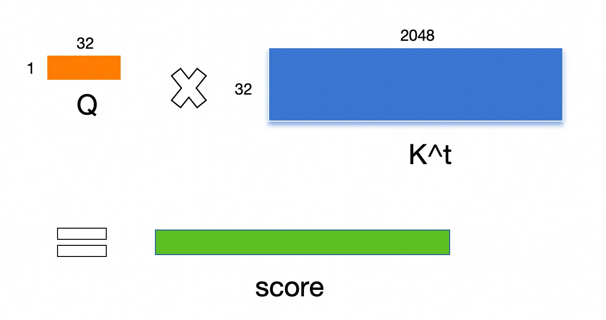
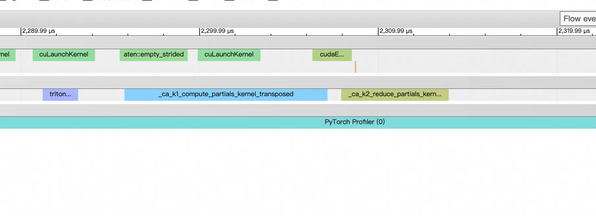
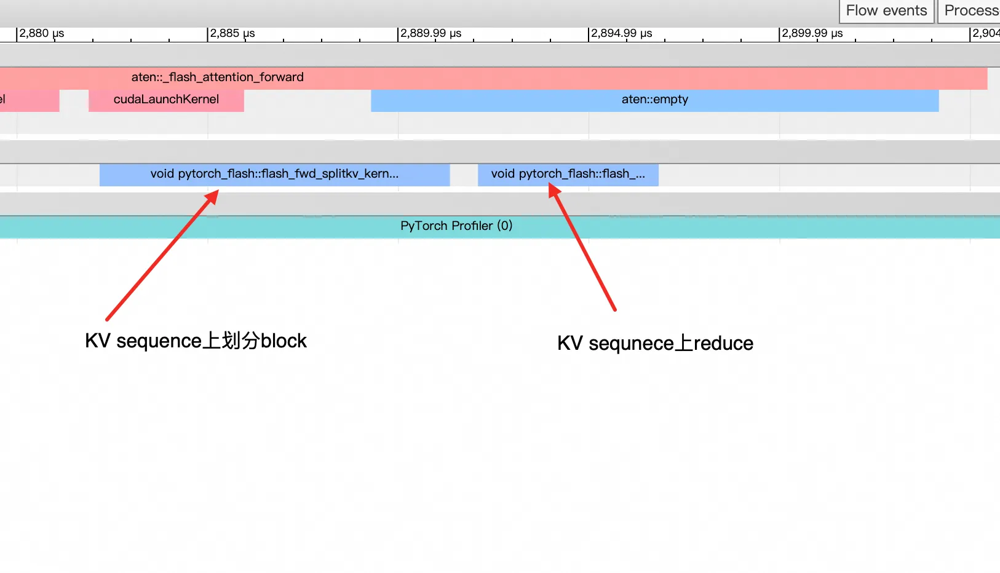
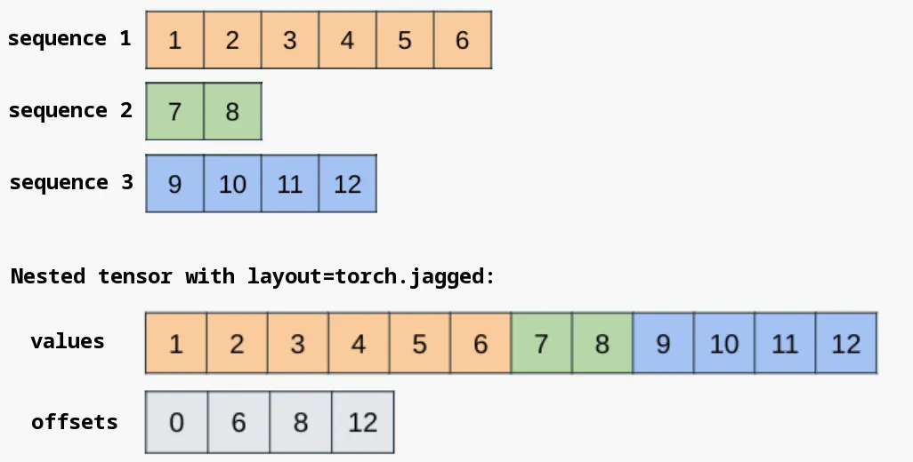
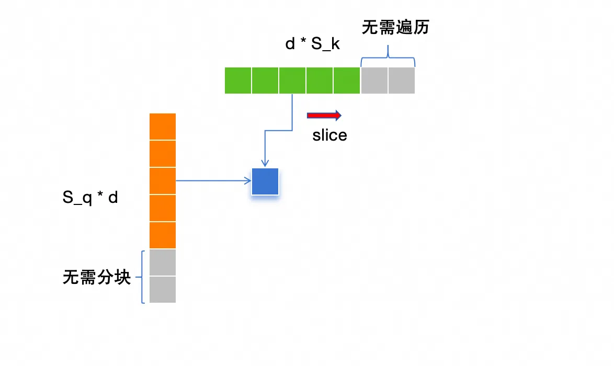
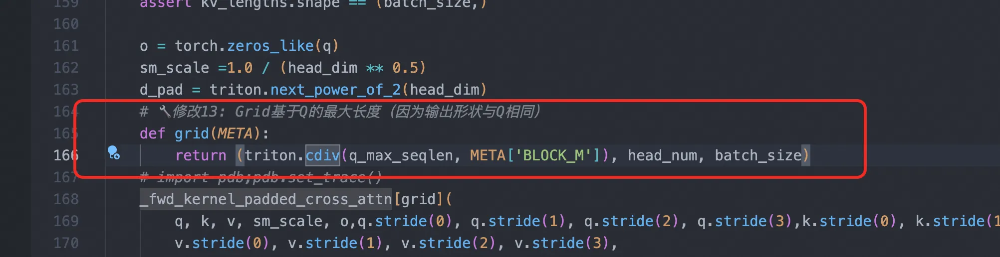
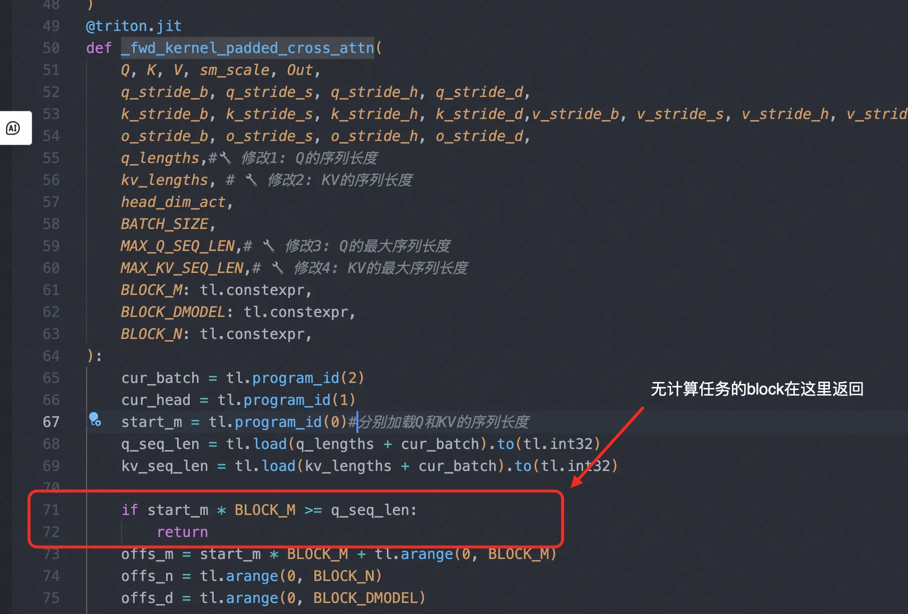

# 搜推场景下的Target-Attention和可变长Flash-attention的加速策略
## Target-Attention
### 为什么常规flash-attn算法对于TA的效率不高

总结来看主要两方面的原因：
1. 单个block需要遍历完整的KV的sequence维度，计算压力大
2. 一般会按照Q的batchsize大小，在这个维度上起对应数量的block，单个block需要访问完整的KV，计算访存比低

target-attention中Q是item特征，维度是[item_count, 1, dimension]，KV是user侧特征，维度是[1, sequence_lenght, dimension]
为了简化建模，我们假定打分item数量是1000，序列长度是2048，dimension是32

#### 为什么单个block计算压力大

因为batch维度在算子内都是在不同的block中并行，我们考虑其余两个维度：



target-attention非常显著的特征是，Q的序列长度是1，K和V的序列长度很长，这里是2048

中间结果attn-score的维度是[1, 2048]，softmax需要在这边的2048维度上进行，也就是说需要这"一行"的累积的logit_sum值才能进行softmax计算

在flash-attention算法里面，尽管并不需要一个完整的attn_score中间矩阵，但为了实现对一行的softmax计算，一个block需要循环遍历K V的完整sequence维度，然后记录

  1. 累加的输出值 (Accumulated Output Value) - acc
  2. 当前行的最大 Logit 值 (Row-wise Maximum Logit) - m_i
  3. 当前行的 Softmax 分母的累加和 (Sum of Softmax Denominator) - l_i

很明显这种记录是连续迭代，不能跨越多个block的

因此，flash-attention中，K V的sequence维度必须由同一个block进行计算，即只能在Q的sequence维度进行分块并行，而不能在K V的sequence维度并行

那么问题就很明显了，由于target-attn的head_dim维度一般都很短，这个维度上没必要进行分块，因此在一个算子中，我们只能在

1. batch_size(打分文档数)
2. num_head
3. Q的sequence_length

三个维度上进行切分block，并且由于Q的序列长度是1，这个维度上只需要一个block

对于每一个block来说，需要完整遍历整个kv的sequence_length维度，假设BLOCK_K=128，kv_sequence_length=2048，那一个block就需要循环16次，效率低也是理所应当的

那为什么一般的self-attn里面没有这个问题呢？这是因为在self-attn中，Q的序列长度远大于1，本身计算量就大得多，单个block相比于全局的计算强度，自然也就小下来了

#### 为什么计算访存比不高
一般而言，flash-attn算子会在Q的batch维度，对于每一个batch都单独划分一个block，在Q的sequence_length维度会切分多个block

以Q[1000, 1, 32]，K V [1, 2048, 32]为例，每一个Q的batch维度的block都需要去完整访问K和V的完整数据，相当于访存了[1, 2048, 32]总共1000次，这个计算访存比是相当低的

为了验证我们的猜想，我们把Q的batch和sequence维度进行transpose，测量一下运算时间，理论上不影响运算正确性，但是transpose之后会在Q的sequence维度上切分block

假设BLOCK_S = 128，则只需要完整访问KV总计1000 // 128 + 1 = 8次，计算访存比大幅提升

```Python
def cross_attention(q, k, v):   
    return F.scaled_dot_product_attention(q, k, v)

def cross_attention_transpose(q, k, v):   
    q = q.transpose(0, 1)
    result = F.scaled_dot_product_attention(q, k, v)
    return result.transpose(0, 1)
```

| 序列长度 | Q [1000, 1, 32] | K&V [1, sequence_length, 32] | 2048  | 4096  | 6144  | 8192  | 10240 |
| -------- | --------------- | ---------------------------- | ----- | ----- | ----- | ----- | ----- |
| transpose前 | 0.328 ms        | 0.654 ms                     | 0.988 ms | 1.313 ms | 1.661 ms |       |
| transpose后 | 0.171 ms        | 0.294 ms                     | 0.319 ms | 0.390 ms | 0.610 ms |       |

只是简单transpose了Q的batch和sequence_length维度, 却带来了2～3倍的性能提

### 加速策略——在序列维度上进行切分block, 单block处理多个Q的batch&head实例
知道了block TA进一步提速的原因，加速策略就非常清晰了

1. 针对单个block需要完整遍历整个kv的sequence维度造成的计算瓶颈，就是需要在kv的序列长度维度进行切分block, 

2. 针对计算访存比低的瓶颈，我们在Q的 batch&head 维度上也进行切分，在Q的 batch&head 维度上划分出 triton.cdiv(batch_size, BLOCK_BH)个block，相当于单个block要处理多个Q的batch&head实例

针对1，我们可以独辟蹊径，把flash-attention拆分成两个kernel来完成一次target-attention：

1. kernel_1: 在kv_sequence_length维度上起多个block，在每个block内部统计  
  i. 累加输出值acc  
  ii. 当前block的logit最大值  
  iii. 当前block的softmax分母累加和

2. kernel_2: 在kv 序列维度上进行规约操作，按照局部logit最大值缩放acc，最后除以当前维度上所有block的softmax分母累加和之和

这样kernel_1就可以在 kv 的序列维度上起多个block

当然起的block越多，kernel_2的规约压力就会变大，同时中间变量的大小也会变大

我测试下来，比较均衡的 BLOCK_K=128 

针对2，我们可以使用triton的finetune能力，自动寻找性能最优的BLOCK_B（如果存在head维度的话则是BLOCK_BH）

如果想要实现得更加简单一些，也可以像上面的测试用例一样，将batch维度和sequence维度进行transpose，这样直接正常在sequence维度上进行切分block即可

需要注意的是，如果存在head维度(也就是支持MHA的情况下)，建议把head维放在batch维度的前面. 
这样一个block连续处理的token大概率属于同一个head，也只需要访存K V的对应的一个head的数据即可，能减少访存量. 
否则block处理Q的多个head的话，也需要访存K V的对应多个head的数据

对于kernel_1，我的finetune空间是

```Python
@triton.autotune(
    configs=[
        triton.Config({'BLOCK_HB': 16, 'BLOCK_S_GRID': 128, 'BLOCK_DK_COMPUTE': 32, 'BLOCK_DV_O': 32}, num_warps=4, num_stages=4),
        triton.Config({'BLOCK_HB': 16, 'BLOCK_S_GRID': 128, 'BLOCK_DK_COMPUTE': 32, 'BLOCK_DV_O': 32}, num_warps=8, num_stages=3),
        
        triton.Config({'BLOCK_HB': 32, 'BLOCK_S_GRID': 128, 'BLOCK_DK_COMPUTE': 32, 'BLOCK_DV_O': 32}, num_warps=4, num_stages=3),
        triton.Config({'BLOCK_HB': 32, 'BLOCK_S_GRID': 128, 'BLOCK_DK_COMPUTE': 32, 'BLOCK_DV_O': 32}, num_warps=8, num_stages=3),
        triton.Config({'BLOCK_HB': 32, 'BLOCK_S_GRID': 128, 'BLOCK_DK_COMPUTE': 32, 'BLOCK_DV_O': 32}, num_warps=4, num_stages=4),
        triton.Config({'BLOCK_HB': 32, 'BLOCK_S_GRID': 128, 'BLOCK_DK_COMPUTE': 32, 'BLOCK_DV_O': 32}, num_warps=8, num_stages=4),

        triton.Config({'BLOCK_HB': 64, 'BLOCK_S_GRID': 128, 'BLOCK_DK_COMPUTE': 32, 'BLOCK_DV_O': 32}, num_warps=4, num_stages=3),
        triton.Config({'BLOCK_HB': 64, 'BLOCK_S_GRID': 128, 'BLOCK_DK_COMPUTE': 32, 'BLOCK_DV_O': 32}, num_warps=8, num_stages=3),
        triton.Config({'BLOCK_HB': 64, 'BLOCK_S_GRID': 128, 'BLOCK_DK_COMPUTE': 32, 'BLOCK_DV_O': 32}, num_warps=4, num_stages=4),
        triton.Config({'BLOCK_HB': 64, 'BLOCK_S_GRID': 128, 'BLOCK_DK_COMPUTE': 32, 'BLOCK_DV_O': 32}, num_warps=8, num_stages=4),
    ],
    key=['SEQ_LEN_KV', 'D_K', 'D_V', 'TOTAL_HB', 'B_DIM'],
)
```

### 测试结果
#### 测试条件
    1. Q: [1000, 1, 32] 
    2. K&V: [1, 2048~10240, 32]  不考虑attn_mask
    3. dtype torch.float16
    4. NVIDIA A10
    5. 使用AOTInductor编译后测算端到端的latency，理论上要算法启动时间，比kernel实际执行的时间高，kernel的时间执行时间需要看timeline

timeline上显然第一个算子由于计算压力更大，timeline上两个算子的耗时总和，2048序列长度下耗时0.018ms，10240序列长度下是0.086ms



与原始PyTorch的scaled_dot_product_attention算子或者手写的attention相比，性能都有明显的提升，带启动时间的端到端耗时约是scaled_dot_product_attention的1/3到1/4左右

Triton 1-stage target-atten是一个参照flash-attn实现的算子，在Q的batch维度上会切分batch个block，理论上访存是比较受限的
scaled_dot_product_attention并未进行transpose和expand之类的操作，只依赖算子自身的广播

| Sequence Length | Triton 2-stage target-atten (ms) | Triton 1-stage target-atten (ms) | Handwritten Attention (ms) | scaled_dot_product_attention (ms) |
|-----------------|----------------------------------|-----------------------------------|---------------------------|-----------------------------------|
| 2048            | 0.0668                           | 0.2776                            | 0.1764                    | 0.3276                            |
| 4096            | 0.0892                           |                                   | 0.3685                    | 0.6539                            |
| 6144            | 0.0961                           |                                   | 0.5532                    | 0.9878                            |
| 8192            | 0.1236                           |                                   | 0.7551                    | 1.3135                            |
| 10240           | 0.1459                           | 1.6527                            | 0.9578                    | 1.6613                            |

我们自己实现的triton版本的TA相较于常规写法，基本有一个数量级的性能提升

### PyTorch里面有免费的午餐
做到这里当然可以很开心，因为我们的效率已经远优于PyTorch的scaled_dot_product_attention了。

但是其实我们可以不用那么麻烦，通过一些比较hack的"黑魔法"，我们可以触发sdpa算子做跟我们一样的事情。

具体来说就是：

1. 如果是单头的注意力，即Q[batch 1 dim]，KV [1, seq_len, dim]，则先插入一个head维度，即Q变成[batch, 1, 1, dim] KV变成[1, 1, seq_len, dim]。如果是多头注意力则无需这个操作，head_num需要是4的倍数
2. 随后我们transpose Q的batch和sequence维度
3. 调用F.scaled_dot_product_attention算子后，将输出结果的batch和sequence维度再transpose回来

经过上面三个步骤，sdpa算子的性能与我们前面精心finetune的two-stage triton算子对比如下：

| Sequence Length                | 2048     | 4096     | 6144     | 8192     | 10240    |
|--------------------------------|----------|----------|----------|----------|----------|
| Two-stage Triton               | 0.0668 ms | 0.0893 ms | 0.0961 ms | 0.1236 ms | 0.1459 ms |
| Scaled Dot Product Attention   | 0.0974 ms | 0.0967 ms | 0.0983 ms | 0.0968 ms | 0.0985 ms |

哇，在一系列hack的操作下，scaled_dot_product_attention的性能取得了惊人的提升，在序列长度小于6000时略输于我们的triton实现，高于6000时略优，相较于原始的性能，具有一个数量级的性能提升，这是怎么做到的呢？我们看一眼timeline



天下英雄果如过江之鲫，江的对岸是我们共同的终点。

原来我们能想到的优化思路，早早也能被别人想到（two-pass的attention早在21年就被提出来了）

经过"黑魔法"的操作之后，scaled_dot_product_attention选择了和我们一样的两阶段的方案，在KV的sequence维度上划分block，再起一个算子进行reduce，同时单个block处理多个Q的batch&head来降低访存压力

在一个真实的受限于TA性能的业务上，通过TA优化，我们成功将吞吐从500以下翻倍到了2000左右，密集运算的latency从3.5ms下降到0.5ms，取得了惊人的性能提升

## Variabl-length attention

搜推里面往往会使用很多的序列特征，例如用户的行为序列，点击序列，由于用户行为的差异，这些序列不一定都是满的，因此在特征前处理的过程中一般都需要padding到指定长度，由此带来了一定程度的冗余计算，尤其是在attention这种计算复杂度与序列长度的二次方成正比的场景。

### padding

在一个batch里面，如果序列数据的序列长度不一样，为了能在batch维度上进行concat"凑批"，一般而言我们会将之进行padding到MAX_SEQ_LEN


在训练过程中，我们可以padding到当前batch的最大SEQ_LEN，例如当前的batch里面，序列长度分别是[2, 3, 4]，只需要统一padding到4即可，下一次请求的batch是[3, 4，5]的话，则padding到5

因为运算一般都是在token维度生效的，所以这样并不会影响正确性，还能节约一点计算量（不过这对于torch.compile会有明显的负面影响, 会频繁触发shape guard）

但是在AOTInductor推理的场景，一次aoti_compile_and_package的结果，与编译时输入的一个batch的数据完全绑定了

例如输入进行编译的SEQ_LEN=4，则中间的C++代码会按照位宽为4*sizeof(float)进行访存，假设这个时候输入一个SEQ_LEN=5的数据，因为只读取了前4个值，运算结果就不对了，所以AOTInductor上，假设只使用一个AOT编译产物的情况下，SEQ_LEN只能指定为全局的MAX_SEQ_LEN

### flatten
显然这种padding策略，既不是内存最优也不是计算最优的，大模型里面往往会将batch维度进行展平：


然后借助第三方库，例如flash-attn或者xformer提供的支持可变长attention的算子，来实现计算和存储的最优

```Python
from flash_attn import flash_attn_varlen_func
packed_output = flash_attn_varlen_func(
            q=packed_q,
            k=packed_k,
            v=packed_v,
            cu_seqlens_q=cu_seqlens,
            cu_seqlens_k=cu_seqlens,
            max_seqlen_q=max(actual_lengths),
            max_seqlen_k=max(actual_lengths),
)

# 或者xformer
import xformers.ops as xops
from xformers.ops.fmha.attn_bias import BlockDiagonalMask
packed_q = torch.cat(packed_parts_q, dim=0).unsqueeze(0)  # [1, total_len, num_heads, head_dim]
packed_k = torch.cat(packed_parts_k, dim=0).unsqueeze(0)
packed_v = torch.cat(packed_parts_v, dim=0).unsqueeze(0)

attn_bias = BlockDiagonalMask.from_seqlens(actual_lengths)#.make_causal()# 5. 执行attention

packed_output = xops.memory_efficient_attention(
    packed_q, packed_k, packed_v,
    attn_bias=attn_bias
)
```

很明显，在大模型里面这种做法是最优并且完全可行的，因为单次token生成大模型里面只有一个输入，也就是prompt+已生成的tokens，然后一路往下做self-attention即可，完全可以摒弃掉batch的概念，使用类似于[all_tokens, num_head, head_dim]的组织结构

上面提到的flash_attn和xformers都是第三方库，并非torch原生的算子。torch官方也知道自己在这方面的局限性，因此实验性的推出了nested_tensor功能，这是一种jagged-tensor，支持一个batch内的tensor具有不同的序列长度，并且在内存上无需进行padding


Torch提供了接口将一个常规的tensor转换为nested_tensor

```Python
def convert_padded_to_nested_with_narrow(padded_tensor, lengths):
    """
    padding_tensor: [batch, max_seq_len, head_dim]
    length: [batch]
    """
    return torch.nested.nested_tensor([t[:, :lengths[i]] for i, t in enumerate(padded_tensor)])
```
nested_tensor目前还是一个实验性质的功能，但是最基本的，sdpa算子已经开始支持这种tensor类型了

### 搜推场景引入flatten的局限

而在搜推里面，由于有着多路的序列特征输入，和商品特征输入，很难让用户在训练和推理中都遵循all_tokens的组织形式，即便遵循了，恐怕编程负担也很重，因此batch的概念几乎无法被摒弃掉。

那我们是否可以在中间过程中进行flatten，然后使用flash-attn提供的算子呢？理论上是可行的，但是flatten本身是一个相当耗时的操作, 我们做一个测试如下

测试条件

1. batch_size, max_seq_len, head_num, dim = 16, 1024, 4, 256
2. 实际的序列长度 [48, 96, 144, 192, 240, 288, 336, 384, 432, 480, 528, 576, 624, 672, 720, 768]

|                   | Fp32 Overall Time (ms) | Fp32 Dense Computation Time | Fp32 Format Conversion Time (Input Format Conversion & Unpacking) | Fp16 Overall Time (ms) | Fp16 Dense Computation Time | Fp16 Format Conversion Time (Input Format Conversion & Unpacking) | Remarks                        |
|-------------------|------------------------|-----------------------------|-------------------------------------------------------------------|------------------------|-----------------------------|-------------------------------------------------------------------|--------------------------------|
| PyTorch SDPA      | 8.37                   |                             |                                                                   | 2.56                   |                             |                                                                   | 使用efficient实现             |
| xformer memory_efficient_attention | 2.93                   | 2.26                        | 0.67                                                              | 1.10                   | 0.47                        | 0.63                                                              | 需要做格式转换                |
| PyTorch SDPA nested_tensor (实验功能) | 8.15                   |                             | 3.89                                                              |                        |                             |                                                                   |                                |
| Flash-attention flash_attn_varlen_func |                        |                             |                                                                   | 1.14                   | 0.35                        |                                                                   | 仅支持Fp16, 误差在1e-4量级     |

可以看到在FP16下：

1. 尽管flash-attn和xfomer都做到了SDPA的40%以下的耗时，但是其中大半时间耗费在将一个[batch, num_head, seq_len, head_dim]维度的tensor进行flatten的过程
2. 而对于nested_tensor，非但也需要tensor的格式变换开销，并且算子效率还不如原生的SDPA
3. 同时这种tensor格式的转换开销，与batchsize的大小成正比，现在batchsize=16下，flash-attn库的速度要优于SDPA，但在我额外的测试里面， 当batchsize上升到三位数，就会远不如SDPA

同时还有一个额外的麻烦事，tensor转换为flatten_tensor的过程往往需要一种非常Pythonic的编码方法，需要在batch_size维度进行一个for循环. 

这引入了实际的数据依赖，也就是说TorchDynamo在数据未知时，无法推导出结果的shape，会直接导致capture fx graph的失败。自然也无法被AOTInductor进行编译

```Python
packed_parts_q = []
packed_parts_k = []
packed_parts_v = []
actual_lengths = []
for i in range(batch_size):
    actual_len = seq_lengths[i].item()
    actual_lengths.append(actual_len)
    # 只取有效长度的部分
    packed_parts_q.append(query_bmhk[i, :actual_len])# [actual_len, num_heads, head_dim]
    packed_parts_k.append(key_bmhk[i, :actual_len])
    packed_parts_v.append(value_bmhk[i, :actual_len])# 3. 拼接成一个长序列[1, total_len, num_heads, head_dim]
if len(packed_parts_q) == 0 or sum(actual_lengths) == 0:
    # 处理边界情况：所有序列长度为0
    return torch.zeros_like(query)
```

Torch官方对nested_tensor也只能说是...真不好用...

torch提供的将tensor转换为nested_tensor的接口，本身就是不支持Dynamo的，在训练环境下也会造成torch.compile的graph break，更不支持AOTInductor

### 不做flatten的可变长的flash-attn方法


我们可以写一个自己的支持可变长输入的flash-attention算子，接受[Batch Hwad Sequence Dim]维度的QKV以及额外的表示有效长度的cur_q_len和cur_kv_len作为输入

在flash-attention的外循环中，只遍历Q有效的sequence部分; 在内循环中，如果block达到了当前KV sequence的边界, 则不再继续计算, 直接return

TorchDynamo和AOTInductor里面引入实际的数据依赖是很麻烦的一件事，为了避免实际数据依赖，按照q_max_seq_len起block. 如果想进一步优化，可以按照实际有效长度起更少的block，但是大多数无计算任务的block任务会很快return，因此开销不大




#### Float16 Performance

Nvidia A10循环100次

输入tensor包含：

1. input_tensor [batch, sequence_length, num_head, head_dim] 
2. lengths [batch]
3. lengths = np.linspace(128, max_seq_len, batch_size).astype(np.int32)

对于flash-attention. xformer等库，需要额外包含tensor flatten开销

"Triton 版本带 flatten 实现" 指接受flatten后的tensor作为输入的triton版本的可变长flash-attention实现，同样包含flatten开销

| Description                           | Time (ms) ｜ 除去packing的耗时 | Configuration (Batch, Seq Length, Heads, Head Dim) |
|---------------------------------------|-------------------------------|-----------------------------------------------------|
| Scaled Dot-Product Attention 实现     | 318.05                        | (16, [128-1024], 4, 256)                            |
| Nested Tensor 实现                    | 394.91                        | (16, [128-1024], 4, 256)                            |
| Triton 版本带 flatten 实现           | 228.65                        | (16, [128-1024], 4, 256)                            |
| Flash-Attention 库实现               | 130.85 | 52.21 ｜ (16, [128-1024], 4, 256)                 | (16, [128-1024], 4, 256)                            |
| XFormer 库实现                       | 143.03                        | (16, [128-1024], 4, 256)                            |
| Triton 版本，无需 flatten 实现 | 92.42                         | (16, [128-1024], 4, 256)                            |


| Description                           | Time (ms) ｜ 除去packing的耗时       | Configuration (Batch, Seq Length Range, Heads, Head Dim) 序列长度59 |
|---------------------------------------|-----------------|--------------------------------------------------------------------|
| Scaled Dot-Product Attention 实现     | 26.71           | (400, [30-45], 8, 64)                                              |
| Nested Tensor 实现                    | 3602.24         | (400, [30-45], 8, 64)                                              |
| Triton 版本带 Packing 实现            | 1714.49         | (400, [30-45], 8, 64)                                              |
| Flash-Attention 库实现               | 1716.08 ｜ 24.57| (400, [30-45], 8, 64)                                              |
| XFormer 库实现                       | 1703.36         | (400, [30-45], 8, 64)                                              |
| Triton 版本，无需 Packing，Tensor Core 实现 | 17.67          | (400, [30-45], 8, 64)                                              |

表1是一个常规的tensor输入，batch_size=16 序列最大长度1024，真实长度在128～1024内均匀分布，num_head=4 head_dim=256
. flash-attn耗时130.82，其中扣除将tensor展平的开销，仅用52.21ms. 我们自己写的triton算子有接近于flash-attn的表现


表2是一个实际业务的测试结果，batch_size=400，序列最大长度59，其中真实长度在30～45之间均匀分布，num_head=8 head_dim=64. 在这个不那么规则的attention上，triton算子有着优于flash-attn库的表现