## RTP-Torch上某直播推荐业务kernel优化实战
该业务使用RTP-Torch进行部署，经过AOTInductor的编译优化之后，密集运算耗时在6ms左右。

### 从attention执行时间进行切入
先纵观一下整体的TimeLine

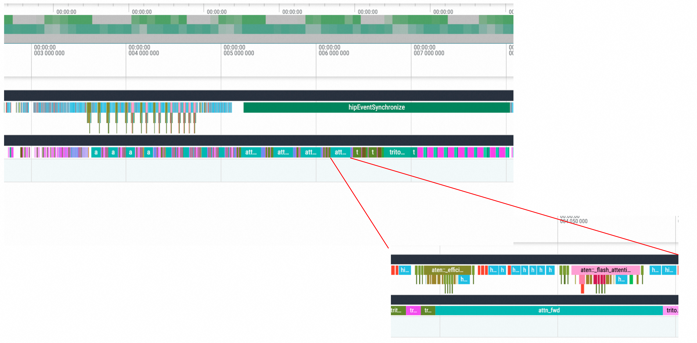

1. 除了最初有一些dtype转换、很小的gemm以及aten::empty造成的bubble之外，整体的TimeLine相当密集，粗略判断在执行层面没有太大的优化空间。
2. kernel层面，attn_fwd(蓝色kernel, AMD ROCM平台上的scaled_dot_product_attention实现)占据了最大一部分执行时间，当然由于整体网络算子比较稀疏的问题，最大也不过只有30%

分析fx graph文件，整个执行过程中需要执行16个sdpa操作，可以4个相同维度的sdpa为一组，可以分为4组。下面分组进行分析

### efficient-attention的重新实现
```python
scaled_dot_product_attention
    aten.scaled_dot_product_attention.default
    torch.Size([1, 8, 890, 16])
    torch.Size([1, 8, 890, 16])
    torch.Size([1, 8, 890, 16])
    torch.Size([1, 1, 1, 890])
```
第一组attention的Q,K,V维度一致，同时具有attn_mask，是一组很常见的self-attention操作，其中batch-size恒定为1是因为这是user侧的操作。根据之前的这篇ATA[小记: PyTorch里面怎么做维度设计才能让attention跑得更快
](https://zhuanlan.zhihu.com/p/1951418724851619024)，这个sdpa会被dispatch到efficient-attention的实现，在我的NVIDIA A10开发机上也确实如此:

<!-- 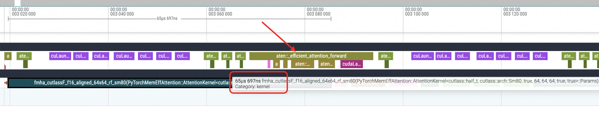
*图：A10上efficient-attention* -->
<div style="text-align: center;">


*图：A10上efficient-attention*
</div>

耗时在65us左右，是一个符合预期的水平。但是在理论算力接近A10两倍的 AMD 平台上，最终的attn_fwd算子(应该是aotriton的实现)耗时到了100us。
<!-- 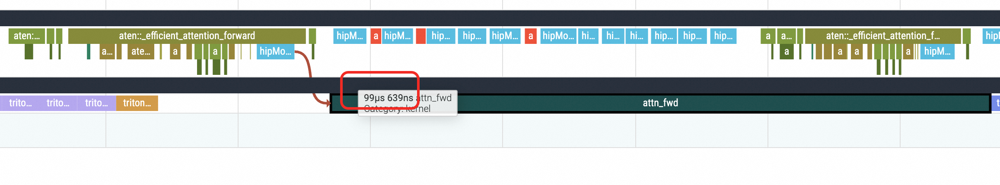
*图：AMD上原始实现* -->
<div style="text-align: center;">


*图：AMD上原始实现*
</div>

也没啥好的原因分析，单纯觉得AMD的实现效果不太行，为此，使用常规flash-attention的写法，我们专门写了一个triton kernel平替掉AMD上的efficient-attention实现，经过一组特别选择的autotune-config，kernel执行时间下降到了与A10相近的水平
<div style="text-align: center;">

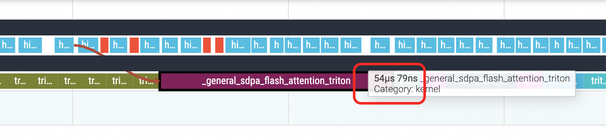
*图：AMD上替换实现 - triton kernel优化后的性能提升效果*
</div>
<!-- 
*图：AMD上替换实现 - triton kernel优化后的性能提升效果* -->

### Long-KV attention
```Python
scaled_dot_product_attention_4
    aten.scaled_dot_product_attention.default
    torch.Size([1, 8, 18, 16])
    torch.Size([1, 8, 890, 16])
    torch.Size([1, 8, 890, 16])
    torch.Size([1, 1, 1, 890])
```
第二组attention是不同domain特征的cross-attention，Q的序列很短，只有18，KV的序列相对比较长，到了890. 在TimeLine上这个kernel的耗时不算很长，AMD上大约是62us
<div style="text-align: center;">

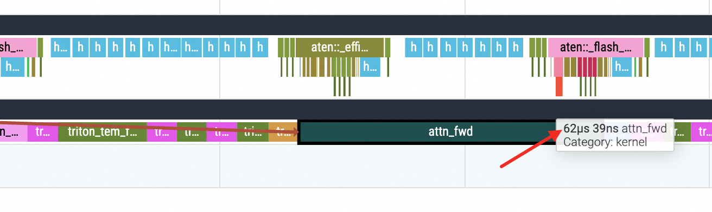
*图：AMD上这组Attention耗时在62us*
</div>

跟这篇ATA[搜推场景下的Target-Attention和可变长Flash-attention的加速策略](https://zhuanlan.zhihu.com/p/1939818412491641816)里面提到的Target-Attention有点异曲同工了，只是这边KV虽然长，但是没有想象中那么长。

解决的思路与Target-Attention是一样的，Split-K，启动！替换之后kernel耗时从62us下降到18.5us
<div style="text-align: center;">

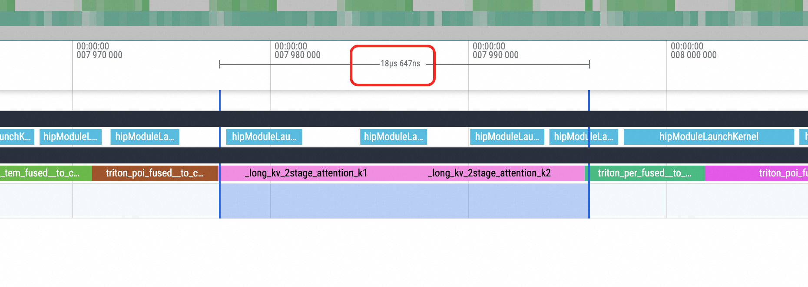
*图：替换为Split-K的两阶段算子之后*
</div>

### 短序列&&超大batch attention
```Python
scaled_dot_product_attention
    aten.scaled_dot_product_attention.default
    torch.Size([s15, 8, 18, 16])
    torch.Size([s15, 8, 18, 16])
    torch.Size([s15, 8, 18, 16])
    torch.Size([s15, 1, 1, 18])
```
第三组attention非常有特色, 本身在序列维度和d_model上都非常小，但是存在batch概念。整个服务晚高峰期间，s15可能会波动到1700

一般而言，写kernel的时候，会直接在Batch和Head维度上，每一个都切分block，那这一个kernel就会启动
1700 * 8 = 13600 blocks，显然这远远超过了GPU上的CU数量。
1. 一方面每个block计算强度非常小，频繁切换造成调度开销增加
2. 其次频繁的context switch 会造成L2命中率下降(这条是gemini说的)

针对这个维度的attention，我们先跟用户进行了讨论，发现去除attn_mask不影响逻辑，去除之后，还是这篇ATA[小记: PyTorch里面怎么做维度设计才能让attention跑得更快
](https://zhuanlan.zhihu.com/p/1951418724851619024)，整个attention会被dispatch到flash-attention实现，效率比efficient-attention更高

batch_size=1536时, kernel耗时是209us左右
<div style="text-align: center;">

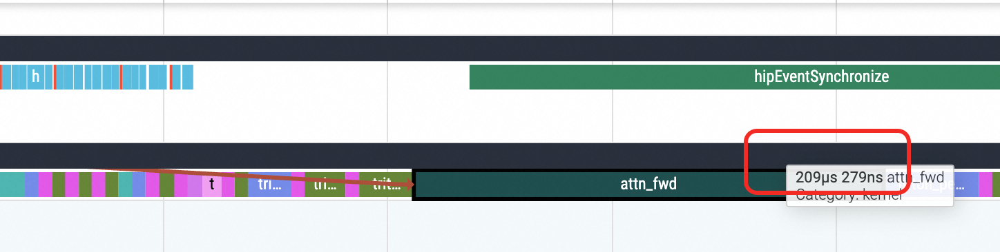
*图：去除attn_mask之后 耗时在209us*
</div>

在这篇ATA[寻找最优attention实现 ——首猜语义ID排序20步decoder进一步优化实战](https://ata.atatech.org/articles/11020489614)中，我们针对紧凑的self-attn开发了一版attention算子，也能应用到这个场景，替换之后，耗时从209us下降到102us
<div style="text-align: center;">

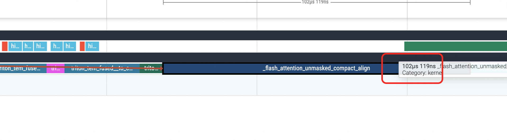
*图：替换为紧凑self-attn算子之后 耗时下降一倍*
</div>

但是这个紧凑型算子，依旧是在batch和head维度上逐个起block的，没有解决之前block数量太高的矛盾，于是我又写了一个特别适配度attention kernel:
1. 在head维度上不进行切分，即单个block需要一次性把8个head全部算完，启动的block数量变为1/8
2. 由于序列维度特别短，不在序列维度上进行遍历循环，极致简化分支控制逻辑

kernel耗时进一步下降到42.6us，相较于原始的209us，仅稍高于原始耗时的1/5
<div style="text-align: center;">

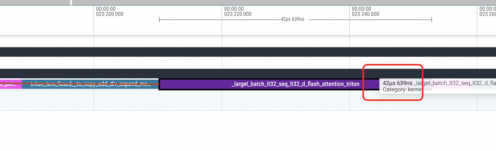
*图：进行了head维度合并和去除kv序列维度循环后 耗时进一步大幅下降*
</div>

### Tiny-SelfAttn
```Python
scaled_dot_product_attention_5
    aten.scaled_dot_product_attention.default
    torch.Size([1, 8, 18, 16])
    torch.Size([1, 8, 18, 16])
    torch.Size([1, 8, 18, 16])
```
第四组attention是一个微型的self-attention，kernel耗时在7us左右，本身耗时太短，出现次数也不够多，没啥好拿的收益，略过
<div style="text-align: center;">

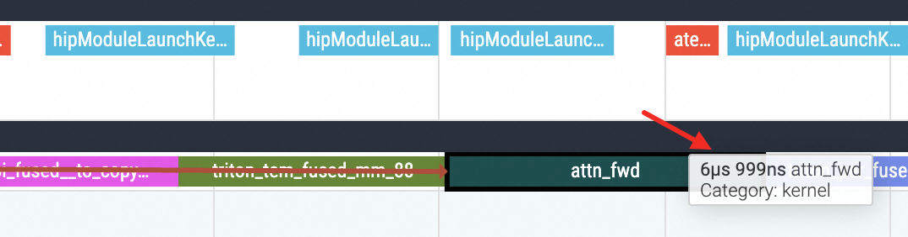
*图：极小的self-attention*
</div>

### e2e效果
稠密运算的e2e耗时从5.7ms下降到4.2ms，下降幅度26.3%。当然，一个搜推网络包含稀疏特征和稠密网络两部分，我们仅是降低了稠密运算的耗时。

<div style="text-align: center;">
  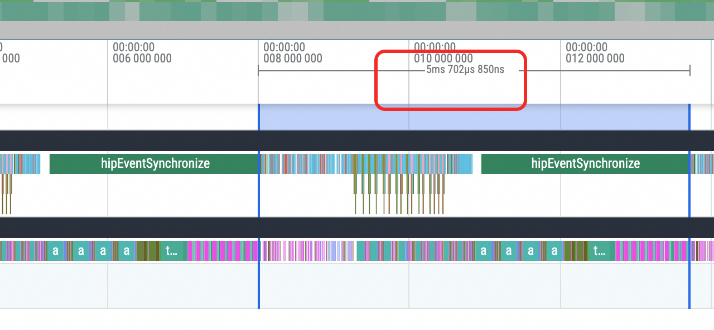
  <br>
  <em>图：原始e2e耗时5.7ms</em>
</div>


<div style="text-align: center;">
  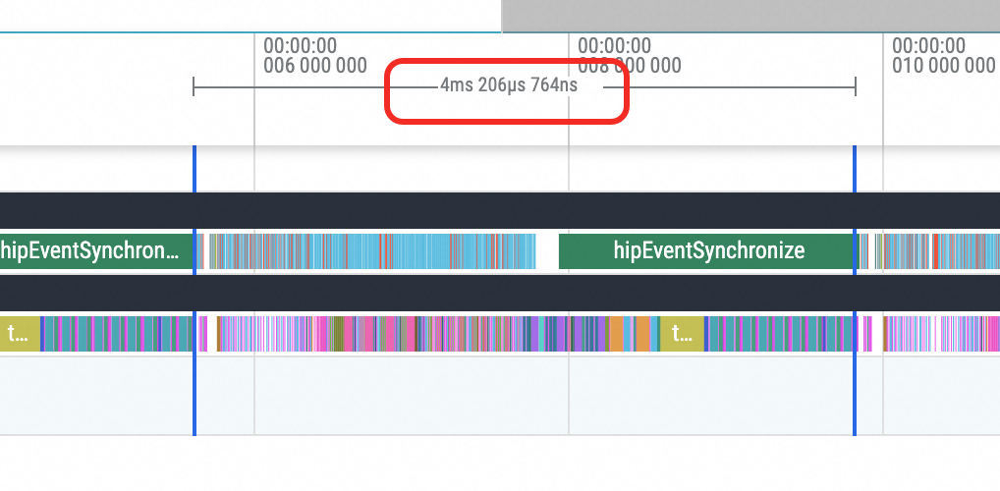
  <br>
  <em>图：各项优化之后 耗时下降到4.2ms</em>
</div>

服务晚高峰出现在晚上21:00，观察3天的latency数据，可以看到是逐日下降，并且这边的算子替换是使用紧凑型attn的结果，理论上换上合并head版本的attention还有一点点下降的空间。
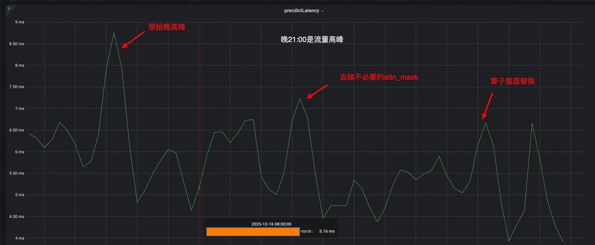


随后在第二天中午的低峰时刻，我把合并head减少block数量的attention算子发送上线，可以看到latency在短时间内有一个明显的下降

<div style="text-align: center;">
  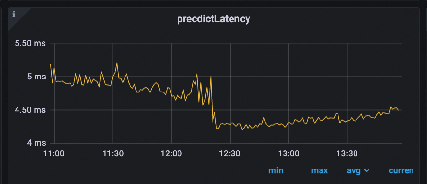
  <br>
  <em>图：合并head减少block数量之后 发送上线</em>
</div>


在另一个部署上，同样在下午的低水位时刻，应用上了前述的全局优化措施，同样在短时间内latency有一个快速的下降
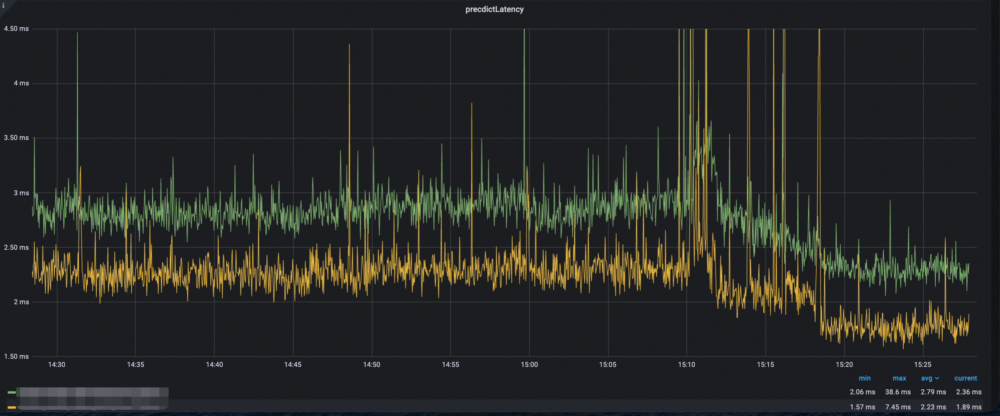
