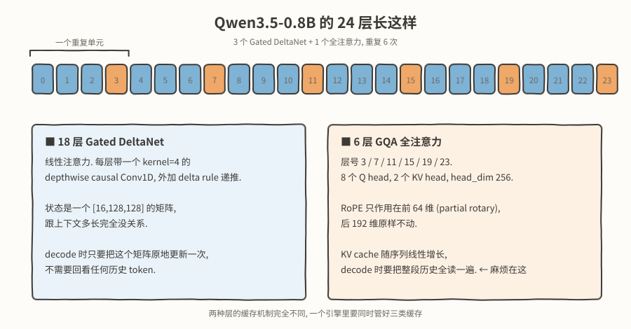
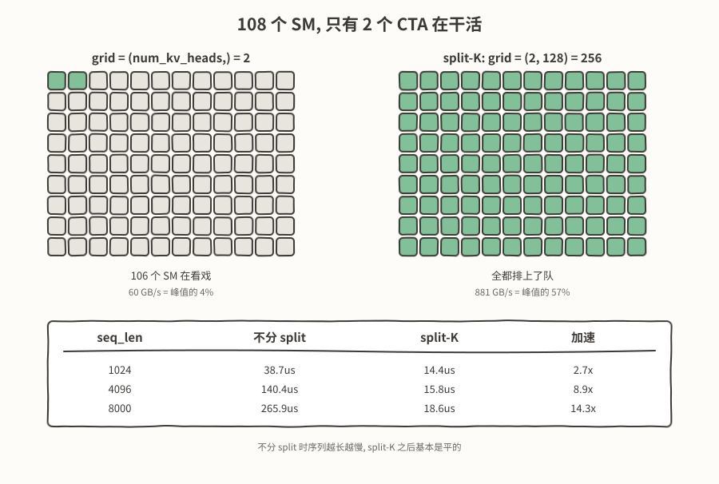
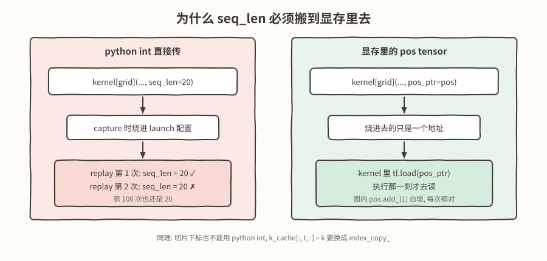

# 纯手写 Triton kernel 跑通 Qwen3.5-0.8B (一): 21 个算子, split-K 和 CUDA Graph

GPU kernel本身是一个上下文很确定的事情, 在2026.09的今天, kernel agent 果不其然正发展得如日中天, 我预感以后手写 kernel 的机会不会太多了. 最近正好尚有余力, 就想干脆用纯手写 Triton kernel 的方式把一个真实的模型从头跑起来, 一来加深对 GPU 的理解, 二来我平时都在搜推场景, 或者说一些高并发低延迟的小模型推理场景里打转, 也想借这个机会初步了解一下 LLM 推理到底是怎么回事.

挑的模型是 Qwen3.5-0.8B. 目标很明确: **推理路径上不依赖 transformers, 不依赖 vLLM, 不依赖 FlashAttention, 也不调用 cuBLAS/cuDNN**. 从 embedding 查表一直到 LM head 的 argmax, 24 层里每一次计算都落在自己写的 Triton kernel 上. PyTorch 只负责分配显存, 变换形状, 拷贝, 以及调用 CUDA Graph 的 API——前向路径上一个 `torch.matmul`, `F.softmax`, `F.linear` 都没有.

代码在这里: [https://github.com/sujuyu/qwen3_5-triton-inference-engine](https://github.com/sujuyu/qwen3_5-triton-inference-engine)

这一篇覆盖的是从搭架子到kernel初步优化以及对cudagraph对支持的整个过程, 具体做了这么几件事:

- **把 24 层拆成 21 个算子, 全部手写**, 分在 15 个文件里. 每一个都跟 Hugging Face 的参考实现逐算子对过, 一共 49 项.
- **搭起 prefill + decode 两条路径, 以及三类缓存.** 这个模型是 18 层 Gated DeltaNet 加 6 层全注意力, 两种层的缓存机制完全不一样, 一个引擎里得同时管好 conv state, recurrent state 和 KV cache.
- **给 decode 的 attention 上 split-K.** 接上 KV cache 之后最先撞上的墙不是算力, 是 CTA 不够: 按 KV head 起 block 的话 grid 只有 2, 108 个 SM 有 106 个在看戏, 带宽只跑到峰值的 4%. 从 T 维再切一刀把 CTA 数拉到 256 之后, seq=8000 那一档快了 14.3 倍, 带宽从 4% 到 57%.
- **把整个 decode step 录进一张 CUDA Graph.** 前提是先把序列长度这类 python 侧的标量搬进显存, 否则它们会被烧死在 capture 那一刻. 做完之后 decode 从 42.0 ms/token 降到 4.4 ms/token.

过程中顺带纠正了我自己一个长期的潜在担心: **图捕获期间分配的中间量不会被 caching allocator 收回**, 因为它们走的是图自己的私有显存池, 生命周期绑在图对象上. 当然我以前多次在C++里面使用过PyTorch的CUDAGraph, 因此对于这个问题, 内心早有答案

实验环境:

- GPU: NVIDIA A100-SXM4-40GB, 108 个 SM, 峰值带宽 1555 GB/s
- torch 2.12.1+cu128, triton 3.7.1, Python 3.11
- 精度: BF16 权重, FP32 累加
- batch = 1, greedy, 暂时还不支持 page attention

---

## Qwen3.5-0.8B 长什么样

挑这个模型不只是因为它小. 它的文本主干不是常见的 24 层全注意力, 而是按 `3 个 Gated DeltaNet + 1 个全注意力` 重复 6 次:



**两种层的缓存机制完全不同**:

- GDN 的状态是一个 `[16,128,128]` 的矩阵, 跟上下文多长完全没关系. decode 的时候把它原地更新一次就完事, 不用回看任何历史.
- 全注意力的 KV cache 随序列线性增长, decode 的时候要把整段历史全读一遍.

所以一个引擎里要同时管三类缓存: GDN 的 conv state `[4,6144]`, GDN 的 recurrent state `[16,128,128]`, 以及全注意力的 K/V cache `[2,T,256]`. 三者的复位时机, 生命周期, 甚至 dtype 都不一样（recurrent state 必须 FP32, 别的是 BF16）.

文本主干 752,393,024 个参数, BF16 下 1.401 GiB. checkpoint 里还有视觉塔和 MTP, 这次只做文本, 直接不加载.

---

## 要写哪些算子

拆下来一共 21 个算子, 分在 15 个文件里. 都写完了, 也都跟 Hugging Face 逐算子对过:

**通用**

`gemm_2d`, `qwen_rmsnorm`, `residual_add`, `swiglu`, `embedding_gather`, `lm_head_argmax`

**全注意力**

`gqa_attention_without_kvcache_casual`（prefill）, `partial_rope`, `attention_gate_pack`, `gqa_attention_decode`, `gqa_attention_decode_split` + `gqa_attention_decode_combine`

**Gated DeltaNet**

`depthwise_causal_conv4_prefill`, `depthwise_causal_conv4_decode`, `gdn_qk_norm_gates`, `gdn_gated_rmsnorm`, `gdn_recurrent_prefill_sequential`, `gdn_recurrent_decode`, `gdn_chunk_prepare_wy` + `gdn_chunk_state` + `gdn_chunk_output`

有两个地方值得单独提一句.

`lm_head_argmax` 把 LM head 的 GEMV 和 argmax 融进了一个 kernel, 词表 248320 维的 logits 从头到尾不物化, 省掉 1 MB 的一写一读. 代价是这条路只能做 greedy, 想加 temperature/top-p 得先把这个 kernel 的输出形式改掉.

`partial_rope` 是这个模型容易看漏的一处: head_dim 是 256, 但 RoPE 只作用在**前 64 维**（`partial_rotary_factor = 0.25`）, 后 192 维原样搬过去. 按 256 维全转的话前向不会报任何错, 只是结果不对, 这种问题只能靠逐层对拍抓.

下面重点说两件事, 都是我在这个项目里花时间最多, 收获也最大的.

---

## 第一件事: 如果不做split-k decode 的时候, 106 个 SM 在看戏

我之前写过一篇 [Triton入门: 从零实现面向Decode场景的GQA Attention](https://github.com/sujuyu/ZhangYu-s-Blog/tree/main/GQA_ATTENTION), 里面比较了「按 Q 的 num_head 起 block」和「按 KV 的 num_head 起 block」两种方案, 结论是后者更好——因为 GQA 下一个 KV head 被多个 Q head 共享, 按 KV head 起 block 可以让这一份 KV 只从显存读一次.

那篇的终点, 正好是这篇的起点.

### 先把 KV cache 接上

一开始的 runner 是**完整重算**: 每生成一个 token, 就把增长后的整个序列重跑一遍 forward. 这个版本的好处是简单且一定对, 后面它一直被我留着当对拍基准. 坏处是每个 token 的代价是 O(T), 总共 O(T²).

接上三类 cache 之后, decode 变成每步只算一个 token. 但是跑下来还是慢, 而且**序列越长越慢**——这就有点不对劲了, KV cache 的全部意义不就是把重算省掉吗.

### 定位: grid 只有 2

回头看 kernel 的 grid:

```python
# 按 KV head 分块: 一个 program 负责一个 KV head 及其 GROUP 个 Q head
torch.library.wrap_triton(_gqa_attention_decode_triton)[(num_kv_heads,)](...)
```

这个模型是 8 个 Q head, 2 个 KV head. 所以 `grid = (2,)`, **整块 GPU 上只有 2 个 CTA 在跑**.

decode 的形状是极端的: q 只有 1 个 token, kv 有几千个. 每个 CTA 要在 T 方向串行地把几千个 token 的 KV 扫一遍. A100 有 108 个 SM, 现在 106 个闲着.



带宽最能说明问题. 这个 kernel 要读的字节数是确定的: `2 heads × T × 256 × 2 bytes × 2 (K和V)`, seq=4096 时是 8 MiB. 拿它去除耗时:

| seq_len | 不分 split | 等效带宽 | 占峰值 |
|---:|---:|---:|---:|
| 1024 | 38.7us | 54 GB/s | 3.5% |
| 4096 | 140.4us | 60 GB/s | 3.8% |
| 8000 | 265.9us | 62 GB/s | 4.0% |

**无论序列多长, 都卡在 60 GB/s 左右**, 也就是峰值的 4%. 这个数字非常干净地说明了问题: 不是算法有问题, 就是并行度不够, 发不出足够的访存请求把带宽填满.

### split-K: 把 T 切开

思路很直接. 既然 head 维只能给 2 个 CTA, 那就从 T 维再切一刀: 把序列切成 `num_splits` 段, 每段一个 CTA 独立算局部的 online softmax, 最后再合并. grid 从 `(2,)` 变成 `(2, num_splits)`.

这里第一个要决定的是**两个 kernel 还是 `tl.atomic_add`**. 我选了两个 kernel. 原因是 online softmax 的合并不是简单相加——每段有自己的 `m`（局部最大值）和 `l`（指数和）, 合并的时候要按全局最大值重新缩放:

$$
m = \max_j m_j, \quad
l = \sum_j l_j e^{m_j - m}, \quad
\mathrm{acc} = \frac{1}{l}\sum_j \mathrm{acc}_j\, e^{m_j - m}
$$

这个式子没法用一条原子指令表达. 硬要用 atomic 就得先原子地更新全局 `m`, 再让所有 CTA 重新缩放自己已经写进去的 `acc`, 而它们之间没有同步点.

代价是要落 `m_partial`, `l_partial`, `acc_partial` 三块 scratch. 这三块并不大（`[8,128]`, `[8,128]`, `[8,128,256]` FP32, 合计 1 MB 出头）, 而且所有 attention 层可以共用一份, 因为它们是串行执行的, 用完即弃.

split kernel 的主体就是标准的 online softmax, 只是循环范围从 `[0, seq_len)` 变成了自己那一段:

```python
seq_len = tl.load(pos_ptr).to(tl.int32) + 1
chunk = (seq_len + MAX_SPLITS_C - 1) // MAX_SPLITS_C

pid_h, pid_s = tl.program_id(0), tl.program_id(1)
start = pid_s * chunk
end = tl.minimum(start + chunk, seq_len)

m_i = tl.zeros([GROUP], tl.float32) - float('inf')
acc = tl.zeros([GROUP, D], tl.float32)
l_i = tl.zeros([GROUP], tl.float32)

q = tl.load(q_ptr + offset_h[:, None] * stride_q_h + offset_d[None, :] * stride_q_d)

for t0 in tl.range(start, end, BLOCK_T):
    ...
    qk = tl.dot(q, k) * scale
    qk = tl.where(offset_t[None, :] < end, qk, -float('inf'))
    m_i_new = tl.maximum(m_i, tl.max(qk, axis=1))
    alpha = tl.exp(m_i - m_i_new)
    p = tl.exp(qk - m_i_new[:, None])
    acc = acc * alpha[:, None] + tl.dot(p.to(tl.bfloat16), v)
    l_i = l_i * alpha + tl.sum(p, axis=1)
    m_i = m_i_new

# 每个 split 把自己的 m / l / acc 落到 scratch, 交给 combine
tl.store(m_partial_ptr + offset_h * stride_mp_h + pid_s * stride_mp_s, m_i)
tl.store(l_partial_ptr + offset_h * stride_lp_h + pid_s * stride_lp_s, l_i)
tl.store(acc_partial_ptr + ..., acc)
```

有一处细节: `tl.range(start, end, BLOCK_T)` 在 `start >= end` 时是零次迭代, 循环体一次都不执行. 所以序列短于 `MAX_SPLITS` 的时候, 多出来的那些 CTA 会直接空转退出, **不需要在 host 侧算 num_splits, 也不需要写 if 去挡**. 这一点在下一节接 CUDA Graph 的时候变得很关键.

`num_splits` 我直接定成了常数 `MAX_SPLITS = 128`. 一开始的想法是让它随 seq_len 变（短序列不需要 128 段）, 但这样 grid 就成了 seq_len 的函数, CUDA Graph 一 capture 就固定死了. 定成常数之后, 短序列多出来的 CTA 空转的代价, 远小于为此多捕获几张图.

### 效果

| seq_len | 不分 split | split-K | 加速 | split-K 带宽 |
|---:|---:|---:|---:|---:|
| 256 | 16.4us | 14.3us | 1.1x | 37 GB/s |
| 1024 | 38.7us | 14.4us | 2.7x | 146 GB/s |
| 4096 | 140.4us | 15.8us | 8.9x | 533 GB/s |
| 8000 | 265.9us | 18.6us | 14.3x | 881 GB/s |


split-K 之后基本是平的: seq 从 1024 涨到 8000, 耗时只从 14.4us 到 18.6us. 短序列（256）几乎没有收益甚至略亏, 因为那时候本来就没多少活, 多出来的 combine kernel 反而成了固定开销.

---

## 第二件事: 把整个 decode step 塞进一张 CUDA Graph

kernel 层面调完之后, 我去看端到端, 结果发现 decode 一步要 42 ms, 而 GPU 上真正在算的时间只有几毫秒.

原因不难猜: 一步 decode 有大约 400 次 op 调用, 每次 `torch.library` 的分发开销约 90us, 乘起来就是几十毫秒. **GPU 大部分时间在等 CPU 发命令.**

这种情况下 CUDA Graph 几乎是唯一解. 把一整个 decode step——24 层前向 + argmax + 位置自增——录成一张图, 之后每步只 `graph.replay()`, CPU 侧的开销直接归零.

### 但是 seq_len 是个 python int

问题在这. 不考虑 CUDA Graph 的话, 这个 kernel 会很自然地写成下面这样——host 侧知道当前解到第几个 token 了, 直接把长度当参数传进去, kernel 里拿它当循环上界:

```python
# ---- host 侧 ----
past_len = int(pos)                       # 当前已经缓存了多少个 token
k_cache[:, past_len, :] = k_new           # 追加这一步新算出来的 K/V
v_cache[:, past_len, :] = v_new

kernel[(num_kv_heads,)](
    q_ptr=q, k_cache_ptr=k_cache, v_cache_ptr=v_cache,
    seq_len=past_len + 1,                 # ← 一个普普通通的 python int
    ...
)

# ---- kernel 里 ----
@triton.jit
def _gqa_attention_decode_triton(..., seq_len, BLOCK_T: tl.constexpr):
    for t0 in tl.range(0, seq_len, BLOCK_T):   # 循环上界来自 host
        ...
```

这么写没有任何问题, 每一步 `past_len` 都是新的, kernel 每次也都拿到正确的长度. 但它和 CUDA Graph 是不兼容的.

原因是 capture 录下来的不是「调用 kernel 这个动作」, 而是**一次具体的 launch, 连同它当时的全部参数值**. `seq_len=past_len + 1` 在 capture 那一刻求值出来是 20, 这个 20 就被写进 launch 配置里了. 之后 replay 一万次, kernel 收到的还是 20——序列早就长到几百了, 它还在只读前 20 个 token.

更糟的是**这件事不会报任何错**. 没有异常, 没有 assert, 数值也不会变成 NaN, 只是 attention 少读了一大截历史, 生成的内容悄悄跑偏. 上面那两句 `k_cache[:, past_len, :] = k_new` 同理: `past_len` 是 python int, 切片偏移一样会被烧进 copy kernel, replay 永远往第 20 行写.



解法是把位置从 python int 换成**一个 `[1]` 的 INT64 显存 tensor**. 这样烧进图里的就只是一个地址, 而地址上的值等到 kernel 真正执行的那一刻才去读:

```python
# ---- host 侧 ----
pos = torch.zeros(1, dtype=torch.int64, device="cuda")   # 位置放显存

# 追加换成 index_copy_: 下标来自显存, 不是 python int
k_cache.index_copy_(1, pos, k_new.unsqueeze(1))
v_cache.index_copy_(1, pos, v_new.unsqueeze(1))

kernel[(num_kv_heads, MAX_SPLITS)](
    q_ptr=q, k_cache_ptr=k_cache, v_cache_ptr=v_cache,
    pos_ptr=pos,                          # ← 传的是指针, 不是值
    ...
)

# ---- kernel 里 ----
seq_len = tl.load(pos_ptr).to(tl.int32) + 1              # 执行时才读
chunk = (seq_len + MAX_SPLITS_C - 1) // MAX_SPLITS_C
```

还有一处值得说: `chunk` 也是在 kernel 里从 `pos` 现算的, host 一个都不传. split 和 combine 两个 kernel 必须对「哪些 split 是有效的」有完全一致的理解, 所以宁可让它们各自重算一遍, 也不要从 host 传一个可能过期的值.

这也是上一节 `num_splits` 定成常数的原因. grid 是 launch 配置的一部分, 一样会被烧死, 所以 grid 里**不能出现任何随 seq_len 变的东西**. 好在 `tl.range(start, end, BLOCK_T)` 在 `start >= end` 时零次迭代, 短序列多出来的 CTA 会直接空转退出, 什么都不用管.

### 图内闭环

把这些都改完之后, 一个 decode step 就可以完整地录进图里了:

```python
def _one_step(self) -> None:
    hidden = self.runner.decode_step(self.tok_slot, self.caches)
    self.tok_out.copy_(lm_head_argmax(hidden, self.runner.w.embed_tokens))
    self.caches.pos.add_(1)              # 位置自增也在图内
    self.tok_slot.copy_(self.tok_out)    # 闭环: 本步输出即下步输入
```

最后那句是关键. 把 argmax 的结果直接写回输入槽, 于是连续 replay 就自动逐 token 生成了, host 每步只要调一次 `graph.replay()`.

结果:

| | ms/token |
|---|---:|
| eager 逐 op | 42.04 |
| graph replay | 4.41 |

**9.5 倍.** 省掉的全是 CPU 侧那 400 次 op 分发, GPU 上的活儿一点没变.

**图是有状态的**. capture 过程本身（warmup 加正式捕获一共 7 次 `one_step`）会把 `pos` 推进好几格, 把三类 cache 写脏. 所以 `capture()` 之后, 每换一个 prompt 之前, 都必须重新 `reset()` + `prefill()`. 我把这个约束封进了 `generate_graphed()` 里, 不指望调用方记得.

---

## 一个没做成的优化

图捕获完还剩最后一个隐患: **autotune 选中的 config 也会被固化**.

这个项目里 decode 的三个 op 都收一个 `seq_bucket: int` 作为 autotune 的 key. 它不参与任何计算, 只决定选哪个 config. 但 config 里的 `BLOCK_T` 会随 bucket 变, capture 之后就定死了——拿短 prompt 时调出来的 config 去跑长序列, 只是慢一点, 不会算错（正确性全部由显存里的 `pos` 决定）.

本来打算每个 bucket 捕一张图. 顺着这条路我把**共享显存池**的行为整个测了一遍, 结果纠正了我一个长期的误解.

我原来担心的是: capture 期间分配的中间量, 会不会在 capture 结束后被 caching allocator 回收掉, 导致 replay 时写到别人的地址上? **完全不会.** 图里烧的是绝对地址, 而图之后还要 replay 任意多次, 每次都往那些地址写. 所以那批地址在图的整个生命周期内必须归它所有. PyTorch 的做法是给每张图开一个**私有显存池**, 池的生命周期绑在图对象上:

```text
基线                        32.0 MiB
capture 图1（私有池）        66.0 MiB   +34
capture 图2（另一个私有池）   98.0 MiB   +34   ← 累加, 不复用
删掉图1                     66.0 MiB   -34   ← 图一死才还回来
删掉图2                     32.0 MiB   -34
```

代价是 N 张图就是 N 份中间量. 注意这**不是**因为它们会并发执行, 而是每张图永久持有自己那批地址. 哪怕永远串行 replay, 只要图都活着, 地址就都得留着:

| 图数 | 各自私有池 | 共享池 |
|---:|---:|---:|
| 1 张 | 34.0 MiB | 34.0 MiB |
| 2 张 | 66.0 MiB | 34.0 MiB |
| 4 张 | 130.0 MiB | 34.0 MiB |
| 8 张 | 258.0 MiB | 34.0 MiB |

用 `torch.cuda.graph(g, pool=...)` 让多张图共享一个池, 就能从 O(N) 变成 O(1). 省下来的也不是「运行时错开使用」, 而是**capture 的时候就没多分配**: 第二次 capture 在同一个池的 free list 里找到上次回收的同样大小的块, 原地发回去了.

不过共享池有个必须遵守的约束: **replay 之后必须先把结果拷到池外, 才能 replay 同池的另一张图**. 因为同池的下一次 replay 会复用那块地址.

方案都想清楚了, 然后我去量了一下 config 固化到底值多少钱. 方法是固定 seq_len, 只改「冻结了哪个 config」:

```text
seq=  64 用自己的 config                    13.06us
seq=  64 用 4096 的 config                  13.38us     +2.4%
seq=4095 用自己的 config                    15.72us
seq=4095 用   64 的 config ← 短捕获长 replay  16.15us     +2.7%
```

**2.7%.** 而且 attention decode 只有 6 层, 6 × 16us ≈ 96us, 只占 4.4ms 一步的 2.2%. 乘一乘, 每 bucket 一张图这个优化值 **0.06%**.

**很好, 不做了**.


---

## 效果

```console
$ python demo.py "李世民是谁？和朱棣有什么共同点？"
提问：李世民是谁？和朱棣有什么共同点？
prompt 23 tokens，最多生成 512 tokens
------------------------------------------------------------------------
李世民（唐太宗）是唐朝的开国皇帝，也是唐朝的第三位皇帝。他生于 601 年，
卒于 649 年，在位 48 年，是唐朝历史上最具影响力的君主之一。

### 李世民的主要成就：
1. **统一全国**：他通过一系列军事行动，成功平定了叛乱，统一了……
------------------------------------------------------------------------
[CUDA Graph] 加载+prefill+捕获 2.7s | 生成 80 tokens，总用时 0.4s
稳态 4.3 ms/token（中位数）
```

很好, 关于李二的回复全错. 0.8B, 当然选择原谅他

正确性是单独验的, 分三层: `gemm_2d` 在模型真实尺寸下的对拍, 49 项逐算子对 Hugging Face 的参考实现, 以及增量 decode / 完整重算 / CUDA Graph 三条路径互相对拍. 逐算子对拍才是稳定判据——「生成的 token 和 HF 完全一样」这种说法换个 prompt 就可能不成立, 因为 top-1 和 top-2 接近的时候, BF16 的舍入差异就足以把 argmax 翻过去.

---

## 还差什么

这次的东西离能用还很远, 有两条是我自己最想补的:

**只能跑单条请求.** batch 恒为 1, 没有 padding, 没有 continuous batching, 也没有请求队列. 单条请求下 decode 的 batch 维是 1, 这本身就是一种浪费——GEMM 全都退化成了 GEMV, 算力利用率极低. 凑批之后 CTA 荒的问题会缓解很多, 但也会带来新的麻烦: 不同请求的序列长度不一样, KV cache 怎么排布, split-K 的切分怎么对齐.

**没有 page attention.** 现在的 KV cache 是一整块连续显存, 启动的时候按 `max_tokens` 一次性分配好, 中途不扩容. 好处是 kernel 里的寻址简单, 坏处是显存浪费严重, 而且多请求的时候没法在请求之间共享或复用页. 这也是凑批绕不开的前置条件.

另外还有几件小的: prefill 目前还卡在 CPU 侧的算子分发上（短 prompt 大约 43ms 是个地板, 跟序列长度几乎无关）, 只有 decode 走了 CUDA Graph; 采样只有 greedy; 数值对拍的 oracle 只覆盖了一个 19 token 的中文 prompt.

这些放到后面的文章里慢慢填.

代码都在 [sujuyu/qwen3_5-triton-inference-engine](https://github.com/sujuyu/qwen3_5-triton-inference-engine), 其中kernel部分手写(chunk-64 GND是让cc帮忙优化的), runner等外围代码让codex和cc写的
