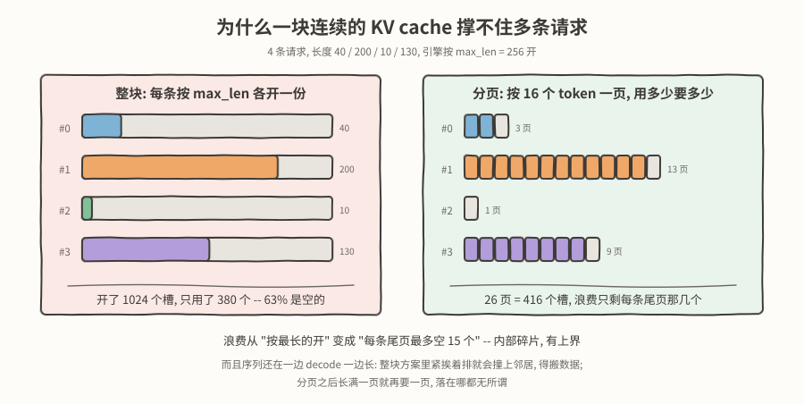
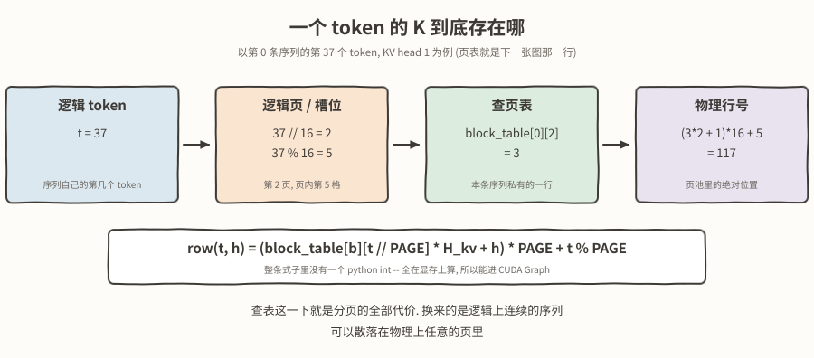
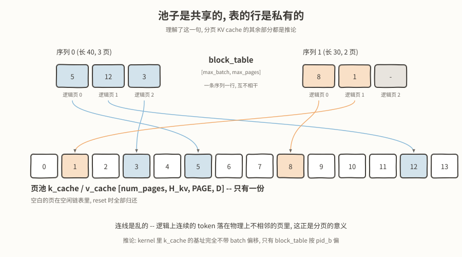
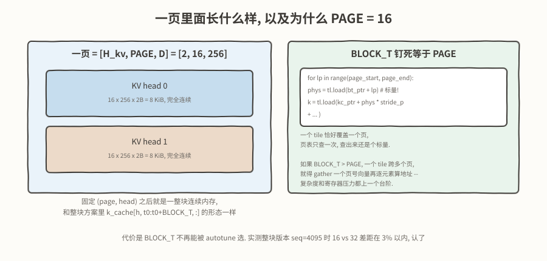
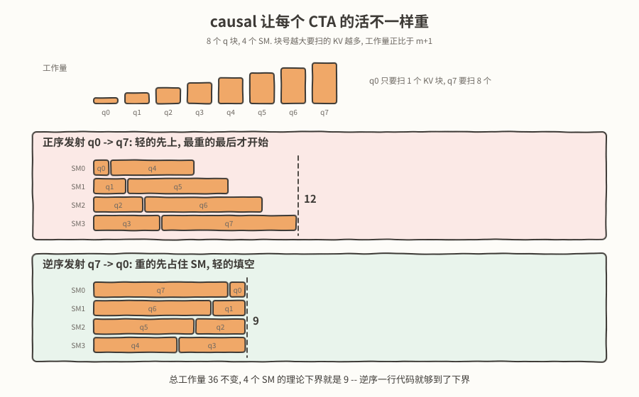
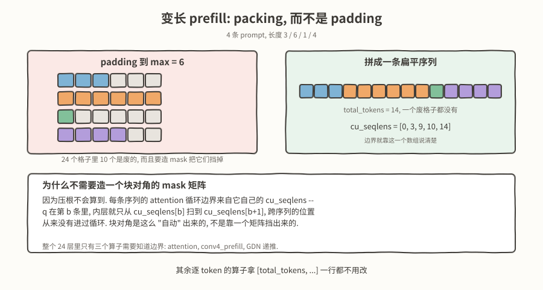
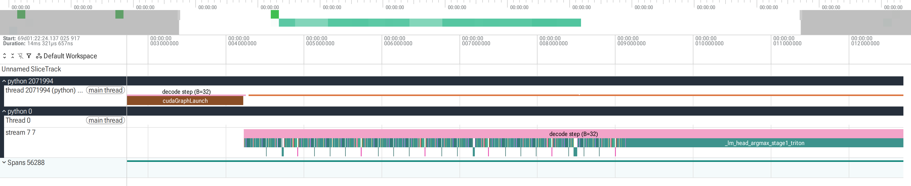
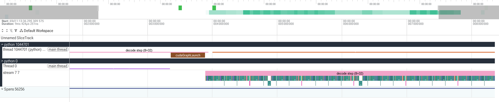
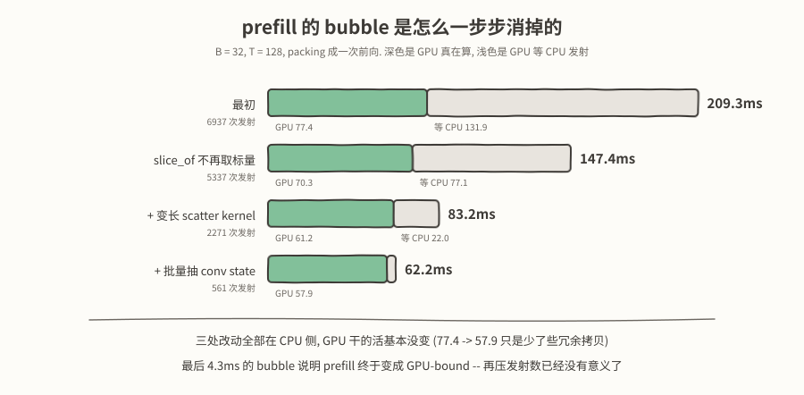

# 纯手写 Triton kernel 跑通 Qwen3.5-0.8B (二): 分页 KV cache, 变长 packing 和 CTA 发射顺序

接着[上一篇](https://github.com/sujuyu/ZhangYu-s-Blog/tree/main/%E7%BA%AF%E6%89%8B%E5%86%99Triton%20kernel%E8%B7%91%E9%80%9AQwen3.5-0.8B%28%E4%B8%80%29%3A%2021%E4%B8%AA%E7%AE%97%E5%AD%90%2C%20split-K%E5%92%8CCUDA%20Graph)内容, 上一篇末尾我们说:

1. 只能跑单条请求
2. 缺失 page attention. 

这一篇的内容就是围绕着 **从一条请求到一批请求** 展开.

上一篇结束在 4.4 ms/token, 之后让claude简单做了一点autotune和runner侧的改动:

- `gemm_2d` 的 autotune 候选里补上 decode 的形状. decode 时 M 恒等于 batch, 原来 12 个 config 全是给 prefill 那种大 M 准备的, `BLOCK_K` 最大只到 64 且只和 `BLOCK_N>=128` 配对, 恰恰没有 M=1 需要的「窄 BLOCK_N + 大 BLOCK_K」. 补 7 个之后 4.294 -> 2.364 ms/token.
- 把**共享同一个输入**的几个 GEMV 沿输出维拼起来 (GDN 的 qkv+z+a+b, attn 的 q+gate+k+v, MLP 的 gate+up), 一步的 gemm 调用从 192 次降到 96 次, 2.364 -> 2.039 ms/token.

一步 2.04ms 读一遍 1.402 GiB 权重, 折合约 740 GB/s, 是 A100 峰值 (1555 GB/s) 的 47%. B=1 时 decode 的 GEMM 全都退化成 M=1 的 GEMV, 算术强度约 1 FLOP/byte, 这个形状下 47% 算是个可以接受的水平了.

接下来就开始凑批吧:

- **分页 KV cache** —— 凑批的前置条件, 一整块连续 cache 撑不住多条变长请求.
- **CTA 发射顺序** —— causal 下每个 CTA 的活不一样重, 反转一行发射顺序, T=8192 快 54.4%.
- **变长 packing prefill** —— B 条 prompt 拼成一条扁平序列一次前向, 首 token 延迟 1475ms -> 61ms.
- **凑批暴露的后续问题** —— decode 下的最优 tiling 在凑批下需要重新审视, 热路径上频繁的同步 D2H 造成 timeline gap, 以及 prefill 上那 43ms 的 CPU 开销 (第一篇的 CUDA Graph 只适用于 decode).

实验环境和上一篇一样:

- GPU: NVIDIA A100-SXM4-40GB, 108 个 SM, 峰值带宽 1555 GB/s
- torch 2.12.1+cu128, triton 3.7.1, Python 3.11
- 精度: BF16 权重, FP32 累加
- greedy, 仍然没有服务入口 (B 条请求必须在启动时一次给全)

---

## 一, 分页 KV cache: 显存池是共享的, 表的行是按照Batch隔离私有的

### 一整块连续 cache 撑不住多条请求

第一篇的 KV cache 是启动时按 `max_tokens` 一次性开好的一整块连续显存, `[H_kv, T_max, D]`. batch=1 的时候寻址简单粗暴.

凑批之后它立刻不成立了. B 条请求长度各不相同, 而 cache 得在 prefill 之前就分配好, 于是只能按**每条都可能长到 max_len** 来预先申请:



4 条长度 40 / 200 / 10 / 130 的请求, 按 max_len = 256 各开一份就是 1024 个槽, 实际用掉 380 个, 63% 是空的. 而且这个浪费没有上界 —— 它等于 `B × (max_len - 实际长度)` 之和, 把 max_len 设得越保守浪费越大.

分页的想法就是把「按最长的开」换成「按页要」: 页是固定大小的一小段 token (这里 PAGE=16), 序列要多少页要多少页. 浪费从「每条最多空 max_len - len 个槽」变成「每条尾页最多空 15 个槽」—— 变成了**内部碎片, 有上界**.

顺带一提, 这套页表天然支持多条请求**共享同一段前缀** —— 两条序列的页表填同一个物理页号就行. 不过这个事情以后再看看要不要搞吧.

### 地址是怎么算出来的

代价是多了一层间接寻址. 原来「第 t 个 token 的 K」就是 cache 里第 t 行, 现在要走两级:



```text
row(t, h) = (block_table[b][t // PAGE] * H_kv + h) * PAGE + (t % PAGE)
```

这条式子里没有一个 python int —— `block_table` 是显存张量, `t` 从显存里的 `pos` 算, 所以整个计算都在 kernel 执行时完成, 所以能直接接入CUDAGraph链路.
### 页表的形状: `[max_batch, max_pages]`

最初我在想page kv cache的时候, 总是会想到`每个请求都需要独立维护页表映射`, 类似于操作系统里面每个进程都有自己的页表, 写起来还挺碍事的, 总不能把一个类似于std::vector<page_table*>的东西传递给kernel吧. 也是在跟claude边聊的过程中才恍然大悟, 直接按照max_batch申请一个二维映射矩阵就完事了, 整个流程豁然清晰了😄 



**页池只有一份, 所有序列共用; 区分靠的是页表的行.** 这一句是整章里最该记住的, 落到 kernel 里就是一句非常具体的话:

> `pos` / `block_table` / `q` / 三块 scratch 各按 `pid_b` 偏一次, 而 **`k_cache` / `v_cache` 的基址完全不带 batch 偏移**.

理解了这一句, 别的都是推论:

- **为什么能共享前缀**: 两条序列的页表填同一个物理页号就行, 页池里那一份数据没有主人.
- **为什么没有外部碎片**: 分配粒度恒等于一页, 任何一页都能满足任何请求.
- **为什么页表必须是一整块 `[max_batch, max_pages]` 而不是 B 个独立张量**: CUDA Graph 里烧的是地址, 必须固定一块; kernel 靠 `block_table_ptr + pid_b * stride_bt_b` 偏到自己那一行, stride 才能是编译期常量. 每条序列一张独立长度的表, 就得传指针数组, 多一层解引用.

decode 的 split kernel 改完长这样. 在线 softmax, split-K 的切分与归约, `pos` 进显存 —— 上一篇讲的这些**一个字都没改**, 唯一的差别是 K/V 的地址怎么算:

```python
pid_b, pid_h, pid_s = tl.program_id(0), tl.program_id(1), tl.program_id(2)

seq_len = tl.load(pos_ptr + pid_b).to(tl.int32) + 1        # 每条序列各自的长度
num_pages_used = (seq_len + PAGE - 1) // PAGE
pages_per_split = (num_pages_used + MAX_SPLITS_C - 1) // MAX_SPLITS_C

page_start = pid_s * pages_per_split
page_end = tl.minimum(page_start + pages_per_split, num_pages_used)

# 本 program 负责的 KV head 在页内的偏移. 注意这里没有 pid_b -- 页池是共用的
k_head_ptr = k_cache_ptr + pid_h * stride_kc_h
v_head_ptr = v_cache_ptr + pid_h * stride_vc_h

for lp in tl.range(page_start, page_end):
    phys = tl.load(block_table_ptr + pid_b * stride_bt_b + lp).to(tl.int64)
    k = tl.load(k_head_ptr + phys * stride_kc_p
                + offset_s[None, :] * stride_kc_s + offset_d[:, None] * stride_kc_d)
    v = tl.load(v_head_ptr + phys * stride_vc_p
                + offset_s[:, None] * stride_vc_s + offset_d[None, :] * stride_vc_d)

    qk = tl.dot(q, k) * scale
    qk = tl.where(lp * PAGE + offset_s[None, :] < seq_len, qk, -float("inf"))
    ...
```

`phys` 要提到 INT64 再参与地址运算. `block_table` 是 INT32, 页数一多乘上 stride 就溢出了 —— 这种错不会崩, 只会静默读到别的页.

### 为什么 PAGE = 16

因为要让 **`BLOCK_T` 恰好等于 `PAGE`**.

看上面那个循环: 一次迭代覆盖一个完整的页, 于是**页表只查一次, 而且查出来是个标量**. `BLOCK_T > PAGE` 的话一个 tile 会跨多个页, 就得 gather 一个页号向量出来再逐元素算地址, 复杂度和寄存器压力都上一个台阶.



页内布局定成 `[num_pages, H_kv, PAGE, D]`, 固定 `(page, head)` 之后那 `16 × 256 × 2B = 8 KiB` 是完全连续的, 和整块方案里 `k_cache[h, t0:t0+BLOCK_T, :]` 的访存形态一模一样 —— 所以 kernel 内层的载入模式一行都不用改.

代价是 `BLOCK_T` 不再能被 autotune 选 (整块版本会在 16/32/64/128 里挑, 长序列时选 32). 实测整块版本 seq=4095 时 16 和 32 的差距在 3% 以内, 认了.

连带着 split-K 的切分也从按 token 均分 (`chunk = cdiv(seq_len, MAX_SPLITS)`) 改成按页均分, 否则切点落在页中间, 一个 tile 又跨页了. 

### host 侧: 页池, 页表, 以及扩页

分页把状态劈成了两半:

```text
host 侧   PagePool._free          哪些物理页是空的
显存      block_table[B, max_pages]   逻辑页 -> 物理页
```

页池就是个空闲链表, 我直接用了 python list —— 分配决策本来就在 host 做, 页数只有几十到几百, 换成显存 bitmap 没有意义, 真做起 continuous batching 再说.

还有一个我原本担心, 后来发现完全不是问题的点: **按需扩页不会破坏 CUDA Graph.** 图里烧进去的只是 `block_table` 的地址, 表的内容是 kernel 执行时才读的. 这和上一篇 `pos` 必须进显存是同一个道理 —— 只要变化的东西在显存里, 形状不变, 图就不用重新捕获. host 每步只需要判断「是否跨过了页边界」, 跨过了就往表里写一个 int32.


---

## 二, CTA 发射顺序: causal 让每个 CTA 的活不一样重

这一节和凑批其实没什么关系 —— 它是 B=1 就成立的优化, 插在这儿是因为它正好是第一篇「CTA 荒」的续集, 两边是很正的一个对照.

第一篇 decode attention 的问题是 **CTA 不够**: 按 KV head 起 block, grid 只有 2, 108 个 SM 有 106 个在看戏, 带宽只跑到峰值的 4%. 解法是从 T 维再切一刀 (split-K), 把 CTA 数拉到 256.

prefill 的 attention 没有这个问题 —— 它按 q 块起 grid, 序列一长 CTA 有的是. 但它有另一个问题: **CTA 够了, 但是每个 CTA 的负载不均匀.**

causal mask 决定了 q 块 `m` 的 KV 循环上界是 `m + 1` 个块: 第 0 块只扫 1 个 KV 块, 第 63 块要扫 64 个, 差 64 倍. 而 CTA 大致是按 `program_id` 递增的顺序发射的, 正序就是**轻的先上, 最重的最后才开始** —— 尾巴拖得很长.



图上是 8 个 q 块 4 个 SM 的示意: 总工作量 36 不变, 4 个 SM 的理论下界是 9. 正序调度要 12, 逆序正好够到 9.

这就是经典的最长处理时间优先 (LPT) 调度: 先把大件塞进去, 小件负责填缝. 改动是一行:

```python
q_id = tl.num_programs(0) - 1 - tl.program_id(0)
```

之后 kernel 里所有用到 q 块号的地方用 `q_id` 而不是 `tl.program_id(0)`. 实测 (A100, B=1):

| T | 正序 | 逆序 | 加速 |
|---:|---:|---:|---:|
| 512 | 43.0us | 41.7us | +3.1% |
| 2048 | 275.3us | 215.8us | +27.6% |
| 8192 | 3148.5us | 2038.9us | **+54.4%** |

**序列越长收益越大**, 因为块数越多, 最重的那块相对越重, 拖出来的尾巴也越长. T=512 时只有 8 个 q 块, 4 个块就能把 SM 铺满一轮, 排序几乎无所谓.

代价是零. 没有额外的显存, 没有额外的指令, 甚至连 grid 都没变 —— 只是把同一批 CTA 换了个顺序发出去.

这个改动同样加在了定长版的 prefill attention 上. 顺带一提, 内层的 `exp` 我换成了 `exp2` (把 `1/sqrt(D)` 的缩放并进 `log2(e)` 里一起乘), 硬件上 `exp2` 是单指令 (常规操作, claude建议的)

---

## 三, 变长 packing: Q 和 KV 两侧的长度都不齐

凑批在 decode 和 prefill 上的难度完全不同.

**decode 侧其实不难.** 每条序列一步只算一个 token, Q 侧天然对齐; KV 侧长度不齐, 但那个不齐已经被吸收进每个 program 自己的循环边界里了 —— `pos` 从 `[1]` 变成 `[B]`, 每个 program 用 `tl.load(pos_ptr + pid_b)` 读自己那条的长度, 别的什么都不用管. 剩下的工作就是给一批算子加 batch 维, 体力活.

**难的是 prefill.** 这时候每条序列有几十到几千个 token, Q 和 KV 两侧的长度都不齐.

### packing, 而不是 padding



padding 到 max 的话, 24 个格子里 10 个是废的, 而且还要造一个 mask 把它们挡掉. packing 就是把 B 条 prompt 首尾相接拼成一条扁平序列, 边界靠一个前缀和数组说清楚:

```text
prompt      [A A A]  [B B B B B B]  [C C]
packing      A A A    B B B B B B    C C      total_tokens = 11
cu_seqlens  [0, 3, 9, 11]
```

选 packing 而不是 padding, 是因为**这个项目的 `_forward` 处理的本来就是扁平的 `[T, 1024]`**. 也就是说, 绝大多数算子拿 `[total_tokens, ...]` 进去, 一行都不用改.

到底有几个要改? 我数了一下, 24 层里只有三个算子有跨 token 的交互, 而且它们需要的索引还不一样, 取决于各自往回够多远:

| 算子 | 往回看多远 | 需要什么 |
|---|---|---|
| `conv4_prefill` | 固定 3 个 token | `seq_start`, 一个下界钳位 |
| attention | 整条序列 | `cu_seqlens`, 基址 + 循环边界 |
| GDN 递推 | 整条序列 (状态) | `cu_seqlens`, grid 加 batch 维 |

`conv4_prefill` 最便宜: 第 t 个 token 回看 3 格时不越过 `seq_start[t]`, 越界的位置补零, **grid 完全不用动**, kernel 里加一个 `VARLEN: tl.constexpr` 分支就完了.

GDN 递推最贵: 状态要贯穿整条序列, 不同序列的状态必须彻底隔离, 只能拆到 grid 的 batch 维上. 好处是 CTA 数从 `H × (DV/BLOCK_V)` 涨到 `B × H × (DV/BLOCK_V)` —— B=1 时只有 64 个 CTA, 108 个 SM 空着一半; B≥2 就填满了.

attention 在中间: 定长版靠 `batch_id * stride_b` 定位一条序列, 变长版靠 `cu_seqlens[batch_id]`:

```python
q_id = tl.num_programs(0) - 1 - tl.program_id(0)     # 上一节那个逆序
head_id, batch_id = tl.program_id(1), tl.program_id(2)

seq_start = tl.load(cu_seqlens_ptr + batch_id).to(tl.int32)
seq_len = tl.load(cu_seqlens_ptr + batch_id + 1).to(tl.int32) - seq_start

if q_id * BLOCK_Q_S >= seq_len:      # 按最长序列起 grid, 超出自己长度的块直接退
    return

q_ptr = q_ptr + seq_start * stride_q_s + head_id * group_size * stride_q_h
k_ptr = k_ptr + seq_start * stride_k_s + head_id * stride_k_h
...
```

grid 按**最长的那条**起 (`cdiv(max_seqlen, BLOCK_Q_S)`), 短序列多出来的块直接 return. 这里的 `max_seqlen` 是 host 侧的 python int, 反正prefill不用CUDAGraph, host 标量随便传. 浪费的是空转的 CTA(发现自己负责的长度超过了真实seq_len就直接return), 实测约 0.7ns 一个: B=8, 长度 [4096, 100×7], BLOCK_Q_S=64 时空转 868 个, 合计约 0.6us, 对毫秒级的 prefill 可以忽略.

### 首 token 延迟

逐条 prefill vs 拼成一次前向:

| | 逐条调用 | 拼成一次 | 加速 |
|---|---:|---:|---:|
| B=4  T=128 | 184ms | 45ms | 4.1x |
| B=8  T=128 | 370ms | 45ms | 8.2x |
| B=16 T=128 | 740ms | 46ms | 16.0x |
| B=32 T=128 | 1475ms | 61ms | 24.3x |

注意左边那一列是**线性涨**的, 因为逐条 prefill 就是把那 43ms 的 CPU 开销乘以 B. 更能说明问题的是这组: B=8/T=128 总共 1024 个 token 要 366ms, B=8/T=512 总共 4096 个 token 要 367ms —— **token 数差 4 倍而耗时相同**, 成本全在「调了 8 次」上.

packing 把 B 次前向合并成 1 次, 首 token 延迟从 `B × 43ms` 变回 `1 × 43ms`.

---

## 四, 凑批之后出现的问题

### 看 timeline 发现的: decode 下的最优 tiling, 凑批之后要重新审视

分页 + batch decode 接上之后, B=32 的 decode 一步是 8.5ms, 而 B=1 是 2.0ms. 直接把 trace 拉进 Perfetto:



右边那一大块 `_lm_head_argmax_stage1_triton` 占掉了整步的 48%.

这个 kernel 是上一篇写的, 把 LM head 的 GEMV 和 argmax 融在一起, 248320 维的 logits 从不物化. 它写得**很好** —— B=1 时一次读 485 MiB 的 embedding 跑到 1362 GB/s, 是 A100 峰值带宽的 88%, 是整个项目里效率最高的 kernel.

问题不在 kernel 体, 在 grid: `(B, num_partials)`, 一个 program 只服务一行 query. 于是 **485 MiB 的 embedding 被每条序列各完整读了一遍**. B=32 就是 32 遍.

修法是加一层 `BLOCK_B` 分块, 让一个权重 tile 载入一次给 `BLOCK_B` 行 query 共用, 权重读取次数从 `B` 次降到 `cdiv(B, BLOCK_B)` 次. `BLOCK_B ∈ {1,2,4,8,16,32}` 进 autotune, key 里加 batch 分桶, B=1 时自然会选回 1, 退化成改动前的行为.

有一处实现上的坎: **必须改用 `tl.dot`, 不能沿用广播乘加.** 原来 `tl.sum(x[None, :] * w, axis=-1)` 的中间量是 `[TILE_V, TILE_K]`, 加上 batch 维之后广播形式会变成 `[BLOCK_B, TILE_V, TILE_K]` —— `BLOCK_B=32` 时 65536 个 float, 寄存器放不下. `tl.dot` 不物化这个中间量, 而且 B≥16 时还能用上 tensor core. 精度上没有损失: x 和 w 在显存里本来就是 BF16, BF16 乘积在 FP32 累加器里是精确的.

kernel 级的效果:

| B | 改前 | 改后 | 加速 |
|---:|---:|---:|---:|
| 1 | 373.5us | 371.2us | 1.01x |
| 4 | 583.9us | 369.8us | 1.58x |
| 16 | 2033.8us | 401.2us | 5.07x |
| 32 | 3977.4us | 423.0us | 9.40x |



右边那一大块没了. 端到端 B=32 一步 8.462 -> 4.662ms, 扩展性也跟着变好: B 从 1 涨到 32, 单步原来涨 4.25 倍, 现在只涨 2.32 倍.

### 热路径上频繁的同步 D2H 造成 timeline gap

prefill 那边 B=32 是 61ms 而不是 45ms, 比预期多了一点, 统计一下细分耗时:

```text
t_cpu = 不 sync, CPU 把所有 kernel 发射完就返回的耗时
wall  = sync 之后的墙钟
gpu   = profiler 里只统计 device 侧事件的 self time 之和
bubble = wall - gpu, GPU 闲着等 CPU 的时间
```

| B | T | wall | t_cpu | gpu | bubble | 发射数 |
|---:|---:|---:|---:|---:|---:|---:|
| 1 | 128 | 47.4ms | 47.4ms | 9.2ms | 38.2ms | 675 |
| 1 | 2048 | 96.7ms | 96.7ms | 68.7ms | 28.0ms | 675 |
| 32 | 128 | 209.3ms | 209.3ms | 77.4ms | 131.9ms | 6937 |


- T=128 时 GPU 只工作了 9.2ms 而端到端耗时 47.4ms, **80% 的时间 GPU 在等 CPU**. 675 次发射摊下来 70us 一次, 远高于 launch 本身的约 2us, 说明大头在 python 层 (`torch.library` 的包装, autotune 查表, grid lambda).

- **发射数随 B 线性涨**: B=1 是 675, B=32 是 6937. packing 明明已经把「B 次前向」合成了「1 次前向」, 发射数怎么还跟着 B 涨? 因为 host 侧还留着三处按序列的 python 循环.

packing 之后所有中间张量都是扁平的 `[total_tokens, ...]`, 但 host 侧有几个地方仍然要知道「第 b 条序列占的是哪一段」: 逐条抽 GDN 的 conv state (每条要它自己最后 4 行, 在打包缓冲里位置各不相同), 逐条把 K/V 按各自那行页表 scatter 进页池, 以及最后把 hidden 按条切开返回. `PackedBatch.slice_of(b)` 就是干这个的, 给出那一段的起止:

```python
def slice_of(self, seq: int) -> slice:
    return slice(int(self.cu_seqlens[seq]), int(self.cu_seqlens[seq + 1]))
```

一句话的函数, 一次调用取两个标量. 但 `cu_seqlens` 是显存张量, `int()` 就是一次 D2H 拷贝 —— 而 **D2H 是同步的**: CPU 要等 GPU 把已经发射的 kernel 全部跑完, 才能拿到那个 int. 18 个 GDN 层加 6 个 attention 层, 每层按序列各调一次, B=32 时一次 prefill 约 1600 次.

拷 4 个字节事小, **把 CPU 卡在热路径上**事很大: CPU 本来应该一路往前发射, 攒出足够深的队列让 GPU 有活可干; 每同步一次, 队列就被清空一次 —— 时间轴上是一串密集的 gap, 加起来就是那 131.9ms 的 bubble.

而这纯粹是我自己挖的坑: 打包那一步在 host 上本来就用 python 整数算出过每条序列的起止, 还顺手和 `cu_seqlens` 一起存进了同一个对象里 —— `slice_of` 却舍近求远去读了显存上的那一份. 改法就是读 host 上那份, 一行. 显存上那份仍然要留着, 它是 kernel 的参数.

另外两处是把「逐条调用」换成「一次发射写满 B 条」, 各写了一个直接消费 `cu_seqlens` 进行搬运的 kernel:

- **`paged_kv_fill_varlen`**: 把 packed 缓冲里的 K/V 散布进页池. 原来每条约 13 个算子 (物理行号展开成一串逐元素运算, 加一次 `.t().reshape(-1)` 的物化, 加两次 `index_copy_`) 乘以 6 个 attention 层. 现在 grid 是 `(B, H_kv, cdiv(max_seqlen, PAGE))`, 一个 program 管一条序列, 一个 KV head, 一个逻辑页 —— 因为 `BLOCK_T == PAGE`, 这一个 tile 恰好就是页池里 `[phys, h]` 那块连续的 `[PAGE, D]`.
- **`conv_state_from_packed_prefill`**: 从 packed 序列里抽每条的末尾 4 个 token 当 conv state. 原来每条 3 个算子乘以 18 个 GDN 层.


### 顺带把 prefill 那 43ms 的 CPU 开销也拆了

上一篇结尾我提过一句: prefill 卡在 CPU 侧的分发上, 短 prompt 大约要 43ms, 而且跟序列长度几乎无关. 说的是这张表 (B=1):

```text
prompt   prefill    每 token
    32    42.9ms    1342.1us
   128    45.4ms     354.7us
   512    43.3ms      84.6us
  2048    66.9ms      32.7us
```

T 从 32 涨到 512, 时间纹丝不动 —— 这时候 GPU 基本闲着, 时间全花在 CPU 发射算子上, 和第一篇里 eager decode 的 42ms/token 是同一个东西. 当时只知道有这么个数, 不知道它由什么构成.

**第一篇的 CUDA Graph 只录了 decode step, prefill 从来没进过图**, 所以这笔开销一直在, 只是 B=1 时被 GPU 时间盖住了看不出来. 凑批把它放大了 32 倍, 反而看清了.

三处改动逐个加上去:



| | wall | gpu | bubble | 发射数 | DtoH |
|---|---:|---:|---:|---:|---:|
| 最初 | 209.3ms | 77.4ms | 131.9ms | 6937 | 1620 |
| 修 `slice_of` | 147.5ms | 70.3ms | 77.1ms | 5337 | 20 |
| + `paged_kv_fill_varlen` | 83.3ms | 61.2ms | 22.0ms | 2271 | 20 |
| + `conv_state_from_packed_prefill` | 62.2ms | 57.9ms | **4.3ms** | 561 | 20 |

三处改动**全部在 CPU 侧**, GPU 干的活基本没变 (77.4 -> 57.9 只是少了些冗余拷贝). 而 B=1 的发射数是 675 -> 499, B=32 是 6937 -> 561 —— **发射数几乎不再随 B 增长了**.

最后那个 4.3ms 的 bubble 才是这一节真正的终点: **prefill 在 B=32 下终于是 GPU-bound, 而不是在等 CPU 发射.** 继续压发射数已经没有收益了, 下一步得去 GPU 侧找 (现在最大的一块是 sequential GDN 的串行深度, T=4096 时占 GPU 时间的 73%).


---

## 效果

decode, 全程在同一张 CUDA Graph 里:

| B | ms/step | ms/token | tok/s | KV+state 显存 |
|---:|---:|---:|---:|---:|
| 1 | 2.010 | 2.010 | 497 | 32 MiB |
| 4 | 3.423 | 0.856 | 1169 | 128 MiB |
| 16 | 4.057 | 0.254 | 3944 | 513 MiB |
| 32 | 4.662 | 0.146 | 6864 | 1025 MiB |

**B 涨 32 倍而单步只涨 2.3 倍**, 权重读取被摊薄了 32 次. 从 497 到 6864 tok/s, 13.8 倍.

首 token 延迟 (B=32, T=128): 1475ms -> 61ms, 24.3 倍.

```console
$ python demo.py "李世民是谁?" "什么是注意力机制?" "用一句话解释 RoPE" --max-tokens 60
batch = 3 条, prompt 长度 [15, 16, 17], 每条最多生成 60 tokens
------------------------------------------------------------------------
[0] 提问: 李世民是谁?
...
[2] 提问: 用一句话解释 RoPE
RoPE 是一种用于生成式 AI 的注意力机制, 旨在通过动态调整模型对输入序列中不同
位置的权重, 以更好地捕捉长距离依赖关系和上下文信息.
------------------------------------------------------------------------
[batch=3] 加载+prefill+捕获 3.2s | 共生成 157 tokens, 总用时 0.2s
稳态 4.23 ms/step = 1.410 ms/token, 709 tok/s
```

回答依然不怎么样, 0.8B, 继续原谅他.


---

代码都在 [sujuyu/qwen3_5-triton-inference-engine](https://github.com/sujuyu/qwen3_5-triton-inference-engine), kernel 部分手写 (chunk-64 GDN 是让 cc 帮忙优化的), runner 等外围代码让 codex 和 cc 写的.
