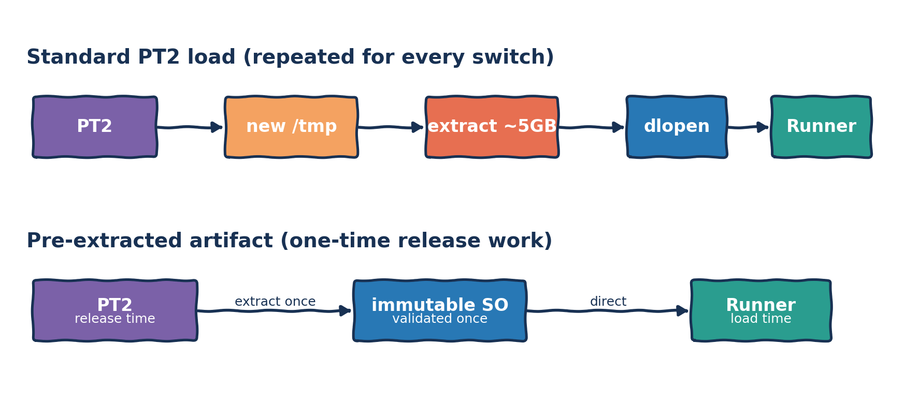
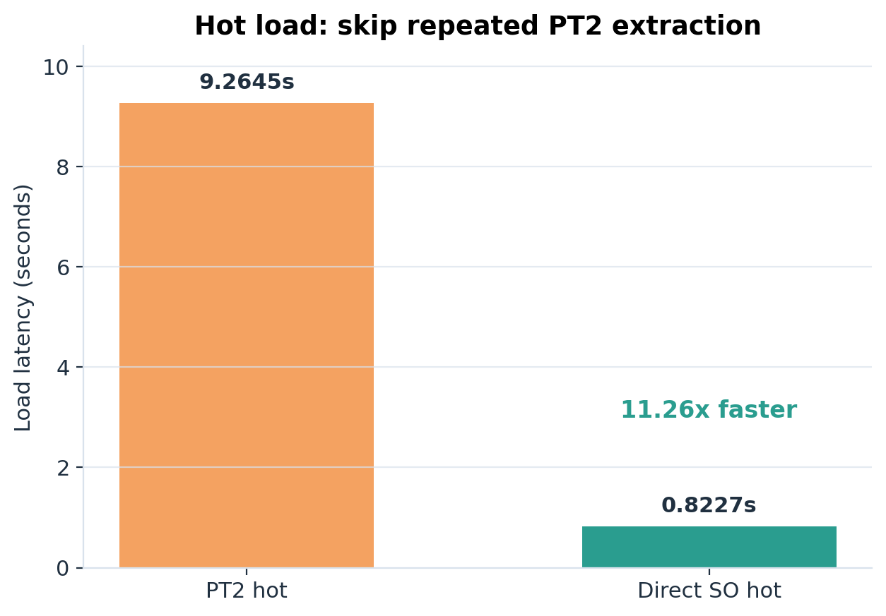
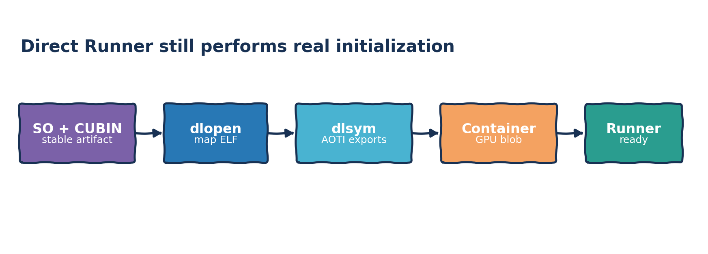
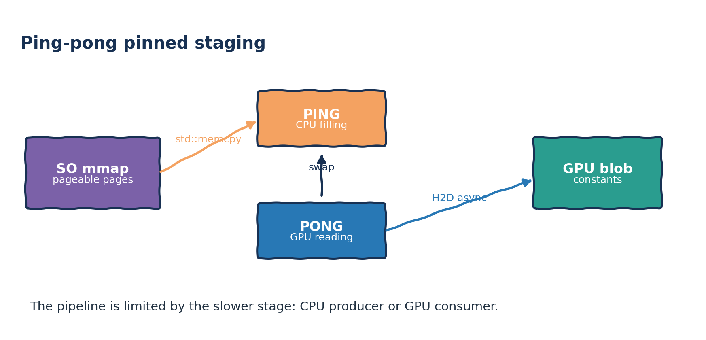
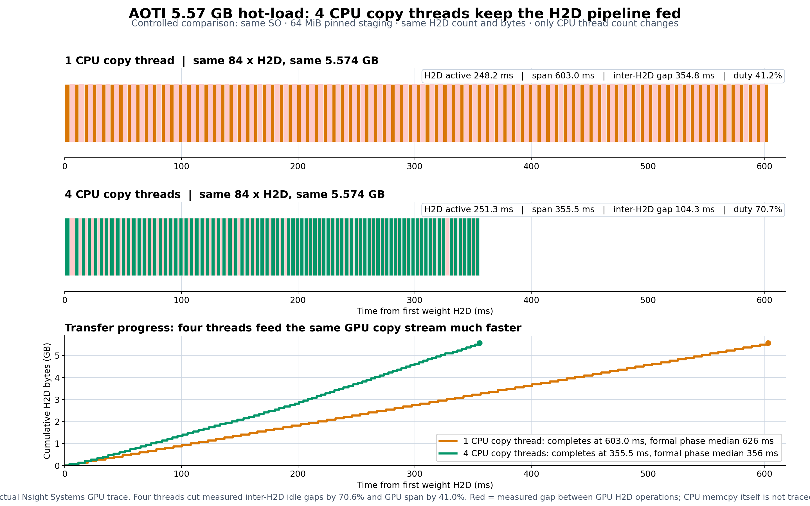
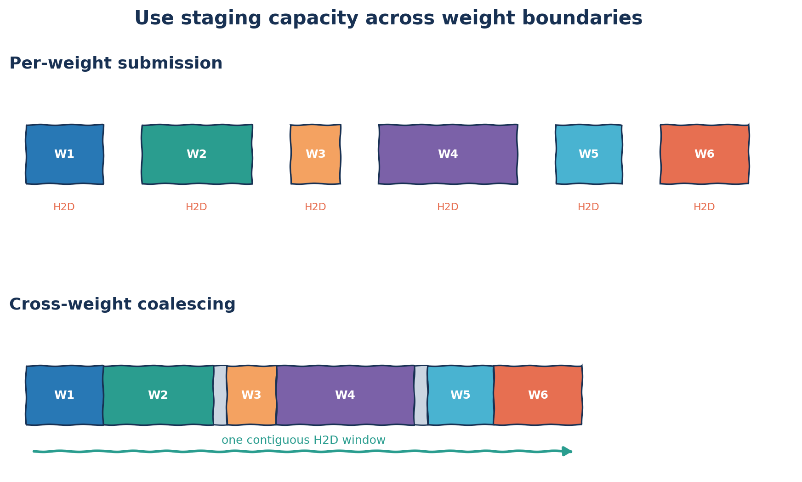
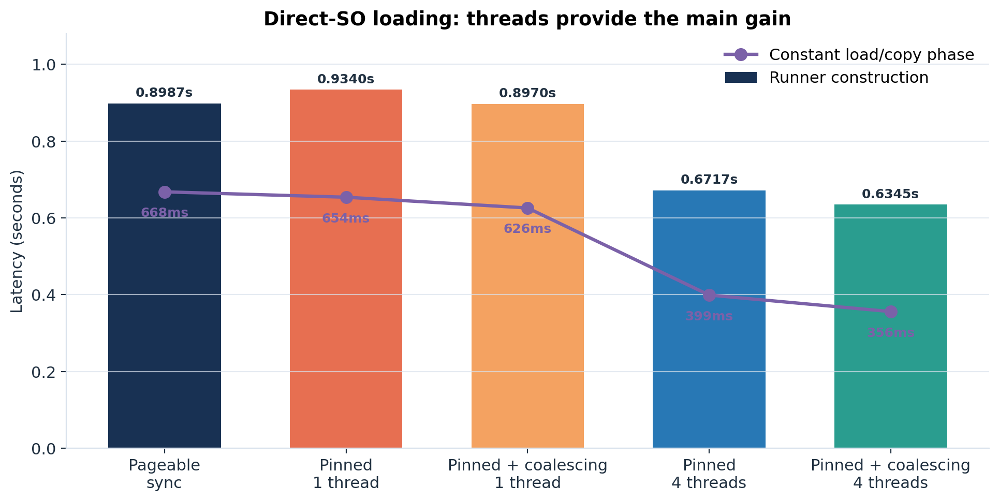

# 小记: 让 AOTInductor 模型"快上快下" - 从 PT2 解包到多线程 Pinned Copy

现在我接手的一个推理服务已经在用 AOTInductor 做推理加速了, 即把 PyTorch 模型提前编译并打包成 PT2 产物, 运行时不再依赖原始 Python 模型.

在一个 GPU 显存有限, 模型数量非常庞大且需要频繁切换的极端场景, 我们很自然地就想到要追求"快上快下".

测试环境很简单: 单个 PT2 文件约 5GB, 机器使用 DDR4, 内存充裕, GPU 是 A100. 下面的 `hot` 特指文件已经进入 Linux page cache, 也就是操作系统可以直接从内存取文件内容; `cold` 则需要从存储设备读取.

AOTInductor 官方提供的标准加载方式是:

```python
aoti_model = torch._inductor.aoti_load_package("model.pt2")
```

这里的 Load 从调用 `aoti_load_package()` 之前开始, 到调用返回并完成 CUDA 同步为止, 不包含模型执行. 后面尝试其他加载路径时, 也沿用相同的开始和结束边界.

先不做任何优化, PT2 冷加载需要 **12.1667s**, 作为我们接下来进行改进的起点.

## 第一反应: 把文件放进 page cache

5GB 文件从磁盘读一遍当然慢. 如果内存够大, 最自然的想法就是先把它读进 Linux page cache, 后续加载直接走内存.

结果确实快了一些:

| 路径 | Load | 相对 PT2 cold |
|---|---:|---:|
| PT2 cold | 12.1667s | 1.00x |
| PT2 hot | 9.2645s | 1.31x |

page cache 只把 12.17s 降到了 9.26s. 一个已经在内存里的 5GB 文件, 加载还需要 9s, 还是偏久了一点.

## PT2 到底是怎么加载的

PT2 可以简单理解为一个装了多个文件的 ZIP 档案. 我们的产物使用 `ZIP_STORED`, 也就是里面的文件没有做 deflate 压缩; 其中绝大部分体积来自一个嵌入权重的巨大 `wrapper.so`. SO 是 Linux 可以动态加载的共享库, 类似 Windows 下的 DLL.

"没有压缩"不等于"可以直接 `dlopen`". SO 在 ZIP 中有自己的偏移, ELF header 并不位于 PT2 的文件开头, 所以 Loader 首先要把包里的 SO 和 CUBIN 取出来. 但更重要的是它取出来之后做了什么.

顺着 `torch/csrc/inductor/aoti_package/model_package_loader.cpp` 往下看, 会发现 `aoti_load_package()` 并不是另一套模型运行时: 它把包内文件准备好, 找到 SO 和 CUBIN 目录后, 最终也是把它们交给对应设备的 AOTI Runner. 删掉具体的解包和错误处理, 主干其实可以缩成两步:

```cpp
// 简化代码: AOTIModelPackageLoader 的 zip 模式
auto [so_filename, cubin_dir] = extract_model_files(model_package_path);

runner_ = registered_aoti_runner[device_key](
    so_filename, num_runners, device.str(), cubin_dir, run_single_threaded);
```



那就有一个很简单粗暴的想法: 既然 Loader 的终点也是实例化 Runner, 那么只要提前拿到 SO 和 CUBIN, 运行时就可以跳过 PT2 Loader, 直接实例化同一个 Runner. Runner 可以理解为"加载并持有编译模型的运行时对象". 其实在PyTorch 2.6之前, 单独的load接口还没出来的时候, 确实就是这么干的, 后来AOTInductor 的maintainer可能觉得这种把so和几百上千个cubin文件放在文件夹里面的方式不太优雅，而且cubin默认是在/tmp目录下的，于是改成了zip文件的形式.

这也解释了 hot PT2 为什么仍然慢: 虽然原始 PT2 已经 100% 命中 page cache, Loader 还是要把其中约 5GB 的 SO 完整写到新的临时目录, 然后才能交给 Runner. page cache 省掉的是磁盘读取, 没有省掉这次全量复制, 写入磁盘本身也是一个很重的操作. 因此我们在发布阶段准备好 `.so` 和 CUBIN 目录, 运行时则把两者直接交给 Runner. 这一步不改模型和权重, 只是绕过了 Loader 每次都会重复的产物准备工作.

为了只比较加载路径, 不再混入磁盘读取, 两边都在文件 100% 命中 page cache 的条件下测试:

| hot 加载路径 | Load | 相对 hot PT2 |
|---|---:|---:|
| 标准 `aoti_load_package(PT2)` | 9.2645s | 1.00x |
| 预解包后直接 Runner (SO) | **0.8227s** | **11.26x** |



到这里其实已经拿到了本文最大的一块收益.

## 直接 Runner 做了什么

跳过 PT2 loader 并不等于跳过模型初始化. Runner 仍然需要用 `dlopen` 把动态库映射进进程, 查找 AOTI 导出符号, 创建 model container, container 再分配 GPU constant blob 并装载权重. CUBIN 则是已经编译好的 GPU kernel 二进制.

Python 里不需要另外写 C++ 扩展, 可以直接使用 PyTorch 已绑定的 Runner:

```python
runner = torch._C._aoti.AOTIModelContainerRunnerCuda(
    model_so_path,
    1,           # num_models
    "cuda:0",
    cubin_dir,
)

flat_outputs = runner.run(flat_inputs)
```

这里的 `torch._C._aoti` 是底层内部接口, 不提供向后兼容保证. 不过就我从 PyTorch 2.3 一直用到 PyTorch 2.12 的经验来看, 用于实例化 Runner 的接口一直比较稳定. 中途确实有小幅更改, 但改动不大.

从 Python binding 往下走, CUDA Runner 本身只是一层很薄的封装, 核心初始化在 `torch/csrc/inductor/aoti_runner/model_container_runner.cpp`:

```cpp
// 简化代码: 直接从 SO 创建 Runner
AOTIModelContainerRunnerCuda runner(
    model_so_path,
    /*num_models=*/1,
    "cuda:0",
    cubin_dir,
    /*run_single_threaded=*/false);

// AOTIModelContainerRunner 内部
model_so_ = std::make_unique<at::DynamicLibrary>(model_so_path.c_str());
create_func_ = model_so_->sym("AOTInductorModelContainerCreateWithDevice");
create_func_(&container_handle_, num_models, device_str, cubin_dir);
```



接下来还剩 0.8s 左右. 我一开始猜, 里面的大头无非两件事: `dlopen`, 以及把权重从 host 搬到 GPU 的 H2D copy.

把 PT2 用unzip命令解包, 生成的 C++ 也在里面. 这里的 constants 就是保存在编译产物中, 并在加载时需要放进 GPU 的权重块. 我们用于测试的模型一共有 **841 个 constants**, 原始权重约 **5.57GB**, 其中 **770 个小于 1MiB**. 在 `torch/csrc/inductor/aoti_runtime/model_base.h`, `load_constants()` 的主干也很朴素:

```cpp
// 简化代码: 为所有 constant 分配一块连续 GPU blob, 再逐个装载
constant_blob_ = RAII_gpuMalloc(blob_size);

for (size_t i = 0; i < num_constants; ++i) {
    size_t data_size = constant_data_size(i);

    uint8_t* internal_ptr = constant_ptr(
        constants_internal_offset[i],
        bytes_read,
        data_size,
        /*skip_copy=*/false);

    aoti_torch_create_tensor_from_blob_v2(
        internal_ptr, ndim, shape, stride, offset, dtype, device, ...);

    constants_map_->emplace(constant_name(i), tensor_handle);
    bytes_read += data_size;
}
```

`constant_ptr()` 最终会把 `_get_constants_start() + bytes_read` 指向的 host 数据复制到 GPU 的 `constant_blob_`. GPU 侧是一整块连续地址; host 源则来自 SO 被 `mmap` 出来的普通页面. `mmap` 可以理解为把文件页映射到进程地址空间, 这些页面仍是 pageable memory.

## 首次载入的CUDA context初始化开销

在后面用来优化 constants 的这份 5GB SO 上, 原始 pageable 路径的 Runner 构造是 0.8536s, runtime 记录的 constant load/copy phase 是 619ms. 这个 phase 从权重搬运开始前计时, 到权重 tensor 创建和最后同步完成后结束. 

两者之间还差了约 235ms. 这一段会是什么? 无非可能是 `dlopen`, metadata 初始化, GPU memory 分配, 或者 CUDA 的首次使用.

先排除最直观的怀疑. SO 已经 100% 命中 page cache 时, 单独 `dlopen` 这个 5GB SO 只需要约 0.6ms, 根本解释不了这个 gap. 接着在 fresh process 中单独调用 `torch.cuda.synchronize("cuda:0")`, 7 次中位数是 217.5ms. 这与缺口已经非常接近: benchmark 在 Runner 之前没有碰过 CUDA, 所以第一次 Runner 构造把 CUDA context 的 lazy initialization 也算进去了.

既然是首次成本, 最简单的解法就是把它提前到服务启动阶段:

```python
torch.cuda.synchronize("cuda:0")
```

`synchronize()` 本身就会触发 CUDA lazy initialization, 不需要额外构造一个 GPU tensor. 再用同一份原始 SO 复测, Runner 构造中位数从 0.8536s 降到了 **0.6284s**, constant phase 中位数为 625ms, phase 外只剩约 3.4ms. 这验证了前面的猜测: 什么都不改, 只把 CUDA context 初始化前移, 第一次 Runner 就可以减少约 225ms, 也就是 26.4%.

这是将工作移出模型上线的关键路径, 不是减少进程从启动到完全就绪的总工作量. 但对长驻服务来说, 这正是我们关心的边界: 服务可以在接收模型上线请求之前完成准备.

## Pageable 不够快, 那就用 pinned memory?

CUDA 里一个很常见的经验是: 普通的 pageable host memory 允许操作系统换页, 做 H2D 时 runtime 往往还要经过内部 staging; pinned memory 则是锁在物理内存里的页面, 可以直接交给 DMA (硬件 copy 引擎) 搬运, `cudaMemcpyAsync` 也才能真正异步排进 CUDA stream. 这里 staging buffer 就是一小块中转内存, stream 是 GPU 工作队列, event 用来标记某块 buffer 何时可以复用.

最直接的思路就是: 能不能把这些 weight 先放进 pinned memory?

我暗自开心的时候, "这个思路搞不好能给 PyTorch 提个 PR". 可惜天下英雄如过江之鲫, 翻看最近的 commit 后, 却发现一个多月前已经有人跑在我们前面了: PR [#186258](https://github.com/pytorch/pytorch/pull/186258) 引入了双 pinned staging buffer, commit 是 `e3a7019566d`; 后续 [#193249](https://github.com/pytorch/pytorch/pull/193249) 又把 H2D stream 改成了每个 device 共享.

本文最初的实验环境是 PyTorch 2.12, 它还不包含这两个 PR. PyTorch 2.13 已经包含第一个 pinned staging PR [#186258](https://github.com/pytorch/pytorch/pull/186258), 而第二个共享 stream PR [#193249](https://github.com/pytorch/pytorch/pull/193249) 当时仍只在 main. 为了测试包含两项改动的上游实现, 我在本地编译了最新的 PyTorch main 分支. 这套实现使用双 pinned buffer 和单线程 CPU staging, 可以通过环境变量开启:

```bash
export AOTI_COPY_USE_PINNED_ASYNC=1
export AOTI_COPY_STAGE_BUFFER_BYTES=67108864  # 每块 64MiB 也是当前的默认值
```

它没有把整个 5GB SO 注册成 pinned memory, 而是申请两块有上限的 staging buffer:

```text
SO mmap(pageable) --CPU memcpy--> pinned ping/pong --cudaMemcpyAsync--> GPU
```

CPU 填 ping 时, GPU 可以传 pong; 随后两者交换. 理想情况下, H2H 和 H2D 像流水线一样重叠, 同时又只锁住 `2 × 64MiB` host memory.



看起来非常合理, 开关一开, 应该直接变快吧?

先只比较上游实现原本的单线程 pinned 路径:

| 配置 | Runner 构造 | 相对 pageable 路径 |
|---|---:|---:|
| pageable 同步路径 | 0.8987s | 基线 |
| 单线程 pinned 路径 | 0.9340s | **慢 3.93%** |

pinned memory 不是免费午餐. 它为可与 CPU 工作重叠的异步 H2D 提供了基础, 但这套 staging 路径新增了一次明确的 `pageable -> pinned` Host-to-Host (H2H) CPU memcpy, 还要管理两块 buffer, event 和提交节奏. 如果 CPU 填 buffer 的速度跟不上 GPU 消费, 双缓冲只是把瓶颈换了个位置.

## 谁在等谁

单线程 pinned 路径比 pageable 更慢, 说明额外的 H2H staging 很可能没有被 H2D 流水线隐藏掉. 但只看 Runner 总耗时还不能断定究竟是 CPU 填充慢, 还是 PCIe DMA 本身已经跑满. 一个简单粗暴的验证方法, 就是只改变 CPU copy 线程数, 再对比 GPU 上的 H2D timeline.

## 用多线程给 staging buffer 供数

我们把每次较大的 staging fill 分片, 交给多个 CPU 线程并行执行:

```cpp
// 示意代码: caller 也是 worker 0
parallel_copy(dst, src, bytes, total_threads=4) {
    shard = align_down(bytes / total_threads, 64);
    workers[0..3].memcpy(dst + begin, src + begin, shard);
    wait_all_workers();
}
```

这里的四线程是 **总计 4 个 copy 线程**, 也就是调用线程加 3 个后台 worker, 并不是额外再开 4 个. 小 copy 继续走单线程, 避免唤醒线程的成本反过来超过 memcpy 本身.

实验要改一下PyTorch源码, 这边把线程数保留成独立选项:

```bash
export AOTI_COPY_STAGE_CPU_THREADS=4
```

为了确认不是统计偶然, 我们用 Nsight Systems (CPU/GPU timeline 分析工具) 采了一组严格控制变量的 timeline. 两组使用同一份 SO, 同样的 64MiB staging 和相同的跨 weight 聚合方式, 都是 84 次 H2D, 传输 5,573,874,344 bytes; 唯一变量就是 CPU copy 线程从 1 个变成 4 个. 因此这里的单线程数据与前表的上游逐 weight 提交路径不是同一配置; 跨 weight 聚合会在下一节展开.

这张图可以这样读: 上半部分是单线程, 下半部分是四线程; 每个橙色或绿色实心块代表 GPU 正在执行一笔 H2D, 块之间的浅粉色区域是 GPU copy stream 没有执行 H2D 的实测空档. `active` 是所有实心块的时长之和, `span` 是第一笔开始到最后一笔结束, `duty = active / span`, 越高说明流水线越紧密.



| 指标 | 单线程 | 四线程 | 变化 |
|---|---:|---:|---:|
| GPU H2D active | 248.2ms | 251.3ms | 基本不变 |
| 首笔到末笔 H2D span | 603.0ms | 355.5ms | -41.04% |
| H2D 之间累计空档 | 354.8ms | 104.3ms | **-70.61%** |
| gap 中位数 | 4.351ms | 0.979ms | **-77.51%** |
| H2D duty | 41.2% | 70.7% | +29.5pp |
| constant load/copy phase | 626ms | 356ms | -43.13% |
| Runner 构造 | 0.8970s | 0.6345s | -29.26% |

最关键的是第一行: H2D 真正工作的总时间几乎没变, 说明四线程没有让 PCIe DMA 本身变快. 变的是两笔 H2D 中间的空档, 累计从 354.8ms 降到 104.3ms. 同样多的数据, 同样多的 copy, GPU 不再频繁等 CPU producer, 队列明显紧密起来了.

线程也不是越多越好. 八线程在这台机器上反而比四线程慢, 更多 worker 会带来同步, 调度和带宽争抢. 线程数应该是可调参数, 而不是写死成"CPU 越多越快".

## 770 个小 weight: 能不能一起搬

多线程解决了 CPU 填 buffer 的速度, 接着看 H2D 提交次数. 841 个 constants 中有 770 个小于 1MiB, 而上游 staging 接口按 weight 调用: 一个 weight 拷完就提交, 下一个 weight 不能继续使用当前 staging window 的剩余空间.

GPU 上的 `constant_blob_` 本来就是连续分配的, 各 weight 通过 offset 落在其中. 于是可以把目标地址连续的多个 weight 依次填进同一块 staging buffer, 连同很小的 alignment gap 一起补齐, 接近 64MiB 时再提交一次 H2D.



CPU 源 weight 不要求物理连续: 每个源片段分别 `memcpy` 到连续 staging 区域即可. 真正需要连续的是这次 H2D 的 staging 源区间和 GPU 目标区间. 一个大 weight 如果跨过 staging 边界, 就先填满当前 buffer 并提交, 剩余部分放到下一块; 这就是"跨边界拆成两段".

在同样使用四个 copy 线程的前提下, 聚合带来了第二段, 相对小一些但很稳定的收益:

```bash
export AOTI_COPY_STAGE_COALESCE_WEIGHTS=1
```

| 指标 | 四线程, 不聚合 | 四线程, 聚合 | 变化 |
|---|---:|---:|---:|
| Runner 构造 | 0.6717s | **0.6345s** | 额外快 5.53% |
| constant load/copy phase | 399ms | **356ms** | -10.78% |
| H2D submissions | 902 | **84** | -90.69% |

聚合没有改变总权重量, 主要省掉的是大量小 H2D, event 和调度开销. 它的绝对收益不如多线程, 但把 902 次提交降到 84 次, 对 weight 很碎的模型很有价值.

## 把直接 SO 内的结果放在一起

最终的完整矩阵如下. 所有配置都在相同的 hot SO 条件下比较:

| 配置 | 含义 | Runner 构造 | constant load/copy phase |
|---|---|---:|---:|
| pageable 同步 | 不使用 pinned staging | 0.8987s | 668ms |
| 单线程 pinned | 逐个 weight 提交 | 0.9340s | 654ms |
| 单线程 pinned + 聚合 | 合并相邻 weight | 0.8970s | 626ms |
| 四线程 pinned | 逐个 weight 提交 | 0.6717s | 399ms |
| 四线程 pinned + 聚合 | 合并相邻 weight | **0.6345s** | **356ms** |



这张表也解释了为什么只说"pinned memory 更快"是不够的: 上游的单线程 pinned 路径甚至比 pageable 同步路径更慢. 真正起作用的是把流水线完整地看成 `pageable mmap -> CPU staging -> pinned H2D`, 然后让 CPU producer 和 GPU consumer 的速度尽量匹配.

## 再进一步: 让 SO 和 GPU blob 使用相同布局

四线程解决了 staging buffer 填充太慢的问题, 聚合又把 902 次 H2D 降到了 84 次. 但这时 CPU 侧还有一层不太显眼的工作: SO 里的 CUDA weights 是紧密排列的, GPU `constant_blob_` 中的每个 weight 却要从 64B 对齐的位置开始.

```text
SO serialized weights:
weight0 | weight1 | weight2 | ...

GPU constant_blob_:
weight0 | padding | weight1 | padding | weight2 | ...
```

这个布局有其历史原因. CPU 模型会直接从 serialized blob 上构造 tensor, 所以源地址必须对齐; CUDA weights 原本只是逐个 H2D 的传输格式, 每次 copy 都明确给出目标偏移, 因此 SO 内部没有对齐的必要.

现在情况变了. 聚合虽然能把多个 weight 合成大 H2D, 但 runtime 仍然要遍历每个 weight, 将源数据 scatter 到 pinned buffer 中的对应位置, 再用 `memset` 补上 padding. weight 跨过 64MiB staging 边界时还要拆分, 大量小 weight 则会带来额外的 memcpy 和 worker barrier.

解法是在 codegen 时便让 CUDA serialized weights 使用同样的 64B 布局:

```text
SO serialized weights:
weight0 | padding | weight1 | padding | weight2 | ...

GPU constant_blob_:
weight0 | padding | weight1 | padding | weight2 | ...
```

对齐后, pageable 路径可以一次复制整个 blob; pinned 路径则把它当作一个连续的逻辑源区间, 再按 64MiB 切成双缓冲的物理 H2D. 两个优化是正交的: 对齐决定数据如何排列, pinned staging 决定加载时如何搬运这些数据.

使用同一个 5GB 模型, 每组进行 7 次 fresh-process 随机交错测试, 中位数如下:

| 配置 | Runner 构造 (fresh CUDA) | constant load/copy phase | H2D submissions |
|---|---:|---:|---:|
| 原始紧密布局, pageable | 0.8536s | 619ms | 841 |
| 原始布局, pinned 四线程, 不聚合 | 0.6737s | 392ms | 902 |
| 原始布局, pinned 四线程, 聚合 | 0.6292s | 353ms | 84 |
| 64B 对齐布局, pageable 整块复制 | 0.8193s | 585ms | 1 |
| 64B 对齐布局, pinned 四线程整块路径 | **0.5844s** | **313ms** | 84 |

单独使用 aligned layout, Runner 构造只改善 4.02%, phase 改善 5.49%. 它的主要价值是和 pinned staging 组合: 在已经开启四线程和聚合的基础上, Runner 构造继续改善 7.13%, phase 继续改善 11.33%. 在相同的 fresh-CUDA 测量边界下, Runner 构造相比最初的 pageable 基线改善 31.54%; 排除 CUDA context 首次初始化的影响后, constant load/copy phase 改善 49.43%. 对已经预热 context 的长驻服务, 最终全开路径实测为 0.3619s; 继续预热 pinned cache 后为 0.3196s.

我们还把每块 staging buffer 从 64MiB 增加到 128MiB. H2D 提交确实从 84 次降到 42 次, 但紧密布局的 phase 只从 353ms 变为 350ms, aligned 也只从 313ms 变为 311ms; Runner 构造反而因更大的 pinned allocation 变慢 5%-7%. 这说明 84 次提交已经不是主要瓶颈, 64MiB 是这台机器上更合适的流水粒度.

## 最后一点点小改动: 预热 pinned cache

到这里, 四线程, 聚合和 aligned layout 已经把 constant phase 从 619ms 压到 313ms. 如果仍然从 fresh CUDA process 开始计时, Runner 是 0.5844s; 但按前面的做法提前初始化 CUDA context 后, Runner 中位数已经是 0.3619s, 对应 constant phase 为 317ms. 这次剩下的 gap 约为 45ms.

现在猜测范围小得多: CUDA context 已经存在, constant phase 又覆盖了真正的搬运和同步. Nsight 里两次 64MiB `cudaHostAlloc` 合计约 38.9ms, 几乎就是全部缺口. 也就是说, 第一次创建双 pinned staging buffer 时的锁页分配, 成了最后一块可以前移的固定成本.

这两块 buffer 也可以在 Python 服务启动时预热:

```python
import os

import torch


default_stage_bytes = 64 * 1024 * 1024
stage_bytes = int(
    os.getenv("AOTI_COPY_STAGE_BUFFER_BYTES", str(default_stage_bytes))
)

# 同时申请两块, 再让它们返回进程级 pinned cache.
pinned_buffers = [
    torch.empty(stage_bytes, dtype=torch.uint8, pin_memory=True)
    for _ in range(2)
]
del pinned_buffers
```

两块 pinned tensor 必须同时存活过, 否则第二次申请可能直接复用第一块, 最终只预热了一块. `del` 之后 tensor 对象被析构, 但 backing memory 不会立即解锁, 而是返回 PyTorch 的进程级 cached pinned allocator, 等待 Runner 复用.

实验结果与这个拆分一致:

| 启动状态 | Runner 构造 | constant phase | phase 外开销 |
|---|---:|---:|---:|
| fresh process, 什么都不预热 | 0.5844s | 313ms | 约 271ms |
| 只提前初始化 CUDA context | 0.3619s | 317ms | 约 45ms |
| CUDA context 与两块 pinned buffer 都预热 | 0.3196s | 316ms | 约 3.6ms |

结果再次吻合猜测. staging pool 对象在每次加载后会析构, 但两块 pinned backing memory 会留在进程级 cache 里, 后续加载可以继续复用.

## END

1. **先消掉重复工作.** PT2 命中 page cache 之后仍要解包并复制巨大 SO; 发布阶段预解包, 运行时直接 Runner, 把 9.2645s 降到了 0.8227s. 这是收益最大, 也最容易工程化的一步.
2. **先拿掉投入产出比最高的固定成本.** 只在服务启动时触发 CUDA context 初始化, 不改 SO 和 PyTorch, 就能把原始 Runner 从 0.8536s 降到 0.6284s.
3. **再优化不可避免的数据搬运.** 上游双 pinned buffer 解决了异步 H2D 的基础问题, 但单线程 H2H 供数跟不上; 改用四线程后, Runner 从 0.8970s 降到 0.6345s, 并让 timeline 上的 H2D 空档下降 70.61%.
4. **然后处理提交碎片.** 跨 weight 聚合把 H2D submission 从 902 次降到 84 次, 在四线程基础上再拿到 5.53% 的增益.
5. **让产物布局配合加载路径.** CUDA serialized weights 按 64B 对齐后, SO 与 GPU blob 可以按同一字节布局连续搬运. 它在四线程加聚合的基础上, 把 Runner 从 0.6292s 继续降到 0.5844s, 把 phase 从 353ms 降到 313ms.
6. **最后预热 pinned cache.** 已经预热 context 的全优化 Runner 从 0.3619s 降到约 0.3196s, phase 之外只剩约 3.6ms.

预解包适合先落地; 多线程 staging 是直接 SO 路径里最主要的增量; 聚合和 aligned layout 分别处理提交碎片与 CPU staging 布局碎片. 后三项目前仍是实验实现, 需要修改 PyTorch 源代码才能启用.
